# KRAKEN Discovery Pipeline — LangGraph Architecture

## Overview

The Discovery Pipeline is a **9-node LangGraph workflow** that performs deep biomedical analysis on user-provided entities. It runs alongside the existing "Classic" single-agent mode and is designed for research-grade discovery queries.

**Key characteristics:**
- Multi-agent orchestration via LangGraph
- Parallel analysis branches for different entity types
- Conditional routing based on study context
- Hypothesis generation with validation gap calibration

---

## Pipeline Flow Diagram

```mermaid
flowchart TD
    subgraph Input["📥 Input Processing"]
        A[/"🔍 INTAKE<br/>Query parsing, entity extraction"/]
        B[/"🧬 ENTITY RESOLUTION<br/>CURIE mapping via Kestrel"/]
    end

    subgraph Triage["⚖️ Classification"]
        C{{"🎯 TRIAGE<br/>Edge count classification"}}
    end

    subgraph Analysis["🔬 Parallel Analysis"]
        D[/"📊 DIRECT KG<br/>Disease, pathway, interactions"/]
        E[/"🔮 COLD-START<br/>Analogue-based inference"/]
    end

    subgraph Enrichment["🧩 Integration"]
        F[/"🔗 PATHWAY ENRICHMENT<br/>Shared neighbors, themes"/]
        G[/"🌉 INTEGRATION<br/>Bridges + gap analysis"/]
    end

    subgraph Temporal["⏱️ Conditional"]
        H{{"📅 TEMPORAL<br/>Longitudinal classification"}}
    end

    subgraph Output["📤 Output"]
        I[/"📝 SYNTHESIS<br/>Report + hypotheses"/]
    end

    A --> B --> C

    C -->|"well_characterized<br/>moderate"| D
    C -->|"sparse<br/>cold_start"| E
    C -->|"no entities"| F

    D --> F
    E --> F
    F --> G

    G -->|"is_longitudinal=true"| H
    G -->|"is_longitudinal=false"| I
    H --> I

    I --> J((END))

    style A fill:#e1f5fe,color:#1a237e
    style B fill:#e1f5fe,color:#1a237e
    style C fill:#fff3e0,color:#e65100
    style D fill:#e8f5e9,color:#1b5e20
    style E fill:#fce4ec,color:#880e4f
    style F fill:#f3e5f5,color:#4a148c
    style G fill:#f3e5f5,color:#4a148c
    style H fill:#fff8e1,color:#f57f17
    style I fill:#e0f2f1,color:#004d40
```



### Routing Logic

| Condition | Route |
|-----------|-------|
| Has well-characterized OR moderate entities | → Direct KG |
| Has sparse OR cold-start entities | → Cold-Start |
| Both types present | → Both branches (parallel) |
| No entities resolved | → Skip to Pathway Enrichment |
| `is_longitudinal=true` | → Temporal → Synthesis |
| `is_longitudinal=false` | → Synthesis directly |

---

## Node Descriptions

### 1. Intake
**File:** `graph/nodes/intake.py`

Parses the user query without LLM calls (heuristic-based for speed).

| Input | Output |
|-------|--------|
| `raw_query` | `query_type` (retrieval/discovery/hybrid) |
| | `raw_entities` (extracted entity names) |
| | `is_longitudinal` (study context flag) |
| | `duration_years` (if applicable) |

**Detection patterns:**
- Discovery triggers: "analyze", "what connects", "pathway", "mechanism", etc.
- Longitudinal keywords: "OGTT", "FDR", "baseline", "progression", etc.

---

### 2. Entity Resolution
**File:** `graph/nodes/entity_resolution.py`

Resolves raw entity names to knowledge graph CURIEs using Claude Agent SDK + Kestrel MCP.

| Input | Output |
|-------|--------|
| `raw_entities` | `resolved_entities` (list of EntityResolution) |

**EntityResolution model:**
```python
{
    "raw_name": "glucose",
    "curie": "CHEBI:17234",
    "resolved_name": "D-glucose",
    "category": "biolink:ChemicalEntity",
    "confidence": 0.95,
    "method": "exact"  # exact|fuzzy|semantic|failed
}
```

---

### 3. Triage & Route
**File:** `graph/nodes/triage.py`

Counts KG edges for each resolved entity and classifies by connectivity threshold.

| Input | Output |
|-------|--------|
| `resolved_entities` | `novelty_scores` (list of NoveltyScore) |
| | `well_characterized_curies` (≥200 edges) |
| | `moderate_curies` (20-199 edges) |
| | `sparse_curies` (1-19 edges) |
| | `cold_start_curies` (0 edges) |

**Classification thresholds:**

| Classification | Edge Count | Routes To |
|----------------|------------|-----------|
| Well-characterized | ≥200 | Direct KG |
| Moderate | 20–199 | Direct KG |
| Sparse | 1–19 | Cold-Start |
| Cold-start | 0 | Cold-Start |

**Routing logic:**
- Both branches needed → parallel execution
- Only well-characterized/moderate → Direct KG only
- Only sparse/cold-start → Cold-Start only
- No entities resolved → skip to Pathway Enrichment

---

### 4a. Direct KG Analysis
**File:** `graph/nodes/direct_kg.py`

Analyzes well-characterized entities using direct knowledge graph queries.

| Input | Output |
|-------|--------|
| `well_characterized_curies` | `disease_associations` |
| `moderate_curies` | `pathway_memberships` |
| | `direct_findings` (Tier 1-2) |
| | `hub_flags` (high-degree nodes) |

**Analysis types:**
- Disease associations (GWAS, DisGeNET, etc.)
- Pathway memberships (Reactome, KEGG)
- Protein interactions
- Hub node detection (>1000 edges)

---

### 4b. Cold-Start Analysis
**File:** `graph/nodes/cold_start.py`

Analyzes sparse/unknown entities via analogue-based semantic reasoning.

| Input | Output |
|-------|--------|
| `sparse_curies` | `analogues_found` |
| `cold_start_curies` | `inferred_associations` |
| | `cold_start_findings` (Tier 3) |

**Approach:**
1. Find semantically similar entities (analogues) via vector search
2. Transfer knowledge from analogues to sparse entity
3. Generate inferred associations with logic chains

**InferredAssociation model:**
```python
{
    "source_entity": "novel_metabolite_X",
    "target_curie": "MONDO:0005148",
    "target_name": "type 2 diabetes mellitus",
    "predicate": "biolink:correlated_with",
    "logic_chain": "X similar to glucose, glucose associated with T2D",
    "supporting_analogues": 3,
    "confidence": "low",
    "validation_step": "Measure X levels in T2D cohort"
}
```

---

### 5. Pathway Enrichment
**File:** `graph/nodes/pathway_enrichment.py`

Finds shared neighbors across all resolved entities and groups by biological theme.

| Input | Output |
|-------|--------|
| All resolved CURIEs | `shared_neighbors` |
| | `biological_themes` |

**SharedNeighbor model:**
```python
{
    "curie": "GO:0006094",
    "name": "gluconeogenesis",
    "category": "biolink:BiologicalProcess",
    "degree": 450,
    "is_hub": false,
    "connected_inputs": ["CHEBI:17234", "UniProtKB:P35557"],
    "predicates": ["biolink:participates_in"]
}
```

**Hub filtering:** Nodes with >1000 edges are flagged but deprioritized in theme analysis.

---

### 6. Integration
**File:** `graph/nodes/integration.py`

Performs cross-type bridge detection and gap analysis.

| Input | Output |
|-------|--------|
| All accumulated findings | `bridges` (cross-entity-type paths) |
| | `gap_entities` (expected-but-absent) |

**Bridge model:**
```python
{
    "path_description": "metabolite → gene → disease",
    "entities": ["CHEBI:17234", "NCBIGene:3630", "MONDO:0005148"],
    "entity_names": ["glucose", "INS", "type 2 diabetes"],
    "predicates": ["biolink:affects", "biolink:gene_associated_with_condition"],
    "tier": 2,
    "novelty": "known",
    "significance": "Direct metabolic link to disease mechanism"
}
```

**Gap analysis (Open World Assumption):**
- Identifies entities expected in study context but absent from results
- Frames absence as "unstudied" rather than "nonexistent"

---

### 7. Temporal (Conditional)
**File:** `graph/nodes/temporal.py`

**Only executes when `is_longitudinal=True`**

Classifies findings by temporal relationship to disease progression.

| Input | Output |
|-------|--------|
| Findings from previous nodes | `temporal_classifications` |

**Classification categories:**
- `upstream_cause` — Changes precede disease onset
- `downstream_consequence` — Changes follow disease onset
- `parallel_effect` — Changes co-occur without causal relationship

---

### 8. Synthesis
**File:** `graph/nodes/synthesis.py`

Generates the final report and extracts structured hypotheses.

| Input | Output |
|-------|--------|
| Full accumulated state | `synthesis_report` (markdown) |
| | `hypotheses` (list of Hypothesis) |

**Hypothesis model:**
```python
{
    "title": "Glucose-INS-T2D metabolic axis",
    "tier": 2,
    "claim": "Elevated glucose affects INS expression, contributing to T2D",
    "supporting_entities": ["CHEBI:17234", "NCBIGene:3630"],
    "contradicting_entities": [],
    "structural_logic": "glucose → affects → INS → associated_with → T2D",
    "confidence": "moderate",
    "validation_steps": [
        "Measure INS expression in hyperglycemic conditions",
        "Correlate glucose levels with INS in longitudinal cohort"
    ],
    "validation_gap_note": "~18% of computational predictions reach clinical investigation"
}
```

**Validation gap calibration:** Based on systematic review of computational-to-clinical translation rates.

---

## State Schema

The pipeline uses a TypedDict state with Pydantic models for validation.

**Key features:**
- `total=False` — All fields optional for incremental building
- `Annotated[list[X], operator.add]` — Reducer for parallel branch merging

```python
class DiscoveryState(TypedDict, total=False):
    # Input
    raw_query: str
    query_type: Literal["retrieval", "discovery", "hybrid"]
    raw_entities: list[str]
    is_longitudinal: bool

    # Resolution
    resolved_entities: Annotated[list[EntityResolution], operator.add]

    # Triage
    novelty_scores: Annotated[list[NoveltyScore], operator.add]
    well_characterized_curies: list[str]
    moderate_curies: list[str]
    sparse_curies: list[str]
    cold_start_curies: list[str]

    # Analysis (parallel branches)
    direct_findings: Annotated[list[Finding], operator.add]
    cold_start_findings: Annotated[list[Finding], operator.add]
    disease_associations: Annotated[list[DiseaseAssociation], operator.add]
    pathway_memberships: Annotated[list[PathwayMembership], operator.add]
    inferred_associations: Annotated[list[InferredAssociation], operator.add]

    # Enrichment
    shared_neighbors: Annotated[list[SharedNeighbor], operator.add]
    biological_themes: list[BiologicalTheme]

    # Integration
    bridges: Annotated[list[Bridge], operator.add]
    gap_entities: Annotated[list[GapEntity], operator.add]

    # Temporal
    temporal_classifications: Annotated[list[TemporalClassification], operator.add]

    # Output
    synthesis_report: str
    hypotheses: Annotated[list[Hypothesis], operator.add]
    errors: Annotated[list[str], operator.add]
```

---

## SDK Integration

### MCP Server Configuration
All nodes use `McpStdioServerConfig` for Kestrel MCP connections:

```python
mcp_config = McpStdioServerConfig(
    name="kestrel",
    command="uvx",
    args=["mcp-client-kestrel"],
)
```

### Concurrency Control
`SDK_SEMAPHORE = asyncio.Semaphore(1)` prevents anyio cancel scope conflicts when using `asyncio.gather` for parallel entity processing.

### Buffer Size
`max_buffer_size=10MB` handles large knowledge graph responses that exceed the default 1MB limit.

---

## Typical Performance

| Query Type | Entities | Execution Time | Output |
|------------|----------|----------------|--------|
| Simple discovery | 3 entities | ~10 minutes | 150+ findings, 3 hypotheses |
| Longitudinal study | 5 entities | ~12 minutes | + temporal classifications |
| Cold-start heavy | 3 unknown | ~8 minutes | Analogue-based inferences |

---

## File Structure

```
backend/src/kestrel_backend/graph/
├── __init__.py
├── builder.py          # Graph construction and routing
├── runner.py           # Execution and streaming
├── state.py            # State schema and Pydantic models
└── nodes/
    ├── __init__.py
    ├── intake.py
    ├── entity_resolution.py
    ├── triage.py
    ├── direct_kg.py
    ├── cold_start.py
    ├── pathway_enrichment.py
    ├── integration.py
    ├── temporal.py
    └── synthesis.py
```

---

## UI Integration

The pipeline integrates with the React frontend via WebSocket:

1. **Mode Toggle** — User selects "Discovery Pipeline" mode
2. **Progress Streaming** — Real-time node status updates via `PipelineProgressMessage`
3. **Report Card** — Final synthesis displayed in `PipelineReportCard` component

**WebSocket message types:**
- `pipeline_progress` — Node completion updates
- `pipeline_complete` — Final results with report and counts
- `pipeline_error` — Error handling

---

## Testing

110 unit tests covering:
- Individual node behavior
- Routing logic
- Parallel branch merging
- End-to-end workflow
- Error handling

Run tests:
```bash
cd backend
uv run pytest tests/ -v -m "not integration"
```
