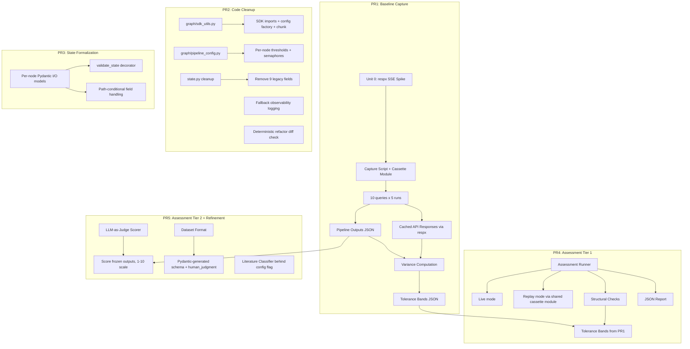

# Discovery Pipeline Cleanup, Formalization, and Evaluation Infrastructure

## Overview

Bring the LangGraph discovery pipeline (~8,100 lines, 10 nodes) from functional prototype to production-grade engineering standards. This involves four coordinated workstreams: extracting duplicated SDK boilerplate into shared modules, parameterizing hardcoded thresholds, adding inter-node state validation, and building assessment infrastructure (structural regression + LLM-as-judge quality scoring) that enables measured refinement of pipeline behavior.

## Problem Frame

The pipeline produces research-grade biomedical discovery output but has accumulated technical debt: SDK setup code duplicated across 8 nodes, inconsistent-but-intentional threshold values with no documented rationale, legacy state fields, and zero assessment infrastructure. Changes are risky (no regression detection) and output quality is unmeasured. The literature grounding node hardcodes all relationship classifications to "supporting" (see TODO at `graph/state.py:223`). (see origin: `docs/brainstorms/pipeline-cleanup-evals-requirements.md`)

## Requirements Trace

### Baseline Capture (Phase 1)
- R1. Baseline capture: 10+ queries, 5 runs each, cached API responses, variance computation

### Code Cleanup (Phase 2)
- R2. Extract shared SDK setup into single module
- R3. Consolidate boilerplate (not fallback logic) into shared utilities
- R4. Parameterize hardcoded values with per-node config and documented rationale
- R5. Remove legacy state fields after verification
- R15. Fallback observability (primary HTTP to SDK events)

### State Formalization (Phase 3)
- R6. Inter-node state validation at node boundaries
- R7. Document state contracts per node

### Assessment Regression (Phase 4)
- R8. Assessment runner with live/replay modes
- R9. Structural checks with empirical tolerance bands
- R10. JSON-serializable assessment results

### Assessment Quality & Refinement (Phase 5)
- R11. LLM-as-judge scoring with Spearman stability >= 0.80
- R12. Assessment dataset format with JSON schema
- R13. `human_judgment` placeholder field for expert-in-the-loop
- R14. Literature relationship classification improvement (config-flagged)
- R16. Assessment-gated refinement (informational for first pass, gating thereafter)

## Scope Boundaries

- **In scope**: Pipeline code cleanup, state formalization, assessment framework, quality scoring, measured refinements (including R14 literature classification fix behind config flag)
- **Out of scope**: Expert-in-the-loop UI or ingestion pipeline. Frontend changes. New pipeline nodes. Kestrel API changes. Dedicated performance benchmarking

### Deferred to Separate Tasks

- Expert-in-the-loop UI and judgment ingestion pipeline: separate project (`projects/expert-in-the-loop/`)
- CI test integration: no automated tests in current GitHub Actions workflow; adding test step to CI is a separate effort
- Flipping the literature classifier config flag to enable LLM classification by default: separate follow-up PR after quality measurement confirms improvement

## Context & Research

### Relevant Code and Patterns

**Pipeline entry point:** `graph/runner.py` -- `run_discovery()` returns full `DiscoveryState` dict. Use this for baseline capture.

**SDK boilerplate (identical across 8 nodes):**
```
try:
    from claude_agent_sdk import query, ClaudeAgentOptions
    from claude_agent_sdk.types import McpStdioServerConfig
    HAS_SDK = True
except ImportError:
    HAS_SDK = False
KESTREL_COMMAND = "uvx"
KESTREL_ARGS = ["mcp-client-kestrel"]
```
Nodes: entity_resolution, triage, direct_kg, cold_start, pathway_enrichment, integration, temporal, synthesis. McpStdioServerConfig imported by 6 of 8 (synthesis and cold_start use SDK without MCP config). `chunk()` utility duplicated in 4 nodes. Unlike the 8 SDK nodes, intake and literature_grounding do not have SDK boilerplate (10 total pipeline nodes).

**HTTP clients (all httpx):**
- `kestrel_client.py` -- persistent `httpx.AsyncClient` with connection pooling + session management. Uses custom SSE parsing (`parse_sse_response()`) on `response.text` (not streaming)
- `openalex.py`, `semantic_scholar.py`, `exa_client.py`, `pubmed_client.py` -- ephemeral per-request clients

**Configuration pattern:** `config.py` uses Pydantic `Settings` with `@lru_cache`. Pipeline constants are module-level globals, not centralized.

**Test patterns:** pytest-asyncio with `asyncio_mode="auto"`, function-scoped event loops. `conftest.py` provides `mock_kestrel_client`, `mock_stream_discovery` fixtures. Tests construct `DiscoveryState` dicts directly and call `node.run(state)`. 300+ tests collected (282 non-integration).

**State schema:** `DiscoveryState` is `TypedDict(total=False)` with ~40 fields. Legacy fields explicitly commented. Pydantic models (frozen) for structured data within state.

**Pipeline conditional paths:** Triage routes to direct_kg (well-characterized/moderate) and/or cold_start (sparse/unknown). Temporal is conditional on `is_longitudinal`. This means downstream nodes (integration, synthesis) may receive different state field populations depending on the path taken.

### Institutional Learnings

- **CURIE deduplication in direct_kg.py:688 is load-bearing** -- refactoring must preserve this pattern. The original bug (PR #6) used `asyncio.sleep(0)` as placeholder for duplicates, returning `None` instead of empty tuple
- **Kestrel API parameter instability** -- 4+ commits fixed parameter name mismatches. VCR cassettes should include API version metadata
- **Greptile reviews are more actionable with single-concern PRs** -- validates the 5-PR structure
- **No `docs/solutions/` knowledge base exists** -- consider documenting learnings after this effort

## Key Technical Decisions

- **respx for HTTP recording**: All 5 external API clients use httpx. `respx` provides transport-level interception without per-client custom mocking. Add as dev dependency. Requires a gating spike (Unit 0) to validate SSE compatibility before committing (see origin: R8 deferred question)
- **Shared cassette module**: A single `assessment/cassette.py` module handles both recording (Unit 1) and replay (Unit 7), solving the respx-SSE compatibility question once rather than twice
- **State validation via decorator with path-conditional awareness**: A `@validate_state` decorator on each node's `run()` function, using per-node Pydantic input/output models. Input models distinguish always-required fields from path-conditional fields (using `Optional` with pipeline path context) to avoid false-positive validation errors on legitimate sparse-path runs (see origin: R6 deferred question)
- **Per-node Pydantic config model**: Create `graph/pipeline_config.py` with a `PipelineConfig` Pydantic model containing per-node sub-models. Pipeline constants don't need env vars -- they need to be testable/overridable per-run (see origin: R4 deferred question)
- **State contracts as Pydantic models**: Each node gets an input/output Pydantic model that serves dual purpose -- runtime validation (R6) and documentation (R7). More machine-checkable than YAML files, co-located with the code (see origin: R7 deferred question)
- **Scorer on frozen outputs with explicit stability computation**: LLM-as-judge scores fixed pipeline outputs. Stability measured as per-dimension pairwise Spearman across all hypotheses in the canonical set (mean of 10 pairwise comparisons from 5 runs). 1-10 scale for better discrimination. Fallback to Krippendorff's alpha if Spearman is degenerate (see origin: R11)
- **Literature classifier behind config flag**: LLM-based classification ships in PR5 but defaults to current "supporting" behavior. Flag flip in a separate follow-up PR after quality measurement confirms improvement. Fits R16's "informational first, gating later" pattern
- **pathway_enrichment state field confirmed safe to remove**: Node writes to `shared_neighbors`/`biological_themes`, not the legacy dict. `_extract_pathway_enrichment` reads from active fields. No read/write references to legacy field in active code (see origin: R5 deferred question)
- **Deterministic refactor verification**: For PR2 specifically, compare pre- and post-refactor structural fields (CURIE sets, finding counts before LLM-touched stages) using cassette replay, not just tolerance-band checks. This is a tighter check for pure refactors than measuring within LLM variance

## Open Questions

### Resolved During Planning

- **Q1 (R3)**: SDK boilerplate is identical across 8 nodes for imports/HAS_SDK/command/args. McpStdioServerConfig setup identical across 6 nodes. Semaphores and batch sizes vary by node. `chunk()` duplicated in 4 nodes. -> Extract imports + config factory + chunk to shared module. Leave semaphores and fallback orchestration per-node.
- **Q2 (R4)**: Hub thresholds documented -- direct_kg=5000 (entity hub bias), pathway_enrichment=1000 (shared-neighbor filtering). Semaphores -- 1 for entity_resolution/triage (CLI spawn prevention), 6 for direct_kg, 8 for cold_start. Rationale captured in code comments and commit `0899452`.
- **Q3 (R5)**: pathway_enrichment node does NOT write to legacy dict field. Returns `shared_neighbors`, `biological_themes`, `errors`. Extractor reads from `shared_neighbors`/`biological_themes`. Safe to remove.
- **Q4 (R6)**: LangGraph has no built-in validation hooks in current usage. Decorator approach on `run()` is cleanest. Path-conditional fields must use `Optional` to avoid false positives on sparse/cold-start paths.
- **Q5 (R7)**: Node docstrings document Returns but not Inputs. No structured contract exists. Per-node input/output Pydantic models are the best format.
- **Q6 (R8)**: All HTTP clients use httpx. `respx` is the natural transport-level interception library. Kestrel SSE parsing uses `response.text` (not streaming), which respx should handle -- but requires spike validation.
- **Q7 (R11)**: LLM-as-judge feasible via `query()` with `allowed_tools=[]`. synthesis.py pattern is the template. Temperature support must be verified before scorer design is committed (Unit 9 Step 0).

### Deferred to Implementation

- **Exact tolerance band values**: Computed from R1 baseline variance data. Cannot be known until baselines are captured.
- **Scorer model selection**: Whether to use the same Claude model for judging or a different model to avoid self-assessment bias. Depends on API access and cost analysis during implementation.
- **respx recording format details**: Whether to use built-in cassette format or custom JSON serialization. Best determined after spike (Unit 0) validates SSE compatibility.
- **Kestrel API version pinning strategy**: How to detect and handle version drift between recorded cassettes and live API. Depends on Kestrel's versioning scheme.
- **Baseline run cost/time budget**: Each full pipeline run invokes Claude SDK across 8 nodes plus external APIs. 50 runs (10 queries x 5) may take hours and cost $100+. Estimate during Unit 0 spike by timing one full run.

## High-Level Technical Design

> *This illustrates the intended approach and is directional guidance for review, not implementation specification. The implementing agent should treat it as context, not code to reproduce.*



## Implementation Units

### Phase 1: Baseline Capture (PR1: `feat/pipeline-baseline-capture`)

- [ ] **Unit 0: respx + Kestrel SSE spike**

**Goal:** Validate that respx can intercept and replay Kestrel client's SSE-formatted HTTP responses before committing to the respx-based architecture. Also time one full pipeline run to estimate baseline capture cost/duration.

**Requirements:** R1, R8 (gating prerequisite)

**Dependencies:** None

**Files:**
- Modify: `backend/pyproject.toml` (add `respx` and `scipy` to `[dependency-groups] dev`)
- Create: `backend/src/kestrel_backend/assessment/__init__.py`
- Create: `backend/src/kestrel_backend/assessment/cassette.py`
- Create: `backend/tests/test_cassette_spike.py`

**Approach:**
- Create `assessment/cassette.py` -- shared module for both recording and replaying HTTP interactions via respx. This is the single point of respx integration for the entire assessment infrastructure
- Write a spike test that: (1) makes a real Kestrel API call via `call_kestrel_tool()`, (2) records the SSE-formatted response via respx, (3) replays it and verifies `parse_sse_response()` produces identical parsed output
- Test with one literature API call (e.g., OpenAlex) to validate ephemeral-client recording
- Time one full pipeline run end-to-end to estimate 50-run baseline capture cost and duration
- **Decision gate with pre-committed threshold**: The spike passes if Kestrel SSE responses round-trip correctly through respx record/replay (parsed JSON is byte-identical). If Kestrel SSE fails, fall back to function-level mocking of the 5 external API choke points (`call_kestrel_tool`, `search_openalex`, `search_s2`, `search_exa`, `search_pubmed`). The threshold is binary on Kestrel specifically -- if the primary KG source doesn't work with respx, transport-level recording loses its main value. Literature API clients (stateless GET/POST) are expected to work; if any of those fail, debug before falling back. Document the decision in this unit's PR description

**Test scenarios:**
- Happy path: Kestrel SSE response round-trips through respx record/replay with identical parsed JSON
- Happy path: OpenAlex GET response round-trips correctly
- Error path: respx fails on SSE format -- test documents the failure mode and recommends function-level fallback
- Integration: full pipeline run timing captured and logged

**Verification:**
- Spike test passes, confirming respx SSE compatibility (or documents the fallback decision)
- Pipeline run timing estimate documented in PR description

---

- [ ] **Unit 1: Capture infrastructure with cassette recording**

**Goal:** Build a script that runs the discovery pipeline against specified queries, recording all external HTTP interactions via the shared cassette module, and serializing pipeline outputs to JSON.

**Requirements:** R1

**Dependencies:** Unit 0 (respx compatibility confirmed)

**Files:**
- Create: `backend/src/kestrel_backend/assessment/capture.py`
- Create: `backend/tests/test_assessment_capture.py`

**Approach:**
- Use `cassette.py` (from Unit 0) to intercept all httpx calls at the transport level during pipeline execution
- Record request/response pairs to JSON cassette files keyed by (query_hash, run_number)
- Call `run_discovery()` from `runner.py` as the execution entry point
- Serialize the returned `DiscoveryState` dict to JSON, handling Pydantic model serialization
- Store cassettes in `backend/assessment_data/cassettes/` and outputs in `backend/assessment_data/outputs/`
- Include Kestrel API version metadata in cassette headers for drift detection

**Patterns to follow:**
- `runner.py:run_discovery()` for pipeline invocation
- `conftest.py:mock_kestrel_client` for existing mock patterns
- Pydantic `.model_dump()` for serializing frozen models in state

**Test scenarios:**
- Happy path: capture script runs a single query, produces cassette file and output JSON with expected structure
- Happy path: cassette file contains entries for Kestrel + literature API calls
- Edge case: pipeline produces empty findings for a query -- output JSON still valid with empty arrays
- Error path: external API timeout during capture -- script logs error and continues to next query

**Verification:**
- Running capture script against one query produces valid JSON output and cassette file
- Cassette file is replayable via the shared cassette module

---

- [ ] **Unit 2: Query dataset definition and baseline execution**

**Goal:** Define 10+ representative queries, execute 5 runs each, compute per-metric variance, and persist tolerance bands.

**Requirements:** R1

**Dependencies:** Unit 1

**Files:**
- Create: `backend/assessment_data/queries.json`
- Create: `backend/src/kestrel_backend/assessment/variance.py`
- Modify: `backend/src/kestrel_backend/assessment/capture.py`
- Create: `backend/tests/test_assessment_variance.py`

**Approach:**
- Define queries in `queries.json` with metadata: query text, expected pipeline path (well-characterized/sparse/cold-start/longitudinal/multi-entity), expected entities
- Extend capture script to run batch mode: iterate all queries x 5 runs
- Variance computation: for each query, compute per-metric stats across 5 runs (finding counts, entity counts, hypothesis counts, node execution flags). Persist as `backend/assessment_data/tolerance_bands.json`
- Select one "canonical" run per query (median finding count) as the frozen output for Tier 2 scoring
- High-variance handling: queries with coefficient of variation (CV) > 0.5 on finding counts are marked as `warning` in the tolerance bands file (assessment still runs but results are flagged, not failed)

**Patterns to follow:**
- JSON dataset format consistent with existing `docs/ark_demo_data.json`

**Test scenarios:**
- Happy path: variance computation on 5 runs produces mean/stddev per metric
- Happy path: tolerance band JSON contains entries for all 10 queries with per-metric bounds
- Edge case: one run of a query fails -- variance computed from remaining 4 runs with warning
- Edge case: CV > 0.5 on finding counts -- tolerance band entry marked `warning` with explanation

**Verification:**
- `assessment_data/queries.json` contains 10+ queries covering all 5 pipeline paths
- `assessment_data/tolerance_bands.json` contains computed bounds per query per metric
- At least one canonical output per query selected and stored

---

### Phase 2: Code Cleanup (PR2: `refactor/pipeline-code-cleanup`)

- [ ] **Unit 3: Shared SDK utilities module**

**Goal:** Extract duplicated SDK imports, MCP config factory, and `chunk()` utility into a shared module. Update all 8 SDK-using nodes to import from shared module.

**Requirements:** R2, R3

**Dependencies:** Unit 2 (baseline captured before code changes)

**Files:**
- Create: `backend/src/kestrel_backend/graph/sdk_utils.py`
- Modify: `backend/src/kestrel_backend/graph/nodes/entity_resolution.py`
- Modify: `backend/src/kestrel_backend/graph/nodes/triage.py`
- Modify: `backend/src/kestrel_backend/graph/nodes/direct_kg.py`
- Modify: `backend/src/kestrel_backend/graph/nodes/cold_start.py`
- Modify: `backend/src/kestrel_backend/graph/nodes/pathway_enrichment.py`
- Modify: `backend/src/kestrel_backend/graph/nodes/integration.py`
- Modify: `backend/src/kestrel_backend/graph/nodes/temporal.py`
- Modify: `backend/src/kestrel_backend/graph/nodes/synthesis.py`
- Create: `backend/tests/test_sdk_utils.py`

**Approach:**
- `sdk_utils.py` provides:
  - `HAS_SDK` flag (single try/except import)
  - `get_kestrel_mcp_config()` -- returns `McpStdioServerConfig` instance
  - `create_agent_options(system_prompt, allowed_tools, max_turns, ...)` -- factory for `ClaudeAgentOptions`. Must support both MCP-tool-enabled and pure-reasoning (`allowed_tools=[]`) use cases (synthesis and cold_start use SDK without MCP config)
  - `chunk(items, size)` -- extracted from the 4 nodes that duplicate it
- Each node replaces its local SDK import block with `from ..sdk_utils import HAS_SDK, get_kestrel_mcp_config, create_agent_options, chunk`
- Semaphore definitions STAY per-node (intentionally different values)
- Fallback orchestration logic STAYS per-node (divergent patterns)
- **Critical**: Preserve CURIE deduplication at `direct_kg.py:688` -- this is load-bearing (PR #6 fix)

**Patterns to follow:**
- Current import pattern in each node for replacement targets
- `config.py` module structure for shared utility organization

**Test scenarios:**
- Happy path: `get_kestrel_mcp_config()` returns valid config with correct command/args
- Happy path: `create_agent_options()` returns options with specified system prompt and tools
- Happy path: `create_agent_options()` works with `allowed_tools=[]` (pure reasoning, no MCP config)
- Happy path: `chunk([1,2,3,4,5], 2)` returns `[[1,2], [3,4], [5]]`
- Edge case: `HAS_SDK` is False when claude_agent_sdk not installed -- no import errors
- Edge case: `chunk([], 3)` returns empty list
- Integration: each modified node still passes its existing unit tests

**Verification:**
- All 300+ existing unit tests pass with zero behavior change
- `grep -r "from claude_agent_sdk" backend/src/kestrel_backend/graph/nodes/` returns only `sdk_utils.py`
- Deterministic refactor check: replay baseline cassettes pre- and post-refactor, diff structural fields (CURIE sets, finding counts at entity_resolution and triage stages) to confirm zero behavioral drift in deterministic pipeline stages

---

- [ ] **Unit 4: Pipeline configuration module**

**Goal:** Centralize hardcoded thresholds, semaphore values, entity limits, and batch sizes into a per-node configuration model with documented rationale.

**Requirements:** R4

**Dependencies:** Unit 3

**Files:**
- Create: `backend/src/kestrel_backend/graph/pipeline_config.py`
- Modify: `backend/src/kestrel_backend/graph/nodes/direct_kg.py`
- Modify: `backend/src/kestrel_backend/graph/nodes/cold_start.py`
- Modify: `backend/src/kestrel_backend/graph/nodes/entity_resolution.py`
- Modify: `backend/src/kestrel_backend/graph/nodes/triage.py`
- Modify: `backend/src/kestrel_backend/graph/nodes/pathway_enrichment.py`
- Modify: `backend/src/kestrel_backend/graph/nodes/literature_grounding.py`
- Create: `backend/tests/test_pipeline_config.py`

**Approach:**
- `PipelineConfig` Pydantic model with per-node sub-models. Each sub-model documents the rationale for its defaults inline via `Field(description=...)`:
  - `direct_kg`: hub_threshold=5000 (entity-level hub bias detection), sdk_semaphore=6, batch_size=6, preset_limit=25
  - `pathway_enrichment`: hub_threshold=1000 (shared-neighbor filtering -- different purpose than direct_kg)
  - `entity_resolution`: sdk_semaphore=1 (prevent CLI spawn conflicts), batch_size=6, tier1_min_score=0.6
  - `triage`: sdk_semaphore=1 (prevent CLI spawn conflicts), batch_size=6
  - `cold_start`: sdk_semaphore=8 (batch parallelism), batch_size=5, inference_timeout=60, analogue_limit=3
  - `literature_grounding`: papers_per_hypothesis=3, max_hypotheses=15, parallel_fetch_limit=6, use_llm_classifier=False (config flag for R14, defaults to current behavior)
- Global config instance via `@lru_cache` pattern (consistent with existing `config.py`)
- Nodes read from config at module level: `config = get_pipeline_config()`
- Config is overridable for testing: `get_pipeline_config.cache_clear()` + set new instance

**Patterns to follow:**
- `config.py` Pydantic Settings pattern with `@lru_cache`
- Existing `SCREAMING_SNAKE_CASE` constant naming at replacement targets

**Test scenarios:**
- Happy path: default config produces expected values for each node
- Happy path: config override changes direct_kg hub_threshold from 5000 to 3000
- Happy path: `use_llm_classifier` defaults to False
- Edge case: invalid semaphore value (0) raises validation error
- Integration: nodes read from config and produce same behavior as before

**Verification:**
- All existing unit tests pass -- config defaults produce identical behavior
- `grep -rn "HUB_THRESHOLD\|SDK_SEMAPHORE\|BATCH_SIZE\|PRESET_LIMIT" backend/src/kestrel_backend/graph/nodes/` shows values coming from config, not module-level constants

---

- [ ] **Unit 5: Legacy state cleanup**

**Goal:** Remove 9 legacy state fields, the `NoveltyTriage` class alias, update `node_detail_extractors.py`, and delete backup files.

**Requirements:** R5

**Dependencies:** Unit 2 (baseline captured before state changes). Unit 3 and Unit 5 are independent; Unit 3 is sequenced first for organizational clarity.

**Files:**
- Modify: `backend/src/kestrel_backend/graph/state.py`
- Modify: `backend/src/kestrel_backend/graph/node_detail_extractors.py`
- Delete: `backend/src/kestrel_backend/graph/state.py.bak`
- Delete: `backend/src/kestrel_backend/graph/state.py.phase4b`
- Delete: `backend/src/kestrel_backend/graph/nodes/synthesis.py.phase4b`
- Delete: `backend/tests/test_langgraph_prototype.py.bak`
- Delete: `backend/tests/test_langgraph_prototype.py.phase4b`
- Modify: `backend/tests/conftest.py`
- Modify: `backend/tests/test_langgraph_prototype.py` (if legacy fields referenced)

**Approach:**
- Remove from `DiscoveryState` TypedDict: `novelty_triage` (legacy field), `well_characterized_ids`, `sparse_ids`, `kg_results`, `predictions`, `pathway_enrichment` (legacy dict -- NOT the node), `legacy_bridges`, `gap_analysis`
- Remove `NoveltyTriage = NoveltyScore` class alias from `state.py`
- Update `_extract_pathway_enrichment` in `node_detail_extractors.py` -- this function already reads from `shared_neighbors`/`biological_themes` (confirmed in research), but verify the dispatch dict key at line 394 still maps correctly after the state field is removed
- Update `conftest.py` mock stream fixture at approximately line 401 -- the `('direct_kg', {'kg_results': [...]})` tuple uses legacy output format and should be updated to reflect current direct_kg output structure (`direct_findings`, `disease_associations`, `pathway_memberships`, `hub_flags`)
- Audit test files for references to any removed field names
- Delete all `.bak` and `.phase4b` files
- **Expanded grep scope**: verify removal across all directories, not just `backend/src/`:
  `grep -rn "kg_results\|predictions\|legacy_bridges\|gap_analysis\|NoveltyTriage\|novelty_triage\|well_characterized_ids\|sparse_ids" backend/ client/ docs/ assessment_data/`

**Patterns to follow:**
- Existing test patterns for state construction in `test_langgraph_prototype.py`

**Test scenarios:**
- Happy path: pipeline execution produces valid state without legacy fields
- Happy path: `_extract_pathway_enrichment` still returns correct data from `shared_neighbors`/`biological_themes`
- Edge case: test that previously set `kg_results` in state dict still works after field removal (TypedDict with `total=False` allows extra keys)
- Integration: full pipeline path through pathway_enrichment node produces same `shared_neighbors` output
- Integration: frontend build succeeds (`npm run build`) to verify no frontend references to removed field names via WebSocket payloads

**Verification:**
- All existing tests pass
- Expanded grep returns zero matches across backend/, client/, docs/, assessment_data/ (except comments explaining removal)
- No `.bak` or `.phase4b` files remain
- Frontend builds without errors

---

- [ ] **Unit 5b: Fallback observability**

**Goal:** Add structured logging for primary (HTTP) to fallback (SDK) transitions so operators can see which entities needed SDK fallback and why. Placed in PR2 to provide monitoring during the refactor PRs most likely to introduce subtle fallback regressions.

**Requirements:** R15

**Dependencies:** Unit 3 (shared SDK module must exist)

**Files:**
- Modify: `backend/src/kestrel_backend/graph/sdk_utils.py`
- Modify: `backend/src/kestrel_backend/graph/nodes/entity_resolution.py`
- Modify: `backend/src/kestrel_backend/graph/nodes/triage.py`
- Modify: `backend/src/kestrel_backend/graph/nodes/direct_kg.py`
- Create: `backend/tests/test_fallback_observability.py`

**Approach:**
- Add structured fallback event logging in nodes that have primary/fallback pattern:
  - `entity_resolution`: log entity name, CURIE, primary failure reason, fallback result
  - `triage`: log batch size, failed entity count, fallback trigger
  - `direct_kg`: log entity CURIE, failed API call type, fallback result
- Use existing `logger` pattern with structured fields (node name, entity, reason, tier)
- Events are logged at INFO level -- visible in `journalctl` on production, no user-facing output change
- Accumulate fallback event counts in state `errors` list for inclusion in assessment reports

**Patterns to follow:**
- Existing `logger.info()`/`logger.warning()` patterns in each node

**Test scenarios:**
- Happy path: primary API success -> no fallback event logged
- Happy path: primary API failure -> fallback event logged with entity, reason, tier
- Edge case: both primary and fallback fail -> both events logged, error added to state

**Verification:**
- Running pipeline with a query that triggers fallback produces structured log entries
- Log entries contain: node name, entity identifier, failure reason, fallback outcome

---

### Phase 3: State Formalization (PR3: `refactor/pipeline-state-formalization`)

- [ ] **Unit 6: State validation decorator with per-node I/O models**

**Goal:** Create input/output Pydantic models for each node and a `@validate_state` decorator that validates state at node entry and exit. Models must handle path-conditional fields correctly to avoid false-positive validation errors on legitimate sparse/cold-start pipeline paths.

**Requirements:** R6, R7

**Dependencies:** Unit 5 (state schema must be clean before formalizing). Unit 4's changes to the same node files are upstream in PR2; Unit 6 applies the decorator after config consumption patterns are in place.

**Files:**
- Create: `backend/src/kestrel_backend/graph/state_contracts.py`
- Modify: `backend/src/kestrel_backend/graph/nodes/intake.py`
- Modify: `backend/src/kestrel_backend/graph/nodes/entity_resolution.py`
- Modify: `backend/src/kestrel_backend/graph/nodes/triage.py`
- Modify: `backend/src/kestrel_backend/graph/nodes/direct_kg.py`
- Modify: `backend/src/kestrel_backend/graph/nodes/cold_start.py`
- Modify: `backend/src/kestrel_backend/graph/nodes/pathway_enrichment.py`
- Modify: `backend/src/kestrel_backend/graph/nodes/integration.py`
- Modify: `backend/src/kestrel_backend/graph/nodes/temporal.py`
- Modify: `backend/src/kestrel_backend/graph/nodes/synthesis.py`
- Modify: `backend/src/kestrel_backend/graph/nodes/literature_grounding.py`
- Create: `backend/tests/test_state_contracts.py`

**Approach:**
- `state_contracts.py` defines per-node input/output Pydantic models with three field categories:
  - **Always-required**: fields populated by all upstream paths (e.g., `raw_query` for all nodes, `resolved_entities` for post-entity-resolution nodes)
  - **Path-conditional**: fields populated only on certain routes (e.g., `direct_findings` only on direct_kg path, `analogues_found` only on cold_start path). These use `Optional[list[...]] = None` with validation that at least one path's fields are populated where needed
  - **Output fields**: what the node must return
- Example: `IntegrationInput` requires `resolved_entities` (always-required) but has `direct_findings: Optional[list[Finding]] = None` and `cold_start_findings: Optional[list[Finding]] = None` with a `@model_validator(mode='after')` that raises on the both-empty case. Do not rely on `Optional` alone -- Pydantic doesn't express OR-semantics natively, so `Optional[X] | Optional[Y]` silently accepts both-None. The same `model_validator` pattern applies to any downstream node that consumes path-conditional output (e.g., SynthesisInput consuming integration results)
- `@validate_state` decorator wraps `run()`:
  - On entry: construct InputModel from state dict, raise `StateValidationError` on failure
  - On exit: construct OutputModel from returned dict, raise on failure
  - Validation errors include node name, missing/invalid fields, and actual vs. expected types
- Each node's `run()` gets decorated: `@validate_state(IntakeInput, IntakeOutput)`
- Unlike Unit 3 (which touches the 8 SDK nodes), Unit 6 covers all 10 nodes including intake and literature_grounding
- The Pydantic model docstrings serve as the machine-checkable state contract documentation (R7)

**Patterns to follow:**
- Existing Pydantic models in `state.py` (frozen=True, Field descriptions)
- Existing decorator patterns in Python stdlib

**Test scenarios:**
- Happy path: valid state passes intake validation without error
- Happy path: node produces output matching its OutputModel
- Error path: missing required field in state -> `StateValidationError` with clear message naming the field
- Error path: wrong type in state field -> `StateValidationError` with expected vs. actual type
- Edge case: optional fields absent -> validation passes (TypedDict with `total=False` semantics)
- Edge case: extra fields in state beyond what InputModel expects -> validation passes (open schema)
- **Edge case: cold-start-only path** -> IntegrationInput validates with `direct_findings=None` and `cold_start_findings` populated
- **Edge case: direct-kg-only path** -> IntegrationInput validates with `cold_start_findings=None` and `direct_findings` populated
- Integration: full pipeline run on each of the 5 pipeline paths with validation enabled succeeds

**Verification:**
- All existing tests pass with validation enabled
- Running a baseline query for each pipeline path (well-characterized, sparse, cold-start, longitudinal, multi-entity) with validation enabled produces no validation errors
- `StateValidationError` messages are clear enough to diagnose the problem without reading source

---

### Phase 4: Assessment Infrastructure -- Regression (PR4: `feat/pipeline-assessment-framework`)

- [ ] **Unit 7: Assessment runner with replay mode**

**Goal:** Build an assessment runner that executes the pipeline against a query dataset in either live or replay mode, collecting outputs for comparison.

**Requirements:** R8

**Dependencies:** Unit 2 (baseline data must exist), Unit 6 (state validation should be in place)

**Files:**
- Create: `backend/src/kestrel_backend/assessment/runner.py`
- Modify: `backend/src/kestrel_backend/assessment/__init__.py`
- Create: `backend/tests/test_assessment_runner.py`

**Approach:**
- `run_assessment(queries_path, mode="replay", cassettes_dir=None)` -- main entry point
- **Live mode**: runs pipeline normally against live APIs. Used for fresh baseline capture or production testing
- **Replay mode**: uses the shared `cassette.py` module (from Unit 0) to serve cached HTTP responses. LLM calls (`query()`) still execute live -- replay eliminates external API dependency, not non-determinism. Each run still requires Claude SDK authentication and incurs API costs
- For each query: run pipeline, collect `DiscoveryState` output, pass to structural checks (Unit 8)
- CLI entry point: `python -m kestrel_backend.assessment.runner --mode replay --queries assessment_data/queries.json`
- Output: per-query results dict + aggregate summary

**Patterns to follow:**
- `runner.py:run_discovery()` for pipeline execution
- `assessment/cassette.py` for respx setup (shared with capture)

**Test scenarios:**
- Happy path: assessment runner in replay mode executes pipeline against 1 query using cached cassette
- Happy path: assessment runner produces output dict with expected structure (query, state, timing)
- Error path: missing cassette file for a query -> clear error message, skip query, continue
- Error path: pipeline fails during execution -> error captured in results, not raised
- Edge case: replay mode with live LLM calls (Claude SDK) -> non-deterministic output accepted

**Verification:**
- `python -m kestrel_backend.assessment.runner --mode replay --queries assessment_data/queries.json` runs to completion
- Results contain entries for all queries in the dataset

---

- [ ] **Unit 8: Structural checks and JSON report**

**Goal:** Implement structural checks using tolerance bands from baseline variance data, producing a JSON pass/fail report.

**Requirements:** R9, R10

**Dependencies:** Unit 7

**Files:**
- Create: `backend/src/kestrel_backend/assessment/checks.py`
- Create: `backend/src/kestrel_backend/assessment/report.py`
- Modify: `backend/src/kestrel_backend/assessment/runner.py`
- Create: `backend/tests/test_assessment_checks.py`

**Approach:**
- `checks.py` implements individual check functions, each returning `CheckResult(passed, metric, expected, actual, tolerance, status)` where status is `pass`, `fail`, or `warning`:
  - `check_pipeline_completion(state)` -- all expected nodes executed (check for presence of node output fields)
  - `check_schema_conformance(state)` -- output matches `DiscoveryState` field types
  - `check_entity_resolution_recall(state, expected_curies)` -- resolved CURIEs contain expected set
  - `check_finding_count_stability(state, baseline_stats)` -- finding counts within tolerance band. Queries with CV > 0.5 from Unit 2 produce `warning` status, not `fail`
  - `check_hypothesis_completeness(state)` -- each hypothesis has required fields (claim, evidence, novelty_score, etc.)
- `report.py` aggregates results into JSON report:
  - Per-query: pass/fail/warning per check, actual values, tolerance bands
  - Aggregate: total pass/fail/warning, queries with regressions, summary stats
  - Format compatible with R10 (serializable, diffable) and R13 (`human_judgment` field per hypothesis -- null initially)
- Tolerance bands loaded from `assessment_data/tolerance_bands.json` (produced by Unit 2)

**Patterns to follow:**
- Pydantic models for report structure (consistent with state.py patterns)

**Test scenarios:**
- Happy path: all checks pass on a state dict matching baseline expectations
- Happy path: report JSON contains per-query and aggregate sections
- Error path: finding count outside tolerance band -> check fails with actual vs. expected
- Error path: missing hypothesis fields -> completeness check fails listing missing fields
- Edge case: entity resolution found extra CURIEs beyond expected -> passes (recall, not exact match)
- Edge case: zero findings for a query that normally produces findings -> finding count check fails
- Edge case: high-variance query (CV > 0.5) -> finding count check returns `warning`, not `fail`
- Integration: assessment runner produces complete report for baseline query set

**Verification:**
- Running full assessment on baseline data produces all-passing report
- Intentionally corrupted state (removed findings) produces failing report with clear diagnostics

---

### Phase 5: Assessment Infrastructure -- Quality + Refinement (PR5: `feat/pipeline-assessment-quality-refinement`)

- [ ] **Unit 9: LLM-as-judge scorer**

**Goal:** Implement quality scoring that assesses hypothesis biological plausibility, finding relevance, and novelty using an LLM judge on frozen pipeline outputs.

**Requirements:** R11

**Dependencies:** Unit 8 (structural checks should exist first)

**Files:**
- Create: `backend/src/kestrel_backend/assessment/scorer.py`
- Create: `backend/tests/test_assessment_scorer.py`

**Approach:**
- **Step 0: Verify temperature parameter support.** Before designing the scorer, verify that `ClaudeAgentOptions` accepts a `temperature` parameter and that it is honored by the SDK. If temperature is not supported, adjust the judge prompt for determinism via explicit instructions ("Always assign the same score for the same evidence") and document the limitation
- Scorer receives frozen pipeline outputs (one canonical run per query from Unit 2)
- For each hypothesis: construct judge prompt with hypothesis text, supporting evidence, query context
- Call `query()` with `ClaudeAgentOptions(system_prompt=JUDGE_PROMPT, allowed_tools=[], max_turns=1)` (plus `temperature=0` if supported)
- Parse structured JSON response: `{plausibility: 1-10, relevance: 1-10, novelty: 1-10, rationale: str}` (1-10 scale for better discrimination vs. 1-5 which produces excessive ties)
- **Stability computation**: Run scorer 5 times on frozen outputs from the full baseline query set. Compute per-dimension (plausibility, relevance, novelty) pairwise Spearman correlation across all hypotheses in the canonical set. Report mean of all 10 pairwise comparisons per dimension (C(5,2)=10). Target: mean pairwise correlation >= 0.80 on each dimension
- **Fallback metric**: If Spearman is degenerate due to ties or small sample, compute Krippendorff's alpha (or ICC) as a secondary stability measure and report alongside

**Execution note:** Start with the judge prompt design -- iterate on prompt wording using a small subset (2-3 hypotheses) before running full calibration.

**Patterns to follow:**
- `synthesis.py:1067-1083` for `query()` with `allowed_tools=[]` pattern
- `state.py:Hypothesis` model for hypothesis field structure

**Test scenarios:**
- Happy path: scorer produces plausibility/relevance/novelty scores in 1-10 range for a hypothesis
- Happy path: scorer parses JSON response correctly from LLM output
- Error path: LLM returns non-JSON response -> scorer logs error, assigns default scores with flag
- Error path: LLM returns scores outside 1-10 range -> clamped with warning
- Edge case: hypothesis with no supporting evidence -> scorer still produces scores (may be low)
- Edge case: empty hypothesis list -> scorer returns empty results, no errors
- Edge case: temperature parameter not supported by SDK -> scorer still functions with prompt-based determinism

**Verification:**
- Scorer runs on frozen baseline outputs and produces valid score vectors
- 5-run Spearman correlation computed per dimension and reported (target: mean >= 0.80 per dimension)
- If Spearman degenerate, Krippendorff's alpha reported as fallback

---

- [ ] **Unit 10: Assessment dataset format and JSON schema**

**Goal:** Define the assessment dataset format with Pydantic-generated JSON schema, including `human_judgment` placeholder, and produce at least one complete example.

**Requirements:** R12, R13

**Dependencies:** Unit 8, Unit 9

**Files:**
- Create: `backend/assessment_data/schema/example.json`
- Modify: `backend/src/kestrel_backend/assessment/report.py`
- Create: `backend/tests/test_assessment_schema.py`

**Approach:**
- Define the assessment dataset as a Pydantic model in `report.py`:
  - `query`: original query text + metadata (path type, expected entities)
  - `pipeline_output`: serialized DiscoveryState (findings, hypotheses, etc.)
  - `structural_checks`: Tier 1 results from Unit 8
  - `quality_scores`: per-hypothesis `{plausibility, relevance, novelty}` from Unit 9
  - `human_judgment`: per-hypothesis `{override_plausibility, override_relevance, override_novelty, notes}` -- all null initially
  - `metadata`: run timestamp, pipeline version (git SHA), scorer model, schema version
- Schema generated from Pydantic model via `model_json_schema()`, not hand-authored. Versioned (start at `v1`) with a version field
- One complete example with real baseline data

**Patterns to follow:**
- Pydantic `model_json_schema()` for auto-generating schema (no separate hand-authored schema file)
- JSON Schema draft-07 (Pydantic default output)

**Test scenarios:**
- Happy path: assessment report validates against generated JSON schema
- Happy path: example.json validates against schema
- Edge case: `human_judgment` fields all null -> valid
- Edge case: schema version mismatch -> validation warns but does not fail (forward compatibility)

**Verification:**
- Generated schema is valid JSON Schema
- At least one complete example validates against it
- Assessment runner output validates against schema

---

- [ ] **Unit 11: Literature relationship classification improvement (config-flagged)**

**Goal:** Add LLM-based relationship classification behind a config flag (`use_llm_classifier`), defaulting to current "supporting" behavior. The flag flip to enable LLM classification will be a separate follow-up PR after quality measurement confirms improvement.

**Requirements:** R14, R16

**Dependencies:** Unit 9 (scorer must exist to measure before/after), Unit 4 (config module with `use_llm_classifier` flag)

**Execution note:** Run Tier 2 scorer on baseline outputs BEFORE making changes to establish the "before" quality scores. Then implement the classification code and re-score with `use_llm_classifier=True` to measure impact. Per R16, treat this first comparison as informational, not gating. The flag ships defaulting to False (no behavior change in this PR).

**Files:**
- Modify: `backend/src/kestrel_backend/semantic_scholar.py`
- Modify: `backend/src/kestrel_backend/graph/state.py` (update `LiteratureSupport.relationship` Literal type)
- Modify: `backend/src/kestrel_backend/graph/nodes/literature_grounding.py`
- Modify: `backend/tests/test_literature_grounding.py`

**Approach:**
- Update `LiteratureSupport.relationship` in `state.py` from `Literal['supporting', 'contradicting', 'nuancing']` to `Literal['supporting', 'contradicting', 'tangential', 'methodological']`. Check for any persisted artifacts (cached results, demo data) containing `'nuancing'` and update
- Add LLM-based `classify_relationship_llm()` in `semantic_scholar.py` alongside the existing function
- `literature_grounding.py` checks `config.literature_grounding.use_llm_classifier`:
  - `False` (default): calls existing `classify_relationship()` (returns "supporting")
  - `True`: calls `classify_relationship_llm()` via `query()` with `allowed_tools=[]`
- Classification categories: "supporting", "contradicting", "tangential", "methodological"
- If SDK unavailable (`HAS_SDK=False`), fall back to current behavior regardless of flag
- Scope guard: changes stay within `semantic_scholar.py` and `literature_grounding.py` only
- **Cost note**: With `use_llm_classifier=True`, up to 45 LLM calls per pipeline run (max_hypotheses=15 x papers_per_hypothesis=3). This cost increase is why the flag defaults to False and the flip is a separate decision

**Patterns to follow:**
- `synthesis.py` pure-reasoning LLM call pattern
- Existing `classify_relationship()` and `score_relevance()` interface

**Test scenarios:**
- Happy path: `use_llm_classifier=False` -> calls existing function, returns "supporting" (no behavior change)
- Happy path: `use_llm_classifier=True` + paper clearly supporting -> classified as "supporting"
- Happy path: `use_llm_classifier=True` + paper contradicting -> classified as "contradicting"
- Error path: LLM returns unexpected classification -> defaults to "supporting" with warning
- Error path: SDK unavailable -> returns "supporting" (current behavior preserved regardless of flag)
- Edge case: existing artifacts with `'nuancing'` classification -> handled gracefully
- Integration: quality scores compared with flag on vs. off -- results documented as informational

**Verification:**
- With `use_llm_classifier=False`: Tier 1 structural checks pass, identical behavior to before
- With `use_llm_classifier=True`: Tier 2 quality scores compared against baseline -- documented as informational
- `classify_relationship_llm()` produces varied classifications across a diverse hypothesis set

---

## System-Wide Impact

- **Interaction graph:** State validation decorator wraps all 10 node `run()` functions (intake and literature_grounding included, unlike Unit 3 which only touches the 8 SDK nodes). Assessment runner calls `run_discovery()` -- same path as production WebSocket handler in `main.py`. No changes to the WebSocket protocol or frontend
- **Error propagation:** `StateValidationError` propagates up through LangGraph execution. Assessment runner catches and reports these. Production callers (`main.py` WebSocket handler) will see these as pipeline errors -- existing error handling covers this
- **State lifecycle risks:** Removing legacy state fields could break external consumers that access state directly. The only external consumer is `node_detail_extractors.py` (verified and addressed in Unit 5). WebSocket protocol sends extracted details, not raw state. Frontend build verification in Unit 5 confirms no silent breakage
- **API surface parity:** No public API changes. Assessment runner is a new internal tool, not a user-facing endpoint
- **Integration coverage:** Assessment runner provides the first cross-node integration test coverage via full pipeline execution with structural checks. Unit tests test individual nodes in isolation -- the assessment runner tests the assembled graph
- **Unchanged invariants:** WebSocket protocol, frontend components, Kestrel API client interface, deployment workflow, and database schema are all unchanged

## Risks & Dependencies

| Risk | Likelihood | Impact | Mitigation |
|------|-----------|--------|------------|
| Kestrel API unavailable during baseline capture | Low | High (blocks all work) | Capture window is one-time; schedule when API is stable. Can re-run individual queries if some fail |
| respx incompatible with Kestrel SSE response format | Medium | Medium | **Gated by Unit 0 spike.** If spike fails, fall back to function-level mocking of the 5 external API choke points. Decision made before committing PR1 |
| LLM-as-judge scores too noisy (Spearman < 0.80) | Medium | Medium | Iterate on judge prompt. Use 1-10 scale for better discrimination. Fallback to Krippendorff's alpha. Verify temperature parameter support in Unit 9 Step 0 |
| Legacy field removal breaks untested code path | Low | Medium | Expanded grep across backend/, client/, docs/. Frontend build check. Baseline comparison before/after. All existing tests must pass |
| Refactoring introduces subtle behavior change | Low | High | Deterministic refactor diff check in Unit 3: compare structural fields (CURIE sets, pre-LLM finding counts) via cassette replay pre/post-refactor |
| Literature classification LLM calls add latency/cost | Medium | Medium | Config-flagged (defaults to off). Up to 45 LLM calls per run when enabled. Flag flip is a separate PR after quality measurement |
| Baseline variance too high for structural checks to detect real regressions | Medium | Medium | High-variance queries (CV > 0.5) produce `warning` not `fail`. Deterministic structural fields (CURIE sets) compared separately from LLM-influenced counts |
| Claude SDK interface changes during implementation | Low | Medium | Pin claude-agent-sdk version in pyproject.toml. Test against specific version during baseline capture |

## Documentation / Operational Notes

- **No CI test step exists** -- assessment runner is invocable locally via CLI command. Adding assessment runs to CI is a separate task
- **Production impact**: Cleanup PRs (2, 3) are pure refactors with zero behavior change. Assessment infrastructure (PRs 4, 5) adds new files only. Literature classification (PR5 Unit 11) ships behind config flag defaulting to off -- no behavior change until flag flip in follow-up PR
- **Monitoring**: Fallback observability (Unit 5b, shipped in PR2) adds structured logging visible in production logs for all subsequent PR deploys. No new monitoring infrastructure needed
- **Dev dependencies**: `respx` and `scipy` added as dev-only dependencies in `pyproject.toml` (not needed in production). `respx` for HTTP recording/replay, `scipy` for Spearman correlation in scorer calibration
- **Rollback plan**: PR2 and PR3 are pure refactors revertable via `git revert <merge-commit>`. PR5 behavior change is behind config flag -- revert by setting `use_llm_classifier=False` without code revert. After any revert, verify via `journalctl -u kraken-backend` and re-run assessment checks
- **assessment_data/ directory**: Add to `.gitignore` for cassettes (large binary-adjacent files) but track `queries.json`, `tolerance_bands.json`, and `schema/` (small, reproducibility-critical)

## Sources & References

- **Origin document:** [docs/brainstorms/pipeline-cleanup-evals-requirements.md](docs/brainstorms/pipeline-cleanup-evals-requirements.md)
- Related code: `backend/src/kestrel_backend/graph/` (pipeline), `backend/tests/` (test suite)
- Related PR: #6 (duplicate CURIE handling fix -- load-bearing pattern to preserve)
- Architecture docs: `docs/discovery-pipeline.md`
