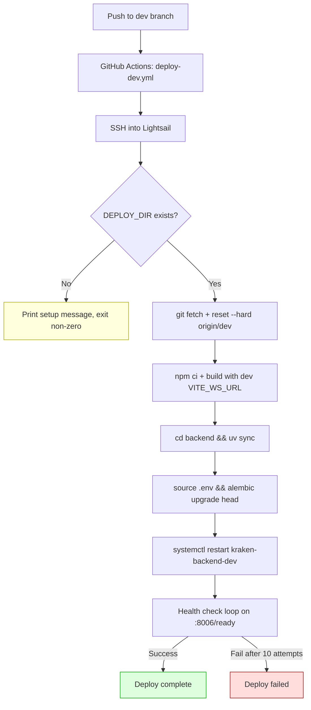

# feat: Add dev branch deployment workflow

## Overview

Create a dev branch deployment pipeline so pushes to the `dev` branch auto-deploy to `dev-kraken.expertintheloop.io` on port 8006. This mirrors the production `main` → `kraken.expertintheloop.io` pipeline but runs as an isolated environment on the same Lightsail instance. The first feature developed on the dev branch will be Clerk OAuth integration.

## Problem Frame

Currently there is no staging/dev environment for kraken-chatbot. All testing happens either locally or by temporarily deploying a feature branch to the production server (then resetting). This is risky and slow. A persistent dev environment allows feature verification at a real URL before merging to main, and the upcoming Clerk OAuth work needs an isolated branch to develop against without disrupting production.

## Requirements Trace

- R1. Pushes to `dev` branch trigger auto-deploy to `dev-kraken.expertintheloop.io`
- R2. Dev runs on port 8006, isolated from production on port 8000
- R3. Dev uses a separate PostgreSQL database (`kraken_dev`) to prevent migration conflicts
- R4. Dev deploys use a concurrency group (`lightsail-deploy-kraken`); prod `deploy.yml` gets the same group via a separate PR to `main` (following biomapper-ui's pattern)
- R5. Version-control all deployment infrastructure (systemd services, nginx configs) for both prod and dev
- R6. WebSocket proxy must work correctly (upgrade headers, long timeouts for pipeline queries)
- R7. CORS configuration is environment-driven (no code changes needed)
- R8. CLAUDE.md documents the dev workflow
- R9. No server-side changes — only create files that will be deployed via GitHub Actions or manually configured by Trent

## Scope Boundaries

- No SSH into the server or server-side changes from this plan
- No changes to application code (CORS/port already env-driven)
- No deletion of the existing `origin/dev_main` branch (Trent handles)
- No authentication changes in this plan (Clerk OAuth is the next feature on dev)

### Deferred to Separate Tasks

- **Server-side setup** (clone dev repo, create `kraken_dev` database, create `.env`, enable nginx config, install systemd service): Manual work by Trent after files are committed
- **Clerk OAuth implementation**: First feature on dev branch after deployment is working
- **Production deploy.yml concurrency group**: Separate small PR to `main` adding `concurrency: { group: lightsail-deploy-kraken, cancel-in-progress: false }` at the workflow level. Until merged, only dev-dev serialization is enforced. Can also add path-based triggers (`client/**`, `backend/**`, `package.json`, `.github/workflows/deploy.yml`) per the task spec

## Context & Research

### Relevant Code and Patterns

- `.github/workflows/deploy.yml` — production deploy workflow; template for dev workflow
- `backend/src/kestrel_backend/config.py` — `PORT`, `HOST`, `ALLOWED_ORIGINS`, `DATABASE_URL` all read from environment via `os.getenv()`
- `client/src/hooks/useWebSocket.ts` — reads `VITE_WS_URL` from `import.meta.env` (baked at build time)
- `client/.env.production` — contains prod `VITE_WS_URL`
- `backend/.env.example` — existing env template for backend
- `vite.config.ts` — builds to `dist/public/` (line 31: `outDir`)
- `backend/alembic.ini` + `backend/alembic/env.py` — migration config reads `DATABASE_URL` from env

### Reference Pattern

- `biomapper-ui/.github/workflows/deploy.yml` and `deploy-dev.yml` — proven dev/prod dual-deploy pattern on the same Lightsail instance. Both use shared concurrency group `lightsail-deploy` at the workflow level. Dev workflow uses `workflow_dispatch` with optional branch input and `environment: development`.

### Institutional Learnings

No existing solutions documented for deployment patterns. This work should be documented after completion.

## Key Technical Decisions

- **Port 8006 (not 8001)**: Port 8001 is potentially in use by biomapper2-api on the same instance. Port 8006 avoids the conflict.
- **Separate PostgreSQL database**: Dev uses `kraken_dev`, prod uses `kraken_db`. Prevents Alembic migration version table conflicts where dev stamps a revision prod doesn't recognize. Also isolates conversation data.
- **Shared concurrency group**: `deploy-dev.yml` uses `concurrency: { group: lightsail-deploy-kraken, cancel-in-progress: false }` at the workflow level (matching biomapper-ui's pattern). A separate small PR to `main` adds the same group to `deploy.yml`. Until that PR merges, dev-prod serialization is not enforced — only dev-dev serialization works. This matches how biomapper-ui was initially set up.
- **No auth for dev initially**: The dev URL will be publicly accessible without authentication. Clerk OAuth will be the first feature implemented on dev, so this exposure window is intentionally short.
- **Deploy directory guard**: The deploy script checks if `$DEPLOY_DIR` exists before proceeding. If missing, it prints a clear error message explaining server-side setup is needed and exits with a non-zero code so the GitHub Actions workflow shows as failed (not a silent green check).
- **WebSocket timeout 3600s**: Pipeline queries can run for minutes with pauses between Claude API calls. The 300s timeout from the task spec is too aggressive; 1 hour prevents mid-conversation drops.
- **nginx basic auth placeholder**: The dev nginx config includes commented-out `auth_basic` directives that Trent can enable before Clerk OAuth is ready, if desired.

## Open Questions

### Resolved During Planning

- **Port conflict**: Port 8001 may be used by biomapper2-api → using port 8006
- **Database isolation**: Shared DB risks migration conflicts → separate `kraken_dev` database
- **Concurrent deploys**: Dev workflow uses `lightsail-deploy-kraken` concurrency group at workflow level (matching biomapper-ui). Prod `deploy.yml` needs the same group via separate PR to `main`
- **WebSocket timeout**: 300s too short for pipeline mode → 3600s for WebSocket locations
- **CORS code changes**: Not needed — `ALLOWED_ORIGINS` already reads from env with comma-separated parsing
- **`dev_main` branch**: Exists on remote, stale. Will be noted but not deleted (Trent's decision).

### Deferred to Implementation

- **Exact `$DEPLOY_DIR` path on server**: Task spec says `/home/ubuntu/kraken-chatbot-dev`. Verify during server-side setup.
- **SSL certificate for `dev-kraken.expertintheloop.io`**: Trent provisions via Let's Encrypt during server setup. The nginx config assumes SSL is handled (certbot directives or upstream load balancer).
- **Double migration execution is safe**: Both the deploy script and `database.py` startup call `alembic upgrade head`. This is already the production pattern (`deploy.yml` line 48 + `database.py` startup). `upgrade head` is idempotent — safe on a dedicated dev DB. No action needed.

## Output Structure

```
deploy/
├── kraken-backend.service              # Prod systemd service (version-controlled)
├── nginx-kraken.conf                   # Prod nginx config (version-controlled)
└── dev/
    ├── kraken-backend-dev.service      # Dev systemd service (port 8006)
    ├── nginx-kraken-dev.conf           # Dev nginx config
    └── .env.example                    # Dev environment template
.github/workflows/
└── deploy-dev.yml                      # New dev deploy workflow
```

## High-Level Technical Design

> *This illustrates the intended approach and is directional guidance for review, not implementation specification. The implementing agent should treat it as context, not code to reproduce.*



```
Lightsail Instance (35.161.242.62)
├── nginx (reverse proxy)
│   ├── kraken.expertintheloop.io     → localhost:8000 (prod)
│   └── dev-kraken.expertintheloop.io → localhost:8006 (dev)
├── kraken-backend.service            → ~/kraken-chatbot/backend (prod, port 8000)
├── kraken-backend-dev.service        → ~/kraken-chatbot-dev/backend (dev, port 8006)
├── PostgreSQL
│   ├── kraken_db                     (prod)
│   └── kraken_dev                    (dev)
└── Shared: npm, uv, Claude OAuth tokens (~/.claude/)
```

## Implementation Units

- [ ] **Unit 1: Create production deployment configs (version-control existing setup)**

**Goal:** Version-control the production systemd service and nginx config that currently only exist on the server.

**Requirements:** R5

**Dependencies:** None

**Files:**
- Create: `deploy/kraken-backend.service`
- Create: `deploy/nginx-kraken.conf`

**Approach:**
- Model the systemd service after what `deploy.yml` implies: uvicorn on port 8000, `WorkingDirectory=/home/ubuntu/kraken-chatbot/backend`, `EnvironmentFile` pointing to `.env`
- Model the nginx config for `kraken.expertintheloop.io`: SPA fallback (`try_files $uri $uri/ /index.html`), WebSocket proxy at `/ws/chat` with upgrade headers and 3600s read timeout, API proxy at `/api/`, health endpoint at `/health`, static files served from `dist/public/` (the Vite build output path, configured in `vite.config.ts`). Prod nginx root: `/home/ubuntu/kraken-chatbot/dist/public`
- These files document the current production state and serve as the template for dev configs

**Patterns to follow:**
- `.github/workflows/deploy.yml` for service name and working directory conventions
- `backend/src/kestrel_backend/config.py` for env var names (`HOST`, `PORT`, `ALLOWED_ORIGINS`)

**Test expectation:** none — pure infrastructure config, no behavioral change

**Verification:**
- `deploy/kraken-backend.service` references port 8000, correct working directory, correct env file path
- `deploy/nginx-kraken.conf` includes WebSocket upgrade headers for `/ws/chat`, SPA fallback, proxy to port 8000

---

- [ ] **Unit 2: Create dev deployment configs**

**Goal:** Create the dev-specific systemd service and nginx config, plus a dev `.env.example`.

**Requirements:** R2, R5, R6

**Dependencies:** Unit 1 (dev configs mirror prod with port/path differences)

**Files:**
- Create: `deploy/dev/kraken-backend-dev.service`
- Create: `deploy/dev/nginx-kraken-dev.conf`
- Create: `deploy/dev/.env.example`

**Approach:**
- Dev systemd service: identical to prod but `PORT=8006`, `WorkingDirectory=/home/ubuntu/kraken-chatbot-dev/backend` (hardcoded, matching how prod hardcodes its path — simpler than a `$DEPLOY_DIR` placeholder requiring sed), service name `kraken-backend-dev`, distinct `SyslogIdentifier` for log separation
- Dev nginx config: `server_name dev-kraken.expertintheloop.io`, proxy to port 8006, root at dev deploy directory's `dist/public/`, same WebSocket upgrade headers and timeout as prod. Include commented-out `auth_basic` block that Trent can enable as a stopgap before Clerk OAuth
- Dev `.env.example`: `HOST=127.0.0.1`, `PORT=8006`, `ALLOWED_ORIGINS=https://dev-kraken.expertintheloop.io`, `KESTREL_API_KEY=`, `DATABASE_URL` pointing to `kraken_dev` database, `AUTH_ENABLED=false`, `RATE_LIMIT_PER_MINUTE=20`, `LANGFUSE_ENABLED=false` (prevents noisy errors when Langfuse keys aren't configured)

**Patterns to follow:**
- `deploy/kraken-backend.service` (Unit 1 output) as the base template
- `deploy/nginx-kraken.conf` (Unit 1 output) as the base template
- `backend/.env.example` for env var naming conventions

**Test expectation:** none — pure infrastructure config

**Verification:**
- Port 8006 is consistently referenced in service file, nginx proxy_pass, `.env.example`, and health check
- Service file hardcodes `/home/ubuntu/kraken-chatbot-dev/backend` for `WorkingDirectory` and `EnvironmentFile`
- nginx config includes `proxy_set_header Upgrade` and `proxy_set_header Connection "upgrade"` for WebSocket
- `.env.example` references `kraken_dev` database in `DATABASE_URL`

---

- [ ] **Unit 3: Create GitHub Actions dev deploy workflow**

**Goal:** Create `.github/workflows/deploy-dev.yml` that auto-deploys on push to `dev`.

**Requirements:** R1, R2, R3, R4

**Dependencies:** Unit 2 (needs to know the dev config file paths and conventions)

**Files:**
- Create: `.github/workflows/deploy-dev.yml`

**Approach:**
- Trigger: push to `dev` branch + `workflow_dispatch` with optional branch input
- Concurrency: `group: lightsail-deploy-kraken`, `cancel-in-progress: false`
- Environment: `development`
- SSH setup: same pattern as `deploy.yml` (base64-decode key, ssh-keyscan)
- Deploy script via SSH heredoc:
  1. Guard: check if `$DEPLOY_DIR` exists, print setup message and exit non-zero if not (so workflow shows as failed, not silent success)
  2. `git fetch origin dev && git reset --hard origin/dev`
  3. `npm ci && VITE_WS_URL=wss://dev-kraken.expertintheloop.io/ws/chat npm run build`
  4. `cd backend && ~/.local/bin/uv sync` (use full path — SSH heredoc sessions do not source .bashrc)
  5. Source `.env` (`set -a && source .env && set +a`), run `~/.local/bin/uv run alembic upgrade head` (same nohup pattern as prod for SSH resilience, but write to `/tmp/alembic-dev.log` to avoid clobbering prod's `/tmp/alembic.log`)
  6. `sudo systemctl restart kraken-backend-dev`
  7. Readiness check: retry loop on `http://localhost:8006/ready` (10 attempts, 3s intervals)
- Use the same secrets: `LIGHTSAIL_SSH_KEY`, `LIGHTSAIL_HOST`, `LIGHTSAIL_USER`
- Deploy dir: `/home/ubuntu/kraken-chatbot-dev` (configurable via env var in the workflow)

**Patterns to follow:**
- `.github/workflows/deploy.yml` — exact SSH setup, heredoc deploy script pattern, nohup Alembic pattern, readiness check loop

**Test scenarios:**
- Happy path: push to `dev` → workflow runs → SSH deploys to `/home/ubuntu/kraken-chatbot-dev` → health check passes on port 8006
- Edge case: `$DEPLOY_DIR` doesn't exist → workflow fails with clear message explaining server setup needed
- Edge case: `workflow_dispatch` with custom branch input → deploys that branch to dev environment
- Error path: Alembic migration fails → deploy stops with non-zero exit, service not restarted
- Error path: health check fails after 10 attempts → workflow fails with diagnostic curl output
- Integration: concurrent push to `main` and `dev` → shared concurrency group serializes them

**Verification:**
- Workflow triggers on push to `dev` and on `workflow_dispatch`
- Concurrency group is `lightsail-deploy-kraken` (shared with prod)
- `VITE_WS_URL` uses `wss://dev-kraken.expertintheloop.io/ws/chat`
- Health check targets port 8006
- Deploy directory guard is present at the top of the SSH script

---

- [ ] **Unit 4: Update CLAUDE.md with dev workflow documentation**

**Goal:** Document the dev branch workflow, URL, port, and promotion flow so future developers (and Claude) know how to use it.

**Requirements:** R8

**Dependencies:** Units 1-3 (document what was built)

**Files:**
- Modify: `CLAUDE.md`

**Approach:**
- Add a "Dev Branch Workflow" section covering:
  - Dev URL (`dev-kraken.expertintheloop.io`) and port (8006)
  - The `dev` branch as a long-lived integration branch
  - How feature branches relate to dev and main (feature branches merge into dev for testing, then PR from feature branch to main for production)
  - Dev deploy trigger (push to `dev`)
  - Manual deployment steps for dev (if needed)
  - Dev database (`kraken_dev`) — separate from prod
  - Note about `origin/dev_main` being stale/superseded
- Note that a separate PR to `main` is needed for the prod concurrency group (until it merges, concurrent dev+prod deploys are unprotected)
  - Note that prod and dev share Claude OAuth tokens (`~/.claude/`) — if OAuth expires, both environments lose access simultaneously

**Patterns to follow:**
- Existing CLAUDE.md structure and heading hierarchy

**Test expectation:** none — documentation only

**Verification:**
- CLAUDE.md has a "Dev Branch Workflow" section
- Port 8006 and `dev-kraken.expertintheloop.io` are documented
- The dev-to-main promotion flow is described

---

- [ ] **Unit 5: Create `dev` branch and commit all changes**

**Goal:** Create the `dev` branch from `main`, commit all new/modified files, and push.

**Requirements:** R1, R9

**Dependencies:** Units 1-4 (all files must be created first)

**Files:**
- All files from Units 1-4

**Approach:**
- Create `dev` branch from current `main`: `git checkout -b dev`
- Stage and commit all changes with a clear message
- Push with `git push -u origin dev`
- Do NOT merge to main — this stays on dev
- The push will trigger the deploy-dev workflow, which will hit the `$DEPLOY_DIR` guard and fail with a clear message since server-side setup hasn't happened yet

**Test expectation:** none — git operations only

**Verification:**
- `dev` branch exists on remote
- All deployment files are committed
- The deploy-dev workflow triggers (and fails with clear message due to missing `$DEPLOY_DIR` — expected before server setup)
- `main` branch is unchanged

## System-Wide Impact

- **Interaction graph:** The new `deploy-dev.yml` workflow uses a concurrency group (`lightsail-deploy-kraken`). For full dev-prod serialization, `deploy.yml` on `main` also needs this group (deferred to a separate PR). Both workflows SSH into the same server. nginx config changes on the server affect both environments.
- **Error propagation:** A failed dev deploy does not affect production. Once the prod concurrency group PR merges, a slow dev deploy will delay a queued prod deploy (and vice versa). **Until then, concurrent dev+prod deploys are unprotected** — mitigated by deploys being infrequent and fast (~2 min).
- **State lifecycle risks:** If Trent forgets to create the `kraken_dev` database before the first real deploy, Alembic will fail and the deploy script will exit non-zero. The service won't restart with a broken migration.
- **API surface parity:** The dev environment exposes the same API surface as prod (WebSocket at `/ws/chat`, REST at `/api/*`, health at `/health` and `/ready`). No new endpoints.
- **Integration coverage:** The deploy-dev workflow + server-side setup + nginx config form a multi-component integration that can only be fully tested by pushing to `dev` after Trent completes server setup.
- **Unchanged invariants:** Production deployment behavior is completely unchanged by this plan. The concurrency group addition to `deploy.yml` is deferred to a separate PR to `main`. No application code changes.

## Risks & Dependencies

| Risk | Mitigation |
|------|------------|
| Port 8006 also in use on the server | Trent verifies port availability during server-side setup. Easy to change in `.env` and service file. |
| Concurrent dev+prod deploys before prod concurrency group PR merges | Deploys are infrequent and fast (~2 min). Once the separate PR adds the group to `deploy.yml` on `main`, full serialization is enforced. |
| Dev environment exposed without auth until Clerk OAuth ships | Short exposure window. Commented-out nginx `auth_basic` block available as stopgap. Dev URL not widely known. |
| Server-side setup incomplete when first push to `dev` happens | Deploy script guard checks `$DEPLOY_DIR` existence, exits non-zero with a clear message. |
| Claude OAuth tokens shared between prod and dev (`~/.claude/`) | Both instances run under the same `ubuntu` user. If OAuth expires, both environments lose Claude access simultaneously. Document this risk in CLAUDE.md. |
| `origin/dev_main` branch causes confusion | Note in CLAUDE.md that `dev_main` is stale and superseded by `dev`. |

## Documentation / Operational Notes

- **Server-side setup checklist for Trent** (after files are committed):
  1. Create `/home/ubuntu/kraken-chatbot-dev` via `git clone` of the repo, checkout `dev`
  2. Create PostgreSQL database: `createdb kraken_dev`
  3. Copy `deploy/dev/.env.example` to `/home/ubuntu/kraken-chatbot-dev/backend/.env`, fill in secrets, then set permissions: `chmod 600 /home/ubuntu/kraken-chatbot-dev/backend/.env`
  4. Install systemd service: `sudo cp deploy/dev/kraken-backend-dev.service /etc/systemd/system/`
  5. Install nginx config: `sudo cp deploy/dev/nginx-kraken-dev.conf /etc/nginx/sites-available/`, symlink to `sites-enabled`
  6. Provision SSL: `sudo certbot --nginx -d dev-kraken.expertintheloop.io`
  7. `sudo nginx -t && sudo systemctl reload nginx`
  8. `sudo systemctl daemon-reload && sudo systemctl enable kraken-backend-dev`
  9. Push any change to `dev` to trigger the first real deploy
- After this work, document the dual-environment pattern in `docs/solutions/` for institutional knowledge

## Sources & References

- Related code: `.github/workflows/deploy.yml`, `backend/src/kestrel_backend/config.py`
- Reference pattern: `biomapper-ui/.github/workflows/deploy.yml` + `deploy-dev.yml` (shared concurrency group, workflow-level, path triggers)
- Task spec: `AGENT-TASK-dev-branch.md`
- Existing branch: `origin/dev_main` (stale, noted but not deleted)
