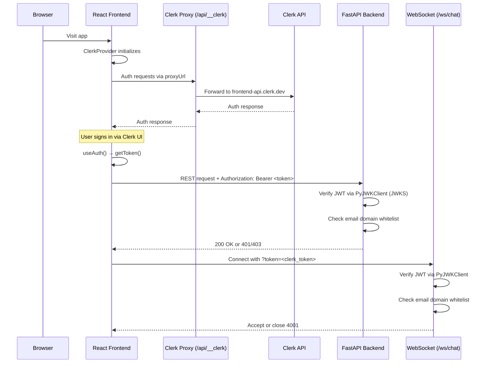

# feat: Integrate Clerk authentication

## Overview

Add Clerk authentication to the kraken-chatbot, replicating the proven pattern from biomapper-ui. Users sign in via Clerk, and access is gated by email domain whitelist. The frontend uses `@clerk/react` with a proxy URL for the custom domain, and the backend uses PyJWT to verify Clerk session tokens. This replaces the existing feature-flagged JWT + API key auth system.

## Problem Frame

The dev environment at `dev-kraken.expertintheloop.io` is currently publicly accessible with no authentication. Anyone who discovers the URL can use it, consuming Claude API credits. The existing auth system (`auth.py`) has the database schema and JWT scaffolding but no user-facing login flow or external identity provider. Clerk provides managed authentication with social sign-in, email verification, and a pre-built UI — the same stack already running in production on biomapper-ui.

## Requirements Trace

- R1. Users must sign in via Clerk before accessing the chat interface
- R2. Access gated by email domain whitelist (configurable via env var), with per-email overrides
- R3. Dual auth gates: frontend UX gate (early redirect to login) + backend API gate (authoritative)
- R4. WebSocket connections must carry and validate Clerk session tokens
- R5. Clerk FAPI proxied through the app's own domain (no CNAME to Clerk needed)
- R6. Auth controlled via explicit `CLERK_AUTH_ENABLED` flag (default `true` in deployment templates). When enabled but `CLERK_SECRET_KEY` is missing, the app fails to start rather than silently disabling auth. Set `CLERK_AUTH_ENABLED=false` explicitly for local development.
- R7. Clerk environment variables configured for both dev and prod deployments
- R8. Pattern matches biomapper-ui's Clerk implementation as closely as architecture allows

## Scope Boundaries

- No user roles or permissions beyond the email domain gate
- No changes to the discovery pipeline or KG query logic
- No migration of existing conversation data to user accounts
- The existing `kraken_users` table and `auth.py` JWT system are replaced, not extended

### Deferred to Separate Tasks

- **Production deployment of Clerk auth**: This feature develops on `dev` branch first. Production gets it after verification.
- **User profile UI**: No account settings, profile page, or user management beyond sign-in/sign-out
- **Rate limiting per authenticated user**: Current per-IP rate limiting stays; per-user quotas are future work

## Context & Research

### Relevant Code and Patterns

**biomapper-ui (reference implementation):**
- `artifacts/frontend/src/App.tsx` — ClerkProvider setup, ProtectedRoute component, email domain gating
- `artifacts/frontend/src/pages/access-denied.tsx` — access denied UI
- `artifacts/api-server/src/app.ts` — `@clerk/express` middleware, `requireMapAuth` gate, dual Clerk env vars
- `artifacts/api-server/src/middlewares/clerkProxyMiddleware.ts` — FAPI proxy at `/api/__clerk`
- `deploy/.env.example` — Clerk env var template

**kraken-chatbot (current auth):**
- `backend/src/kestrel_backend/auth.py` — JWT + API key hybrid (will be replaced)
- `backend/src/kestrel_backend/config.py` — `AUTH_ENABLED`, `JWT_SECRET_KEY`, `API_KEYS` settings
- `backend/src/kestrel_backend/main.py:674-699` — WebSocket auth via `?token=` query param
- `client/src/hooks/useWebSocket.ts` — reads `VITE_AUTH_TOKEN`, appends to WS URL, handles 4001 close code
- `backend/alembic/versions/002_add_users_table.py` — `kraken_users` table with `api_key_hash`

### External References

- Clerk React SDK: `@clerk/react` v6.x — `ClerkProvider`, `useUser()`, `useAuth()`, `SignIn`, `SignUp` components
- Clerk JWT verification: `PyJWT` with `PyJWKClient` — fetches JWKS from Clerk's well-known endpoint, verifies RS256 tokens
- Clerk FAPI proxy: custom domain proxy at `/api/__clerk` avoids CNAME requirement, needs 3 headers: `Clerk-Proxy-Url`, `Clerk-Secret-Key`, `X-Forwarded-For`

## Key Technical Decisions

- **PyJWT for backend verification (not Clerk Python SDK)**: The official `clerk-backend-api` SDK expects `httpx.Request`, not Starlette/FastAPI `Request`, creating unnecessary friction. `PyJWT` + `PyJWKClient` is simpler, well-maintained, and gives full control over claim validation.
- **Clerk proxy via FastAPI (not nginx)**: biomapper-ui proxies Clerk FAPI through Express middleware. Kraken needs the same via a FastAPI route at `/api/__clerk/{path}` that forwards requests to `https://frontend-api.clerk.dev` with the required headers. This keeps the pattern consistent and avoids nginx config changes.
- **Replace existing auth system**: The current `auth.py` JWT + API key system is unused (AUTH_ENABLED=false) and was scaffolding. Clerk replaces it entirely. The `kraken_users` table can be repurposed or a new Clerk-aware user tracking approach adopted.
- **WebSocket auth via Clerk session token**: The frontend calls `session.getToken()` from `@clerk/react` and appends it to the WebSocket URL as `?token=<clerk_token>`. The backend verifies it with the same PyJWT JWKS flow used for REST endpoints. Token is verified **once at connect time** — established connections are not re-verified mid-session (the 60s token TTL is sufficient for the handshake).
- **Suppress WebSocket token from nginx logs**: Add `access_log off;` to the `/ws/chat` location block in both nginx configs to prevent Clerk session tokens in `?token=` from being written to access logs.
- **Email domain gating matches biomapper-ui**: `ALLOWED_EMAIL_DOMAINS` (backend, authoritative) and `VITE_ALLOWED_EMAIL_DOMAINS` (frontend, UX-level). Both configurable via env vars, comma-separated.
- **Clerk application**: Create a new Clerk application in the dashboard for `expertintheloop.io`. Dev and prod environments within the same Clerk app, or separate apps — resolved during implementation based on Clerk's environment model.
- **Explicit auth flag replaces implicit detection**: Use `CLERK_AUTH_ENABLED=true` (default in deployment templates) instead of inferring from `CLERK_SECRET_KEY` presence. When `CLERK_AUTH_ENABLED=true` but `CLERK_SECRET_KEY` is missing, the app must fail to start with a clear error. This prevents misconfigured deployments from silently bypassing auth. Set `CLERK_AUTH_ENABLED=false` explicitly for local development without Clerk keys.
- **Clerk proxy path allowlist**: The `/api/__clerk/{path}` proxy must restrict forwarded paths to only those the Clerk React SDK needs (e.g., `/v1/client`, `/.well-known/`). Reject and log requests to any other path. This prevents the admin-level `CLERK_SECRET_KEY` from being used to reach arbitrary Clerk API surfaces.

## Open Questions

### Resolved During Planning

- **Backend Clerk verification approach**: Use `PyJWT` + `PyJWKClient` (not Clerk Python SDK) — avoids httpx.Request friction
- **Proxy approach**: FastAPI route at `/api/__clerk/{path}` — matches biomapper-ui pattern without nginx changes
- **Existing auth system**: Replace entirely — it was scaffolding never used in production
- **DNS requirements**: No CNAME needed — proxy approach routes through the app's own domain

### Deferred to Implementation

- **Clerk application setup**: Create application in Clerk dashboard, configure allowed origins, get publishable/secret keys. Depends on whether dev and prod share a Clerk app or use separate ones.
- **Exact Clerk JWKS URL**: Derived from the Clerk instance ID after app creation
- **Squarespace DNS records**: May need verification TXT records if Clerk requires domain verification. Exact records determined during Clerk dashboard setup.
- **Whether to keep `kraken_users` table**: May repurpose it to store Clerk user IDs for conversation ownership, or create a lightweight mapping. Decide during implementation based on how much conversation-user linking is needed.

## High-Level Technical Design

> *This illustrates the intended approach and is directional guidance for review, not implementation specification. The implementing agent should treat it as context, not code to reproduce.*

## Implementation Units

- [ ] **Unit 1: Clerk dashboard setup and environment configuration**

**Goal:** Create the Clerk application, configure it for the dev domain, and add env vars to the dev deployment.

**Requirements:** R5, R7

**Dependencies:** None

**Files:**
- Modify: `deploy/dev/.env.example`
- Modify: `backend/.env.example`

**Approach:**
- Create a new Clerk application in the Clerk dashboard (or use the existing expertintheloop.io account)
- Configure allowed origins: `https://dev-kraken.expertintheloop.io`
- Enable the proxy URL feature in the Clerk dashboard for the dev domain
- Add env vars to `deploy/dev/.env.example`: `VITE_CLERK_PUBLISHABLE_KEY`, `CLERK_SECRET_KEY`, `VITE_CLERK_PROXY_URL`, `CLERK_JWKS_URL`, `ALLOWED_EMAIL_DOMAINS`, `ALLOWED_EMAILS`
- Update the server `.env` file with actual Clerk keys
- Update `backend/.env.example` with Clerk-related env var placeholders

**Patterns to follow:**
- `biomapper-ui/deploy/.env.example` and `biomapper-ui/deploy/dev/.env.example` for Clerk env var naming

**Test expectation:** none — manual dashboard configuration and env var setup

**Verification:**
- Clerk application exists in dashboard with dev domain configured
- Dev server `.env` has `CLERK_SECRET_KEY` and `VITE_CLERK_PUBLISHABLE_KEY` set
- `deploy/dev/.env.example` documents all required Clerk env vars

---

- [ ] **Unit 2: Backend Clerk JWT verification and proxy**

**Goal:** Add Clerk session token verification to FastAPI and a proxy route for the Clerk FAPI.

**Requirements:** R3, R4, R5, R6

**Dependencies:** Unit 1 (needs Clerk env vars)

**Files:**
- Create: `backend/src/kestrel_backend/clerk_auth.py`
- Create: `backend/src/kestrel_backend/clerk_proxy.py`
- Modify: `backend/src/kestrel_backend/config.py`
- Modify: `backend/src/kestrel_backend/main.py`
- Modify: `backend/pyproject.toml`
- Test: `backend/tests/test_clerk_auth.py`

**Approach:**
- Add `PyJWT[crypto]` to `pyproject.toml` dependencies
- Create `clerk_auth.py` with:
  - `PyJWKClient` pointed at `CLERK_JWKS_URL` (cached internally)
  - `verify_clerk_token(token: str) -> dict` — verifies RS256 JWT with explicit algorithm pinning (`algorithms=['RS256']` — never derive from token header to prevent alg:none attacks), validates `exp`, `nbf`, `iss`, and `azp` (authorized party) claims, returns payload
  - `get_current_user` FastAPI dependency — extracts Bearer token from Authorization header, calls `verify_clerk_token`, checks email domain against `ALLOWED_EMAIL_DOMAINS` / `ALLOWED_EMAILS`
  - `validate_ws_clerk_token(token: str) -> dict` — same verification for WebSocket tokens (extracted from query param)
  - Feature flag: controlled by `CLERK_AUTH_ENABLED` env var (default `true`). When `true` but `CLERK_SECRET_KEY` is missing, fail startup with a clear error. When `false`, auth is skipped entirely (local dev mode). This prevents misconfigured deployments from silently disabling auth.
- Create `clerk_proxy.py` with:
  - FastAPI route at `/api/__clerk/{path:path}` that proxies to `https://frontend-api.clerk.dev/{path}`
  - Path allowlist: only forward paths the Clerk React SDK needs (e.g., `/v1/client`, `/.well-known/`). Reject and log requests to non-allowlisted paths with 403.
  - Adds required headers: `Clerk-Proxy-Url` (derived from config, e.g., `https://dev-kraken.expertintheloop.io/api/__clerk`), `Clerk-Secret-Key` (from env), `X-Forwarded-For` (from `Request.client.host`)
  - Forward full request: method, headers (including cookies), body, query params via a shared `httpx.AsyncClient`
  - Forward response: status code, headers (including `Set-Cookie`), body back to the browser
  - Only active when `CLERK_AUTH_ENABLED=true`
- Update `config.py`: add `clerk_secret_key`, `clerk_jwks_url`, `clerk_issuer`, `allowed_email_domains`, `allowed_emails` settings (reuse existing `allowed_origins` pattern)
- Update `main.py`: mount the Clerk proxy router, replace existing `validate_api_key` / `validate_ws_token` with Clerk equivalents on protected endpoints and WebSocket

**Patterns to follow:**
- `biomapper-ui/artifacts/api-server/src/middlewares/clerkProxyMiddleware.ts` for proxy logic
- `biomapper-ui/artifacts/api-server/src/app.ts` for `requireMapAuth` gate pattern
- Existing `backend/src/kestrel_backend/auth.py` for the FastAPI dependency pattern

**Test scenarios:**
- Happy path: valid Clerk JWT with allowed email domain → returns user payload with `sub` (user ID) and email
- Happy path: valid JWT with email in `ALLOWED_EMAILS` override → access granted
- Error path: expired JWT → 401 Unauthorized
- Error path: JWT with unrecognized `kid` (key not in JWKS) → 401
- Error path: valid JWT but email domain not in whitelist → 403 Forbidden
- Edge case: `CLERK_AUTH_ENABLED=false` → auth skipped, all requests pass (local dev mode)
- Edge case: `CLERK_AUTH_ENABLED=true` but `CLERK_SECRET_KEY` not set → app fails to start with clear error
- Edge case: malformed token (not a JWT) → 401
- Edge case: token with `alg: none` header → 401 (algorithm pinning prevents bypass)
- Edge case: valid token missing `azp` claim → verify behavior matches Clerk's expected claims
- Edge case: proxy request to non-allowlisted path (e.g., `/api/__clerk/v1/users`) → 403
- Integration: REST endpoint with `Depends(get_current_user)` → rejects unauthenticated request, accepts valid Clerk token
- Integration: WebSocket connection with valid Clerk token in `?token=` → accepted
- Integration: WebSocket connection with invalid/missing token → closed with 4001

**Verification:**
- `PyJWT[crypto]` is in `pyproject.toml`
- Protected REST endpoints return 401 without token, 200 with valid Clerk token
- WebSocket accepts connections with valid Clerk token
- `/api/__clerk/` proxy forwards allowlisted paths to Clerk FAPI, rejects non-allowlisted paths with 403
- Auth is skipped when `CLERK_AUTH_ENABLED=false`; app fails to start when `CLERK_AUTH_ENABLED=true` without `CLERK_SECRET_KEY`

---

- [ ] **Unit 3: Frontend Clerk integration and auth UI**

**Goal:** Add `@clerk/react`, wrap the app in ClerkProvider, create login/signup pages, and protect the chat route.

**Requirements:** R1, R2, R3, R5, R6

**Dependencies:** Unit 2 (backend must accept Clerk tokens)

**Files:**
- Create: `client/src/components/ProtectedRoute.tsx`
- Create: `client/src/pages/Login.tsx`
- Create: `client/src/pages/SignUp.tsx`
- Create: `client/src/pages/AccessDenied.tsx`
- Modify: `client/src/App.tsx` (or equivalent root component)
- Modify: `client/src/hooks/useWebSocket.ts`
- Modify: `package.json`

**Approach:**
- Add `@clerk/react` to `package.json`
- Wrap the app root in `<ClerkProvider publishableKey={...} proxyUrl={...}>` with Vite env vars
- Create `ProtectedRoute` component: checks `useUser()` for auth state, validates email domain against `VITE_ALLOWED_EMAIL_DOMAINS` / `VITE_ALLOWED_EMAILS`, redirects to `/login` if not signed in, shows `AccessDenied` if email not allowed
- Create `/login` page with Clerk's `<SignIn />` component
- Create `/sign-up` page with Clerk's `<SignUp />` component
- Create `AccessDenied` page for unauthorized email domains
- Modify `useWebSocket.ts`: replace `VITE_AUTH_TOKEN` with `useAuth().getToken()` from Clerk, append to WebSocket URL. Token is verified once at connection time — no mid-session refresh needed. If the connection drops, reconnect with a fresh token (existing reconnection logic already handles this).
- Add Authorization header to REST API calls (`/api/conversations/{id}`, `/api/feedback`) using `useAuth().getToken()`
- When `VITE_CLERK_PUBLISHABLE_KEY` is not set AND `CLERK_AUTH_ENABLED` is not `true` on the backend, the app renders without auth (local dev mode). Both frontend and backend must agree on the auth state.

**Patterns to follow:**
- `biomapper-ui/artifacts/frontend/src/App.tsx` for ClerkProvider setup, ProtectedRoute pattern, email domain gating
- `biomapper-ui/artifacts/frontend/src/pages/access-denied.tsx` for denied access UI
- Existing `client/src/hooks/useWebSocket.ts` for the `?token=` pattern (reuse, replace token source)

**Test scenarios:**
- Happy path: unauthenticated user visits `/` → redirected to `/login`
- Happy path: user signs in with allowed email domain → redirected to chat interface
- Happy path: WebSocket connects with Clerk token → messages flow normally
- Error path: user signs in with unauthorized email domain → shown AccessDenied page
- Error path: user signs out → redirected to `/login`, WebSocket disconnected
- Edge case: WebSocket connection drops mid-conversation → frontend reconnects with fresh Clerk token (pipeline progress lost, pre-existing limitation)
- Edge case: `VITE_CLERK_PUBLISHABLE_KEY` not set → app renders without auth (local dev mode, must match backend `CLERK_AUTH_ENABLED=false`)

**Verification:**
- Visiting the app without signing in redirects to `/login`
- Clerk sign-in flow completes and redirects to chat
- WebSocket connects successfully with Clerk session token
- Unauthorized email domains see the AccessDenied page
- Sign-out clears session and redirects

---

- [ ] **Unit 4: Remove legacy auth system**

**Goal:** Remove the unused JWT + API key auth system now that Clerk handles authentication.

**Requirements:** R8 (clean pattern match with biomapper-ui)

**Dependencies:** Units 2-3 (Clerk auth must be working first)

**Files:**
- Delete: `backend/src/kestrel_backend/auth.py`
- Delete: `backend/tests/test_auth.py`
- Delete: `backend/AUTH_README.md`
- Modify: `backend/src/kestrel_backend/config.py` (remove `jwt_secret_key`, `jwt_algorithm`, `jwt_expire_minutes`, `api_keys` settings)
- Modify: `backend/src/kestrel_backend/main.py` (remove imports of old auth functions)
- Modify: `backend/tests/test_websocket_e2e.py` (update auth mocks to use clerk_auth)
- Modify: `backend/tests/test_database_integration.py` (remove legacy auth imports)
- Modify: `backend/tests/conftest.py` (remove create_access_token usage)
- Modify: `backend/pyproject.toml` (remove `python-jose[cryptography]` and `passlib[bcrypt]` dependencies)
- Modify: `backend/.env.example` (remove `JWT_SECRET_KEY`, `JWT_ALGORITHM`, `JWT_EXPIRE_MINUTES`, `API_KEYS`)

**Approach:**
- Delete `auth.py` entirely — all auth now flows through `clerk_auth.py`
- Delete `test_auth.py` and `AUTH_README.md` — legacy auth documentation and tests
- Update test files that import from auth.py to use clerk_auth equivalents
- Remove `python-jose[cryptography]` and `passlib[bcrypt]` from `pyproject.toml` — no longer needed after auth.py removal (PyJWT is the replacement)
- Remove legacy auth settings from `config.py` (keep `auth_enabled` as a Clerk feature flag or rename to `clerk_enabled`)
- Remove old auth imports from `main.py`
- Clean up `.env.example` files
- Do NOT drop the `kraken_users` database table in this unit — it may be useful for conversation ownership tracking later

**Test expectation:** none — pure removal of dead code. Verify no imports break.

**Verification:**
- `auth.py` is deleted
- No references to `validate_api_key` or `validate_ws_token` remain in the codebase
- App starts without errors
- Clerk auth still works after removal

---

- [ ] **Unit 5: Update deployment configs and documentation**

**Goal:** Update environment templates, CLAUDE.md, and deployment workflow for Clerk auth support.

**Requirements:** R7, R8

**Dependencies:** Units 1-4

**Files:**
- Modify: `deploy/dev/.env.example`
- Modify: `deploy/nginx-kraken.conf`
- Modify: `deploy/dev/nginx-kraken-dev.conf`
- Modify: `CLAUDE.md`
- Modify: `client/.env.production`

**Approach:**
- Ensure `deploy/dev/.env.example` has all Clerk env vars documented with comments (including `CLERK_AUTH_ENABLED=true`)
- Add `access_log off;` to the `/ws/chat` location block in both nginx configs to prevent Clerk session tokens from being logged
- Add Clerk env vars to `client/.env.production` (with placeholder publishable key for prod)
- Update CLAUDE.md with:
  - Clerk auth section explaining the pattern
  - Required Clerk env vars for new deployments
  - How email domain whitelisting works
  - Note that the Clerk proxy at `/api/__clerk` must be accessible

**Test expectation:** none — documentation and config

**Verification:**
- All Clerk env vars documented in `.env.example` files
- CLAUDE.md explains the auth pattern
- A fresh deployment using the template would have clear guidance on Clerk setup

## System-Wide Impact

- **Interaction graph:** The Clerk proxy route (`/api/__clerk`) is a new HTTP surface. The auth middleware runs on every REST request and WebSocket connection. Clerk's JavaScript SDK makes network calls to the proxy on page load and token refresh.
- **Error propagation:** If Clerk's FAPI is down, the proxy returns errors to the frontend and users can't sign in. Existing signed-in sessions with valid JWTs continue to work until token expiry (Clerk tokens are short-lived, typically 60s, auto-refreshed by the SDK).
- **State lifecycle risks:** Clerk manages session state externally. If `CLERK_SECRET_KEY` is rotated, existing tokens become unverifiable — all users are signed out. JWKS key rotation is handled automatically by `PyJWKClient`'s cache.
- **API surface parity:** REST endpoints and WebSocket both use the same Clerk verification. No endpoint is protected by one mechanism but not the other.
- **Integration coverage:** End-to-end test of: sign in via Clerk → navigate to chat → WebSocket connects with Clerk token → send message → pipeline runs. This is the critical path that proves auth doesn't break the core chat experience.
- **Unchanged invariants:** The discovery pipeline, KG queries, conversation storage, and WebSocket message protocol are unchanged. Auth is purely a gate, not a data transformation.

## Risks & Dependencies

| Risk | Mitigation |
|------|------------|
| Clerk FAPI outage prevents sign-in | Existing signed-in sessions continue (tokens cached). Clerk has high availability. Feature flag allows disabling auth. |
| PyJWT JWKS cache staleness after key rotation | `PyJWKClient` automatically refreshes on `kid` mismatch. |
| WebSocket token expiry during long pipeline runs | Token is verified once at connection time (60s TTL is sufficient for the handshake). Established WebSocket connections are not re-verified. If the connection drops mid-pipeline, progress is lost (no server-side state persistence) — this is a pre-existing limitation, not introduced by Clerk. |
| Clerk proxy exposes CLERK_SECRET_KEY in memory | Same pattern as biomapper-ui production. Secret is in server process memory, not in responses. |
| Email domain whitelist is too restrictive or too broad | Configurable via env var without code changes. `ALLOWED_EMAILS` provides per-user overrides. |
| Local development requires Clerk keys | `CLERK_AUTH_ENABLED=false` explicitly disables auth. When `true` (default in deployments), missing `CLERK_SECRET_KEY` fails startup rather than silently disabling auth. |
| WebSocket token visible in nginx logs | `access_log off;` on `/ws/chat` location blocks. Tokens are short-lived (~60s) which limits exposure. |
| Clerk proxy used as open relay to Clerk API | Path allowlist restricts forwarded paths to SDK-needed endpoints only. Non-allowlisted paths return 403. |

## Documentation / Operational Notes

- **Clerk dashboard**: After creating the application, note the Instance ID for deriving the JWKS URL
- **Squarespace DNS**: If Clerk requires domain verification, add TXT records. The proxy approach should avoid needing CNAME records.
- **Token flow**: Clerk tokens are short-lived (~60s). The `@clerk/react` SDK handles refresh automatically. The backend verifies each token independently via JWKS — no session storage needed server-side.
- **Monitoring**: Failed auth attempts will appear as 401/403 in nginx access logs and FastAPI logs

## Sources & References

- Reference implementation: `biomapper-ui` Clerk integration (see Context & Research section)
- Clerk React SDK: `@clerk/react` v6.x
- Clerk JWT verification: PyJWT + PyJWKClient (manual verification approach)
- Clerk FAPI proxy docs: https://clerk.com/docs/guides/dashboard/dns-domains/proxy-fapi
- Clerk manual JWT verification: https://clerk.com/docs/guides/sessions/manual-jwt-verification
- Prior plan: `docs/plans/2026-05-06-001-feat-dev-branch-deployment-plan.md` (dev environment setup)
