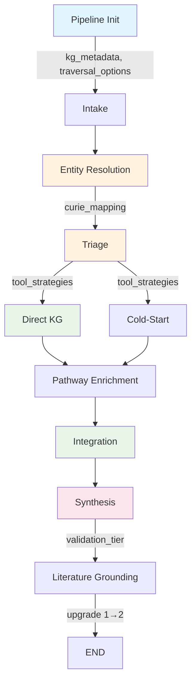

> **Review corrections (2026-05-30) appended at the end of this document** — code-verified fixes
> to Units 4–8 and the D-note fold-ins. Read `## Review Corrections (2026-05-30)` before implementing.

# feat: Method-Aware Discovery Pipeline via Kestrel API Depth

## Overview

The KRAKEN discovery pipeline currently uses ~8 of 22 Kestrel REST API endpoints and 2 of 6 ranking presets. This plan wires in 4 unused endpoints (`subgraph`, `canonicalize`, `traversal-options`, `metagraph`), expands ranking preset usage, adds multi-hop queries to Direct KG, and introduces per-entity tool strategies so that Triage routes different API call patterns based on entity sparsity. A new `validation_tier` field on hypotheses provides interpretive framing from the systematic review's validation hierarchy.

All changes are additive — existing analysis stays, new endpoints augment.

## Problem Frame

Researchers using KRAKEN get shallower analysis than the knowledge graph supports. Dense entities and sparse entities receive identical API call patterns despite having fundamentally different KG profiles. The pipeline ignores ranking presets beyond `established` and `hidden_gems`, never uses multi-hop in Direct KG, and leaves several verified endpoints uncalled. (See origin: `docs/brainstorms/kestrel-api-depth-requirements.md`)

## Requirements Trace

- R1. Triage outputs `tool_strategies: dict[str, ToolStrategy]` keyed by CURIE
- R2. Downstream nodes read tool strategies and adapt API calls accordingly
- R3. Direct KG expands from 2 presets to strategy-informed preset selection
- R4. Validate all 6 presets differentiate results before wiring all in
- R5. Direct KG uses `/multi-hop` for well-characterized entities
- R6. Integration uses `/subgraph` for connecting subgraphs between entities
- R7. Entity Resolution calls `/canonicalize` after CURIE resolution
- R8. Pipeline init queries `/traversal-options` and `/metagraph`, caches results
- R9. Hypotheses carry `validation_tier` field (4 tiers)
- R10. Synthesis presents tier-specific attrition context as interpretive framing

## Scope Boundaries

- **In scope:** Wiring verified REST API endpoints into the pipeline via `kestrel_client.py`; per-entity triage routing; validation tier metadata on hypotheses
- **Out of scope:** Classic mode changes; the 5 agent-side "discovery" tools (Claude SDK prompts, not API endpoints); training ML models; new Kestrel API endpoints; frontend UI changes; literature grounding changes beyond validation_tier upgrade
- **Not changing:** Pipeline topology (current 10 nodes unchanged; Pipeline Init adds an 11th), WebSocket protocol, existing `tier: Literal[1, 2, 3]` semantics

### Deferred to Separate Tasks

- Classic mode MCP tool expansion (separate concern from pipeline HTTP calls)
- Frontend rendering of validation_tier metadata
- Performance optimization pass after profiling baseline is established

## Context & Research

### Relevant Code and Patterns

- **Node signature:** `async def run(state: DiscoveryState) -> dict[str, Any]` with `@validate_state(InputModel, OutputModel)` decorator
- **Two-tier execution:** Tier 1 (direct API via `call_kestrel_tool`) → Tier 2 (Claude SDK fallback). Pattern consistent across entity_resolution, triage, direct_kg, cold_start, integration
- **State models:** Frozen Pydantic with `ConfigDict(frozen=True)`. Modify via `model_copy(update={...})`
- **Parallel safety:** Fields using `Annotated[list[X], operator.add]` in `DiscoveryState` merge safely across parallel branches
- **Dedup pattern:** `_merge_into_deduped()` in `direct_kg.py` tracks preset as string, collapses to `"both"` for 2 presets. Must be extended for 6 presets
- **Config pattern:** Per-node Pydantic models in `pipeline_config.py` with `Field(description=...)` documenting rationale
- **Error pattern:** Nodes return `errors: list[str]` via `operator.add` reducer
- **API call pattern:** `call_kestrel_tool(name, arguments)` returns `{"content": [...], "isError": bool}`. Parse JSON from `content[0]["text"]`
- **`multi_hop_query()` wrapper:** `kestrel_client.py` lines 340-403. Takes `start_node_ids`, optional `end_node_ids`, `max_hops`, `predicate_filter`, `limit`. Currently only used in integration (doubly-pinned mode)

### Institutional Learnings

- **State validation OR-semantics:** Use `@model_validator(mode='after')` for nodes receiving input from multiple upstream branches (`docs/solutions/best-practices/langgraph-pipeline-production-formalization.md`)
- **Tier 2 fallback coverage:** Triage Tier 2 had zero test coverage and contained a NameError bug. New code must test fallback paths (`docs/solutions/runtime-errors/triage-tier2-undefined-variable-2026-05-06.md`)
- **Semaphore values differ intentionally:** Entity resolution/triage use semaphore=1 (CLI spawn conflicts); batch analysis nodes use 6-8. Do not homogenize
- **Config-flagged rollout:** Ship new behavioral changes behind a config flag, flip in a separate PR after quality measurement

### External References

- Kestrel REST API: OpenAPI spec at `https://kestrel.nathanpricelab.com/api/docs`
- Systematic review of 135+ biomedical link prediction studies (directional guidance for method selection by entity sparsity) — [vendored PDF](../references/biomedical-link-prediction-methods-and-evidence.pdf)

## Key Technical Decisions

- **New `pipeline_init` node before intake:** `build_discovery_graph()` is synchronous — no async init hook exists. A new node at the graph entry point fits the existing `async def run(state) -> dict` pattern and naturally integrates with state contracts. Queries `/traversal-options` and `/metagraph` once per pipeline invocation (per-session cache, no invalidation needed since these don't change during a single analysis)
- **`tool_strategies` is a read-only dict, not a reducer field:** Triage is the sole writer, writing before the parallel fork. Downstream nodes only read. Plain dict field in `DiscoveryState` — no `operator.add` annotation needed. LangGraph guarantees Triage completes before the fork, so reads are safe
- **CURIE mapping for /canonicalize, not replacement:** Add `canonical_curie: str | None` to `EntityResolution` and `curie_mapping: dict[str, str]` to `DiscoveryState`. Downstream nodes prefer canonical CURIEs when available. Original CURIEs remain valid for backward-compatible lookups. This avoids re-keying all prior state
- **Preset tracking changes from string to set:** The current dedup collapses to `"both"` for 2 presets — meaningless with 6. Track contributing presets as `set[str]` internally, render as sorted comma-separated string in `discovery_preset` field. `DiseaseAssociation.discovery_preset` and `PathwayMembership.discovery_preset` field type stays `str` (no model change needed)
- **Strategy-informed preset selection, not all-6-for-everyone:** Each entity's strategy specifies 2-4 presets based on sparsity. Dense: `established`, `hidden_gems`, `deep_dive`. Moderate: add `frontier`. Sparse: `speculative`, `long_shot`, `deep_dive`. This keeps API call count manageable (6-12 calls per entity instead of 18)
- **`validation_tier` is orthogonal to `tier`:** `tier: Literal[1,2,3]` = KG evidence quality (unchanged). `validation_tier: Literal[1,2,3,4]` = validation hierarchy from the systematic review. Both remain on the Hypothesis model
- **Literature Grounding can upgrade validation_tier 1→2:** When corroborating papers are found, LG upgrades from "computational only" to "literature corroboration". Tiers 3-4 (wet-lab, clinical) require structured evidence not available from paper search
- **New endpoints have no Tier 2 fallback:** `/canonicalize`, `/traversal-options`, `/metagraph` are deterministic metadata queries — LLM fallback is nonsensical. `/subgraph` could theoretically have a fallback, but the complexity isn't justified for v1. Failures are logged and gracefully degraded (pipeline continues without the enrichment)
- **Separate test file for new features:** The existing `test_langgraph_prototype.py` is 86K+ lines. New test coverage goes in `tests/test_kestrel_api_depth.py` following the same class-per-node pattern

## Open Questions

### Resolved During Planning

- **Where does the /traversal-options and /metagraph cache live?** Resolution: New `pipeline_init` node writes to state fields. Per-session cache (once per pipeline invocation). No invalidation needed
- **What happens when /canonicalize returns a different CURIE?** Resolution: Store both — `canonical_curie` field on EntityResolution + `curie_mapping` dict in state. Downstream prefers canonical, original stays for backward compatibility
- **How does dedup work with 6 presets?** Resolution: Track as `set[str]` internally, render as sorted comma-separated string. Strategy limits entities to 2-4 presets, not all 6
- **Should Literature Grounding update validation_tier?** Resolution: Yes, can upgrade 1→2 (computational → literature) when papers corroborate. No higher

### Deferred to Implementation

- **[R4] Do all 6 presets produce differentiated results?** Run all 6 on a representative well-characterized entity (e.g., `CHEBI:17234` glucose) and compare result sets. Drop any preset that returns identical results to another. This is an execution-time validation
- **[R5] Multi-hop query latency profile:** Time multi-hop calls per entity to determine if batch concurrency needs tuning. May need a separate config parameter
- **[R6] /subgraph response format:** Test with representative entity pairs. Confirm it returns connecting paths (not just shared neighbors). Parse format may differ from multi-hop
- **[R7] /canonicalize response format and edge cases:** Test with known CURIEs. Determine what happens for CURIEs that are already canonical, for invalid CURIEs, and for CURIEs with multiple canonical forms
- **[R8] /traversal-options and /metagraph response format:** Parse and cache the metadata structure. Shape unknown until first call

## High-Level Technical Design

> *This illustrates the intended approach and is directional guidance for review, not implementation specification. The implementing agent should treat it as context, not code to reproduce.*



**New data flow (bold = new state fields):**
- `pipeline_init` → **`kg_metadata`**, **`traversal_options`**
- `entity_resolution` → **`curie_mapping`** (+ `canonical_curie` on EntityResolution)
- `triage` → **`tool_strategies`**
- `direct_kg` reads `tool_strategies` → selects presets + multi-hop per entity
- `cold_start` reads `tool_strategies` → selects search mode per entity
- `integration` reads `tool_strategies` → calls `/subgraph` for applicable entities
- `synthesis` → **`validation_tier`** on Hypothesis
- `literature_grounding` → upgrades `validation_tier` 1→2

**ToolStrategy shape (directional):**
```
ToolStrategy:
  ranking_presets: list[str]     # 2-4 presets from the 6 available
  use_multi_hop: bool            # True for well_characterized
  search_mode: "topological" | "hybrid" | "embedding"
```

**Sparsity → Strategy mapping (directional):**

| Classification | Presets | Multi-hop | Search Mode |
|---|---|---|---|
| well_characterized | established, hidden_gems, deep_dive | Yes | topological |
| moderate | established, hidden_gems, frontier, deep_dive | No | hybrid |
| sparse | speculative, long_shot, deep_dive | No | embedding |
| cold_start | (handled by Cold-Start node) | No | embedding |

## Implementation Units

- [ ] **Unit 1: State Models and ToolStrategy Type**

**Goal:** Define the `ToolStrategy` model and add all new state fields to `DiscoveryState` and state contracts. This is the foundation that all other units depend on.

**Requirements:** R1 (partial — type definition), R9 (partial — field definition)

**Dependencies:** None

**Files:**
- Modify: `backend/src/kestrel_backend/graph/state.py`
- Modify: `backend/src/kestrel_backend/graph/state_contracts.py`
- Test: `backend/tests/test_kestrel_api_depth.py`

**Approach:**
- Add `ToolStrategy` as a frozen Pydantic model with `ranking_presets: list[str]`, `use_multi_hop: bool`, `search_mode: Literal["topological", "hybrid", "embedding"]`
- Add `canonical_curie: str | None = None` to `EntityResolution`
- Add `validation_tier: Literal[1, 2, 3, 4] = 1` to `Hypothesis` with description distinguishing it from `tier`
- Add to `DiscoveryState`: `tool_strategies: dict[str, Any]`, `curie_mapping: dict[str, str]`, `kg_metadata: dict[str, Any]`, `traversal_options: dict[str, Any]`
- Update state contracts: `TriageOutput` adds `tool_strategies`, `EntityResolutionOutput` adds `curie_mapping`, new `PipelineInitOutput` with `kg_metadata` and `traversal_options`
- Update `DirectKGInput`, `ColdStartInput`, `IntegrationInput`, `PathwayEnrichmentInput` to accept `tool_strategies` as optional field
- Update `SynthesisOutput` — `hypotheses` list items now carry `validation_tier`
- Update `LiteratureGroundingOutput` — same

**Patterns to follow:**
- Existing frozen Pydantic models in `state.py` (e.g., `NoveltyScore`, `Finding`)
- `_ContractBase` with `extra="ignore"` in `state_contracts.py`
- OR-semantics `@model_validator` for path-conditional fields

**Test scenarios:**
- Happy path: ToolStrategy model validates with valid preset names, search mode, and multi_hop flag
- Happy path: Hypothesis with validation_tier=3 serializes and deserializes correctly
- Happy path: EntityResolution with canonical_curie set round-trips through frozen model
- Edge case: ToolStrategy with empty ranking_presets list — decide whether to reject or allow
- Edge case: validation_tier and tier are independent — Hypothesis(tier=1, validation_tier=4) is valid
- Integration: DiscoveryState TypedDict accepts all new fields without LangGraph errors

**Verification:**
- All new models pass Pydantic validation
- Existing tests in `test_langgraph_prototype.py` still pass (no regressions)
- State contracts validate correctly for nodes that now accept new fields

---

- [ ] **Unit 2: Pipeline Init Node**

**Goal:** Add a new `pipeline_init` node as the graph entry point that queries `/traversal-options` and `/metagraph` from the Kestrel API and caches results in state.

**Requirements:** R8

**Dependencies:** Unit 1 (state fields must exist)

**Files:**
- Create: `backend/src/kestrel_backend/graph/nodes/pipeline_init.py`
- Modify: `backend/src/kestrel_backend/graph/builder.py`
- Modify: `backend/src/kestrel_backend/graph/nodes/__init__.py`
- Modify: `backend/src/kestrel_backend/graph/state_contracts.py`
- Test: `backend/tests/test_kestrel_api_depth.py`

**Approach:**
- New node follows the standard `async def run(state) -> dict` pattern with `@validate_state` decorator
- Calls `call_kestrel_tool("traversal_options", {})` and `call_kestrel_tool("metagraph", {})` in parallel via `asyncio.gather`
- Parses responses and stores in `kg_metadata` and `traversal_options` state fields
- On failure: logs error, returns empty dicts. Pipeline continues — downstream nodes fall back to hardcoded values (existing behavior). No Tier 2 fallback
- In `builder.py`: insert node before intake. Change entry point from `intake` to `pipeline_init`, add edge `pipeline_init → intake`
- Add `PipelineInitInput` (accepts `raw_query`) and `PipelineInitOutput` contracts
- Add pipeline_init to `NODE_CONTRACTS` registry

**Execution note:** Test the actual `/traversal-options` and `/metagraph` response formats first by calling them manually. The response structure is unknown — parse accordingly.

**Patterns to follow:**
- Node structure: `backend/src/kestrel_backend/graph/nodes/intake.py` (simplest node)
- API calls: `call_kestrel_tool()` pattern from any existing node
- Error handling: `errors: list[str]` accumulation pattern

**Test scenarios:**
- Happy path: Both endpoints return valid JSON → state contains parsed metadata
- Error path: `/traversal-options` returns `isError: True` → empty dict in state, error logged, pipeline continues
- Error path: `/metagraph` is unreachable → empty dict, error logged
- Edge case: One endpoint succeeds, other fails → partial cache is stored
- Integration: Graph compilation with new node succeeds, entry point is `pipeline_init`

**Verification:**
- Pipeline runs end-to-end with the new init node
- `kg_metadata` and `traversal_options` are populated in state after init completes
- Existing pipeline behavior unchanged when cache is empty (graceful degradation)

---

- [ ] **Unit 3: Entity Resolution — /canonicalize Integration**

**Goal:** After resolving CURIEs via hybrid_search, call `/canonicalize` to normalize identifiers and build a CURIE mapping for downstream use.

**Requirements:** R7

**Dependencies:** Unit 1 (state fields must exist)

**Files:**
- Modify: `backend/src/kestrel_backend/graph/nodes/entity_resolution.py`
- Test: `backend/tests/test_kestrel_api_depth.py`

**Approach:**
- After Tier 1/1.5/2 resolution produces `EntityResolution` objects, add a canonicalization pass
- For each resolved entity with a non-null CURIE, call `call_kestrel_tool("canonicalize", {"curie": curie})`
- Batch all canonicalize calls with `asyncio.gather(return_exceptions=True)`
- If canonical CURIE differs from resolved CURIE: create new `EntityResolution` via `model_copy(update={"canonical_curie": canonical})`, add to `curie_mapping`
- If canonical CURIE matches or call fails: keep original, no mapping entry
- Return `curie_mapping` alongside `resolved_entities`
- On failure: log and continue — the pipeline works fine without canonicalization. No Tier 2 fallback (canonicalization is deterministic)

**Patterns to follow:**
- Batch parallel API calls: `asyncio.gather(*tasks, return_exceptions=True)` pattern in `entity_resolution.py`
- `model_copy(update={...})` for frozen Pydantic model modification
- Error logging: `FALLBACK_EVENT` pattern

**Test scenarios:**
- Happy path: Entity resolved as `HMDB:HMDB0000122`, `/canonicalize` returns `CHEBI:17234` → `canonical_curie` set, `curie_mapping` contains `{"HMDB:HMDB0000122": "CHEBI:17234"}`
- Happy path: Entity already canonical → `canonical_curie` equals original, no mapping entry
- Error path: `/canonicalize` returns error for one entity → that entity keeps original CURIE, others still canonicalized
- Error path: `/canonicalize` endpoint unreachable → all entities keep original CURIEs, empty mapping, error logged
- Edge case: Entity with `curie=None` (failed resolution) → skip canonicalization for that entity
- Edge case: Multiple entities resolve to the same canonical CURIE → mapping is many-to-one, downstream dedup handles it

**Verification:**
- `curie_mapping` in state correctly maps original → canonical CURIEs
- `canonical_curie` field populated on EntityResolution objects
- Pipeline continues normally when canonicalization fails entirely

---

- [ ] **Unit 4: Triage — Per-Entity Tool Strategy Generation**

**Goal:** After classifying entities by sparsity, generate a `ToolStrategy` for each entity that specifies which ranking presets, multi-hop, and search mode to use. Write `tool_strategies` dict to state.

**Requirements:** R1

**Dependencies:** Unit 1 (ToolStrategy type), Unit 3 (curie_mapping for canonical CURIEs). Unit 2 (kg_metadata) is an additive enhancement — Triage falls back to hardcoded defaults when metadata is empty, so Units 2, 3, and 4 can be implemented in parallel after Unit 1

**Files:**
- Modify: `backend/src/kestrel_backend/graph/nodes/triage.py`
- Modify: `backend/src/kestrel_backend/graph/pipeline_config.py`
- Test: `backend/tests/test_kestrel_api_depth.py`

**Approach:**
- After existing edge-count classification (which populates `novelty_scores` and classification buckets), add a strategy generation phase
- For each classified entity, build a `ToolStrategy` based on its `NoveltyScore.classification`:
  - `well_characterized`: presets `[established, hidden_gems, deep_dive]`, `use_multi_hop=True`, `search_mode="topological"`
  - `moderate`: presets `[established, hidden_gems, frontier, deep_dive]`, `use_multi_hop=False`, `search_mode="hybrid"`
  - `sparse`: presets `[speculative, long_shot, deep_dive]`, `use_multi_hop=False`, `search_mode="embedding"`
  - `cold_start`: presets `[long_shot]`, `use_multi_hop=False`, `search_mode="embedding"`
- Key the dict by CURIE (prefer canonical CURIE from `curie_mapping` if available)
- If `kg_metadata` is available from pipeline_init, use it to validate that strategy presets and categories are actually available on the server. Fall back to hardcoded defaults if metadata is empty
- Add `TriageConfig` parameters for the sparsity→strategy mapping thresholds so they can be tuned
- Return `tool_strategies` alongside existing triage outputs

**Execution note:** Ship behind a config flag (`use_tool_strategies: bool = True` in `TriageConfig`). When False, downstream nodes use their existing hardcoded behavior. Flip after validating quality improvement.

**Patterns to follow:**
- Existing classification logic in `triage.py` (lines 129-138)
- Config pattern: `pipeline_config.py` with `Field(description=...)` documenting rationale
- State return: nodes return only the fields they modify

**Test scenarios:**
- Happy path: 3 entities classified as well_characterized, moderate, cold_start → 3 different strategies with correct preset lists
- Happy path: Strategy presets match the sparsity→strategy mapping table
- Edge case: Entity with edge_count exactly at threshold boundary (e.g., 200 edges) → classified correctly, strategy matches
- Edge case: All entities in same classification → all get same strategy shape
- Edge case: No valid entities (all failed resolution) → empty `tool_strategies` dict
- Integration: `tool_strategies` dict keys match CURIEs in classification buckets
- Config: `use_tool_strategies=False` → `tool_strategies` still generated but downstream behavior unchanged

**Verification:**
- `tool_strategies` in state contains one entry per classified entity
- Each strategy has valid preset names from the 6 available
- Existing triage outputs (novelty_scores, classification buckets) unchanged

---

- [ ] **Unit 5: Direct KG — Preset Expansion and Multi-Hop**

**Goal:** Direct KG reads per-entity tool strategies to select ranking presets dynamically (instead of hardcoded 2) and adds multi-hop queries for well-characterized entities to detect mechanistic chains.

**Requirements:** R2 (partial), R3, R4, R5

**Dependencies:** Unit 1 (state models), Unit 4 (tool_strategies must be in state)

**Files:**
- Modify: `backend/src/kestrel_backend/graph/nodes/direct_kg.py`
- Modify: `backend/src/kestrel_backend/graph/pipeline_config.py`
- Test: `backend/tests/test_kestrel_api_depth.py`

**Approach:**

*Preset expansion (R3):*
- Replace hardcoded `PRESETS = ["established", "hidden_gems"]` with strategy-informed selection
- For each entity, read `tool_strategies.get(curie)`. If present, use `strategy.ranking_presets`. If absent (fallback), use existing `["established", "hidden_gems"]`
- Refactor `_merge_into_deduped()`: change `preset` tracking from `str` to `set[str]`. When merging duplicates, union the sets. When creating `DiseaseAssociation`/`PathwayMembership`, render as sorted comma-separated string in `discovery_preset`
- Update novelty annotation logic in `parse_deduped_diseases`: replace `"both"` check with logic that recognizes multi-preset attribution. An entity found by `established` AND `speculative` is more interesting than one found by `established` only. Note: multiple callsites in `parse_deduped_diseases` and logging code check `preset == "both"` — all must be updated
- Update `discovery_preset` field description on `DiseaseAssociation` and `PathwayMembership` to reflect the new format (e.g., "Ranking preset(s) that found this: sorted comma-separated from the 6 available presets")
- Add `DirectKGConfig.max_presets_per_entity: int = 4` as a safety ceiling

*Multi-hop (R5):*
- Import `multi_hop_query` from `kestrel_client.py`
- For entities where `strategy.use_multi_hop is True` (well-characterized), call `multi_hop_query(start_node_ids=[curie], max_hops=2, limit=10)` in singly-pinned mode (no `end_node_ids`)
- Parse multi-hop results into `Finding` objects with `source="direct_kg_multi_hop"` and `logic_chain` describing the mechanistic chain (e.g., "Drug → Gene → Pathway → Disease")
- Run multi-hop calls in parallel with the existing one-hop preset calls
- Add `DirectKGConfig.multi_hop_max_hops: int = 2` and `multi_hop_limit: int = 10`

*Preset validation (R4):*
- This is an implementation-time validation: run a well-characterized entity through all 6 presets during development, compare result differentiation, and remove any preset that doesn't add value. Document findings in commit message

**Patterns to follow:**
- Existing `analyze_via_api()` task creation pattern in `direct_kg.py` (lines ~300-330)
- `multi_hop_query()` usage in `integration.py` `detect_bridges_via_api()` (doubly-pinned mode, adapt to singly-pinned)
- `asyncio.gather(*tasks, return_exceptions=True)` for parallel execution

**Test scenarios:**
- Happy path: Entity with strategy `[established, frontier, deep_dive]` → 9 API calls (3 categories × 3 presets), results deduplicated
- Happy path: Well-characterized entity with `use_multi_hop=True` → multi-hop call made, mechanistic chains in findings
- Happy path: `discovery_preset` field shows "established,frontier" for entity found by both presets
- Edge case: Entity with no tool_strategy → falls back to `["established", "hidden_gems"]` (existing behavior preserved)
- Edge case: All presets return identical results for an entity → single deduplicated entry with all presets listed
- Edge case: Multi-hop returns no paths → no additional findings, no error
- Error path: Multi-hop call times out → error logged, one-hop results still returned
- Error path: One preset call fails → other preset results still processed
- Integration: `direct_findings` and `disease_associations` correctly attributed to preset sources
- Config: `max_presets_per_entity=2` truncates strategy to first 2 presets

**Verification:**
- Different entities in the same query use different presets (visible in logs)
- Multi-hop findings appear with `source="direct_kg_multi_hop"` and non-empty `logic_chain`
- Deduplication correctly tracks multi-preset attribution
- No regression in existing Direct KG behavior for entities without strategies

---

- [ ] **Unit 6: Cold-Start and Pathway Enrichment — Strategy Adaptation**

**Goal:** Cold-Start and Pathway Enrichment nodes read tool strategies to adapt their API call patterns — Cold-Start uses strategy's search mode, Pathway Enrichment uses metadata from pipeline_init.

**Requirements:** R2 (partial)

**Dependencies:** Unit 1 (state models), Unit 4 (tool_strategies)

**Files:**
- Modify: `backend/src/kestrel_backend/graph/nodes/cold_start.py`
- Modify: `backend/src/kestrel_backend/graph/nodes/pathway_enrichment.py`
- Test: `backend/tests/test_kestrel_api_depth.py`

**Approach:**

*Cold-Start:*
- Read `tool_strategies` for each sparse/cold-start entity
- When `strategy.search_mode == "embedding"`, prefer `vector_search` over `hybrid_search` for analogue discovery (currently uses hybrid_search for all)
- The analogue-based inference logic stays the same — only the search method for finding analogues changes
- Fallback: if no strategy or strategy absent, use existing hybrid_search behavior

*Pathway Enrichment:*
- Read `traversal_options` and `kg_metadata` from state if available
- Use available predicate types and entity categories from metadata to construct more precise shared-neighbor queries instead of hardcoding category filters
- Fallback: if metadata empty, use existing hardcoded filters (current behavior preserved)

**Patterns to follow:**
- Existing `cold_start.py` analogue search pattern
- Existing `pathway_enrichment.py` shared-neighbor query pattern
- Graceful degradation: always fall back to existing behavior

**Test scenarios:**
- Happy path: Cold-start entity with `search_mode="embedding"` → `vector_search` used for analogue discovery
- Happy path: Pathway enrichment with kg_metadata → category filters from server metadata
- Edge case: No tool_strategy for a cold-start entity → falls back to hybrid_search
- Edge case: kg_metadata empty → pathway enrichment uses hardcoded filters
- Error path: vector_search fails for cold-start entity → falls back to hybrid_search with error logged

**Verification:**
- Cold-start entities use embedding-based search when strategy specifies it
- Pathway enrichment uses server metadata for query construction when available
- No regression in existing behavior when strategies/metadata are absent

---

- [ ] **Unit 7: Integration — Subgraph Extraction**

**Goal:** Integration node calls `/subgraph` to find connecting subgraphs between entities, augmenting existing multi-hop bridge detection.

**Requirements:** R2 (partial), R6

**Dependencies:** Unit 1 (state models), Unit 4 (tool_strategies)

**Files:**
- Modify: `backend/src/kestrel_backend/graph/nodes/integration.py`
- Modify: `backend/src/kestrel_backend/graph/pipeline_config.py`
- Test: `backend/tests/test_kestrel_api_depth.py`

**Approach:**
- Add a new phase alongside existing bridge detection (`detect_bridges_via_api`) — call it `detect_subgraphs_via_api`
- For entity pairs that have tool strategies recommending topological or hybrid search, call `call_kestrel_tool("subgraph", {"node_ids": [curie_a, curie_b], ...})`
- Parse subgraph response into `Bridge` objects with appropriate `path_description`, `entities`, `predicates`
- Run subgraph calls in parallel with existing bridge detection via `asyncio.gather`
- Deduplicate bridges: if multi-hop and subgraph find the same path, keep the one with more detail
- Subgraph results feed into synthesis as additional bridge evidence
- Add `IntegrationConfig.max_subgraph_pairs: int = 3` and `subgraph_enabled: bool = True` config parameters
- On failure: log error, continue with existing bridge detection results

**Execution note:** Test `/subgraph` response format with representative entity pairs first. The endpoint is confirmed in the OpenAPI spec but has never been called — response structure may differ from expectations.

**Patterns to follow:**
- `detect_bridges_via_api()` in `integration.py` (line ~527) — same entity pair selection logic
- `Bridge` model construction from multi-hop results
- Config parameters with rationale documentation

**Test scenarios:**
- Happy path: Entity pair with connecting subgraph → Bridge objects created with subgraph-derived paths
- Happy path: Both multi-hop and subgraph return bridges → results merged, duplicates removed
- Edge case: Subgraph returns shared neighbors but no connecting paths → no bridges added from subgraph
- Edge case: `subgraph_enabled=False` → subgraph call skipped, existing behavior preserved
- Error path: `/subgraph` returns error → existing multi-hop bridge detection still runs
- Error path: `/subgraph` times out → error logged, fallback to multi-hop only
- Integration: Subgraph-derived bridges appear in synthesis report alongside multi-hop bridges

**Verification:**
- Subgraph connections appear in bridge analysis when entities have connecting paths
- Existing multi-hop bridge detection unchanged
- Integration node performance profiled with subgraph calls added

---

- [ ] **Unit 8: Synthesis — Validation Tier and Attrition Context**

**Goal:** Synthesis assigns `validation_tier` to each hypothesis and presents tier-specific attrition context from the systematic review. Literature Grounding upgrades validation_tier from 1→2 when papers corroborate.

**Requirements:** R9, R10

**Dependencies:** Unit 1 (validation_tier field on Hypothesis)

**Files:**
- Modify: `backend/src/kestrel_backend/graph/nodes/synthesis.py`
- Modify: `backend/src/kestrel_backend/graph/nodes/literature_grounding.py`
- Test: `backend/tests/test_kestrel_api_depth.py`

**Approach:**

*Validation tier assignment (R9):*
- In `extract_hypotheses()`, assign `validation_tier` based on hypothesis source and evidence:
  - Tier 1 (Computational): Default for all hypotheses. Pure KG-derived predictions
  - Tier 2 (Literature): Hypotheses with existing `literature_support` entries or PubMed references in source findings
  - Tier 3 (Wet-lab testable): Hypotheses where `validation_steps` describe concrete, feasible experiments. Determined by presence of specific experimental protocols (not just "further investigation needed")
  - Tier 4 (Clinical): Hypotheses involving clinical endpoints with existing trial data. Rare at generation time
- Use the existing `validation_steps` field to inform tier assignment — specific steps suggest higher testability

*Attrition context (R10):*
- Add a `VALIDATION_ATTRITION_CONTEXT` constant with the review's attrition data:
  - 100% computational → ~60% literature corroboration → ~30% wet-lab reproducibility → ~18% clinical relevance
- Inject this context into the synthesis report's hypothesis section as interpretive framing
- Frame as "literature-derived baselines across diverse biomedical domains, not calibrated for Kestrel specifically"
- Present per-tier: each hypothesis's section includes its tier and the corresponding attrition baseline

*Literature Grounding upgrade:*
- In `literature_grounding.py`, after finding supporting papers for a hypothesis:
  - If hypothesis has `validation_tier=1` and now has `literature_support` with `relationship="supporting"`, upgrade to `validation_tier=2`
  - Use `model_copy(update={"validation_tier": 2, "literature_support": [...]})` since Hypothesis is frozen
  - Do not upgrade beyond tier 2 — tiers 3-4 require structured evidence
  - Note: `hypotheses` is NOT a reducer field (`operator.add`). Literature Grounding must return the complete updated hypothesis list, not just modified entries. This matches the existing pattern where LG reconstructs the full list

**Patterns to follow:**
- `extract_hypotheses()` in `synthesis.py` (lines 939-1027)
- `VALIDATION_GAP_NOTE` constant pattern for calibration text
- Literature Grounding's existing hypothesis update pattern (it already reconstructs the list)

**Test scenarios:**
- Happy path: Hypothesis with no literature → validation_tier=1, attrition context shows "100% computational"
- Happy path: Hypothesis with supporting PMIDs in source findings → validation_tier=2
- Happy path: Literature Grounding finds papers for tier-1 hypothesis → upgraded to tier=2
- Happy path: Synthesis report includes attrition framing per hypothesis
- Edge case: Hypothesis with validation_steps=["further investigation needed"] → stays tier 1 (not specific enough for tier 3)
- Edge case: Hypothesis already at tier 2 → Literature Grounding doesn't downgrade
- Edge case: Literature Grounding finds only contradicting papers → no upgrade
- Integration: validation_tier preserved through Literature Grounding's hypothesis list reconstruction
- Integration: Existing `tier` field (1-3 evidence quality) unchanged by validation_tier logic

**Verification:**
- Hypotheses in final output carry `validation_tier` values appropriate to their evidence
- Synthesis report includes attrition context framed as interpretive guidance
- Literature Grounding correctly upgrades tier 1→2 but never higher
- Existing `tier` and `validation_gap_note` fields unchanged

## System-Wide Impact

- **Interaction graph:** Pipeline Init is a new node that runs before Intake. Triage writes `tool_strategies` read by 4 downstream nodes (Direct KG, Cold-Start, Pathway Enrichment, Integration). Entity Resolution writes `curie_mapping` used by Triage for canonical CURIE keying. Synthesis writes `validation_tier` that Literature Grounding may upgrade
- **Error propagation:** All new API calls follow the existing pattern: errors appended to `errors: list[str]` via `operator.add` reducer. Individual endpoint failures are gracefully degraded — pipeline continues with existing behavior. No cascading failures possible since all new endpoints are additive enrichment
- **State lifecycle risks:** `tool_strategies` is written once by Triage and read-only downstream — no parallel write conflict. `curie_mapping` is written once by Entity Resolution. `kg_metadata` and `traversal_options` are written once by Pipeline Init. No partial-write risks. All new state fields have safe defaults (empty dict) when not populated
- **API surface parity:** WebSocket protocol unchanged. Frontend receives the same response structure. `validation_tier` is a new field in the hypothesis JSON — additive, no breaking change. Frontend can display it when ready (separate task)
- **Integration coverage:** Cross-layer scenarios: (a) canonical CURIE from Entity Resolution flows through Triage strategy keying into Direct KG preset selection — must verify CURIE key consistency; (b) multi-hop results from Direct KG and subgraph results from Integration may describe the same path — must verify dedup; (c) validation_tier set in Synthesis and upgraded in Literature Grounding — must verify frozen model update pattern works
- **Unchanged invariants:** Existing `tier: Literal[1, 2, 3]` on Hypothesis, Finding, Bridge — semantics and values unchanged. Pipeline topology remains 10 nodes (Pipeline Init makes 11 total, but Intake through Literature Grounding unchanged). WebSocket protocol unchanged. Classic mode ALLOWED_TOOLS unchanged. Existing ranking preset behavior for `established` and `hidden_gems` preserved as baseline

## Risks & Dependencies

| Risk | Mitigation |
|------|------------|
| Unused Kestrel endpoints (`/subgraph`, `/canonicalize`, `/traversal-options`, `/metagraph`) may have undocumented edge cases or unexpected response formats | Implementation-time validation: test each endpoint with representative inputs before wiring in. Graceful degradation — pipeline continues without enrichment on failure |
| Expanded preset calls increase API load on Kestrel server (from 6 to 8-12 calls per entity) | Strategy-informed selection limits presets to 2-4 per entity. Config parameters (`max_presets_per_entity`, `subgraph_enabled`) provide runtime control. Profile before/after |
| CURIE mapping introduces indirection that could cause key mismatches across nodes | Triage uses canonical CURIEs for strategy keys when available. All downstream lookups try canonical first, then original. Comprehensive integration tests verify CURIE consistency |
| Multi-hop queries may have high latency for entities with many connections | Config parameter `multi_hop_limit=10` caps results. Only well-characterized entities get multi-hop (strategy-controlled). Monitor latency in profiling |
| 86K+ test file is unwieldy — adding more tests compounds the problem | New test file `test_kestrel_api_depth.py` isolates new feature tests. Follow same class-per-node pattern |

## Documentation / Operational Notes

- Profile pipeline execution time before and after implementation (success criterion from requirements)
- Document which presets actually differentiate results (R4 validation finding)
- Log new API calls with existing `logger.info` patterns for observability
- Monitor Kestrel API error rates after deployment — new endpoints may have different reliability characteristics

## Sources & References

- **Origin document:** [docs/brainstorms/kestrel-api-depth-requirements.md](docs/brainstorms/kestrel-api-depth-requirements.md)
- Related code: `backend/src/kestrel_backend/graph/` (state, nodes, builder, contracts, config)
- Related code: `backend/src/kestrel_backend/kestrel_client.py` (API wrappers)
- External docs: Kestrel OpenAPI spec at `https://kestrel.nathanpricelab.com/api/docs`
- Institutional learnings: `docs/solutions/best-practices/langgraph-pipeline-production-formalization.md`
- Institutional learnings: `docs/solutions/runtime-errors/triage-tier2-undefined-variable-2026-05-06.md`
- **Vendored review (slide deck):** [biomedical-link-prediction-methods-and-evidence.pdf](../references/biomedical-link-prediction-methods-and-evidence.pdf)
- **Vendored source review 1:** [elicit-predicting-biomedical-associations-via-kg.pdf](../references/elicit-predicting-biomedical-associations-via-kg.pdf) (63pp, ~140 studies)
- **Vendored source review 2:** [elicit-validating-biomedical-hypotheses-from-kg.pdf](../references/elicit-validating-biomedical-hypotheses-from-kg.pdf) (17pp, 65 studies)

---

## Deepening Note (2026-05-28): Synthesis architecture + literature-grounded enrichments

Added after reading the two source Elicit reviews behind the slide deck (now vendored in `docs/references/`). These are **directional decisions and follow-on candidates** — not a change to the 8 units' scope unless explicitly marked "fold into Unit N."

### D1. Synthesis stays generalist for v1 — but architect for a structural/biological split

**Decision:** Keep `synthesis` a single node/prompt in this plan. Do **not** split hypothesis generation yet.

**Rationale:** The shipped eval infra (PRs #45–51) cannot yet measure whether a specialist panel beats a generalist; splitting before we can measure is faith, not engineering.

**Forward-compat — fold into Unit 1:** Add a `signal_type: Literal["structural", "biological"]` discriminator to `Finding` and `Bridge`. This partitions evidence at the source:
- **structural** = multi-hop chains (`source="direct_kg_multi_hop"`), `/subgraph` connecting paths, shared-neighbor counts, multi-preset attribution
- **biological** = disease associations, pathway memberships, literature corroboration

With this field, a later two-synthesizer split becomes *route-by-`signal_type` into two prompts + a reconciler node* — a routing change over partitioned data, not a data migration. Cost in Unit 1 is ~nil; it is the highest-leverage forward-compat move available.

### D2. Correction to the "biology-blind reasoner = novelty engine" framing

The slide deck makes structure-vs-biology its central axis and reads as endorsing a biology-blind structural reasoner. **The source reviews are more nuanced and partly contradict that read** — capture this so we don't over-build on a flattened premise:

- The prose reviews do **not** affirmatively support structure-only prediction as a distinct *novelty* source. Where they touch structure-alone, raw high-degree topological signal is treated as a **bias to suppress** — Sosa et al. 2024 explicitly "downsample[s] high-degree triples to mitigate topological bias." Structure-only over-predicts to hubs, which are by definition *un*-novel.
- Adding semantics consistently *helps accuracy* (multimodal fusion "+13–36% MRR").

**Revised framing for the eventual split:** the value of a structure-first reasoner is not that biology-blindness makes it more novel — it's a **generate → judge** division of labor: a structural reasoner *generates* candidates (degree-corrected, not raw), a biological reasoner *judges* plausibility. Novelty is a property of the **combination** — structurally-supported AND biologically-plausible AND literature-silent — not of biology-blindness per se. In-corpus anchors: physicians deemed "33% of false positives… plausible… potentially novel" (closed-world FPs can be novel hits); expert raters found "89% [of predictions] credible and/or novel."
- **Two purpose-built papers to pull in full before any split:** Sosa et al. 2024 ("Semantics-Topology Trade-Off") and Cattaneo et al. 2024 ("Role of Graph Topology in Biomedical KGC"). Neither is summarized numerically in the reviews.

### D3. Novelty axis is orthogonal to `validation_tier` (Open World Assumption)

`validation_tier` (Unit 8) measures *how far toward clinical proof* a hypothesis is. It does **not** measure novelty — and for our "predict the next publication / fill knowledge gaps" goal, **literature absence is the positive novelty signal**, not weakness.

- Both reviews endorse the consequence of the Open World Assumption (unobserved ≠ false); the canonical caution is the **negative-sampling / plausible-false-positive** problem.
- **Risk in current design:** Unit 8 only *upgrades* tier on corroboration (1→2). Nothing rewards the high-value bucket: structurally-supported + biologically-plausible + **literature-silent**. → **Candidate addition (not in current scope):** a `novelty_signal` field distinct from `validation_tier`, so the report can surface "strong + plausible + unpublished" as the gold tier rather than burying it as "merely tier 1."

### D4. Temporal (time-sliced) eval — the real test of "predicting the next publication"

Both reviews call temporal holdout the realistic test of novel-discovery: train on pre-date data, test against subsequently-published edges ("simulates the discovery timeline"; Swanson ABC validated by timestamping, "94% recall"; pre-2014→later-published protocols). The shipped eval used variance tolerance bands, **not** temporal holdout.

**Follow-on (separate task, gated on the existing eval infra):** add a time-sliced eval mode — freeze the KG/literature at date T, run the pipeline, score predictions against edges published after T. This converts "predict the next publication" from metaphor to a number, and is arguably the single highest-value validation we could build.

> **Feasibility correction (2026-05-29):** "freeze the *Kestrel* KG at date T" is **not feasible** — Kestrel edges carry no per-edge dates (0/120 sampled; only ~18% have undated PMIDs) and there is no temporal query constraint. The corrected approach: run the same pipeline against a *natively-dated* biomedical KG via a swapped MCP backend. See `docs/solutions/best-practices/verify-temporal-provenance-before-kg-holdout-eval-2026-05-29.md` and `AGENT-TASK-temporal-eval-port.md`.

### D5. Calibration target + grounding cautions (fold into Unit 8)

- **Calibration anchor:** the validation review reports KG confidence ↔ validation outcome **R² = 0.94** (antibiotic-resistance work), and "all 17 validated kinase-substrate predictions had probability ≥ 0.7." Use as a *target/sanity band* for any confidence→validation calibration — with the caveat it's a single-domain figure.
- **Attrition numbers are sound:** "2,078 predictions → 401 (18.1%) entered clinical trials"; ~1/3 of hypotheses eventually supported; >90% at the (least-stringent) literature tier, 18–50% at stringent clinical/epidemiological. The Unit 8 `VALIDATION_ATTRITION_CONTEXT` (100/60/30/~18) is consistent — keep it, framed as "literature-derived baselines, not Kestrel-calibrated."
- **Circular-evidence caution (fold into `literature_grounding` reasoning):** "knowledge graphs inherit biases from underlying literature… circular dependency between training data and validation evidence." Kestrel is partly literature-derived; literature corroboration of a Kestrel-derived hypothesis is **weakly circular**. Treat a 1→2 upgrade as "consistent with the literature," not independent confirmation. Prefer corroboration from sources/edge-types *not* used to build the KG region in question.
- **Top-ranked selection bias:** validation studies score only top candidates; the 18.1% trial rate "may better represent overall positive predictive value." Don't over-read high success rates measured only on the head of the ranking.

### D6. Structural-stream guards (fold into Units 5 & 7) + scorer metric

- The structural evidence stream (multi-hop, subgraph) must be **degree/hub-aware** or it will resurface hubs as "findings." The pipeline already has per-node hub thresholds (1000/5000) and Adamic-Adar-style "penalize hubs" is the literature norm — apply down-weighting to multi-hop/subgraph results, not just one-hop.
- **Eval scorer metric:** prefer **AUC-PR over AUC-ROC** on this 99%-sparse graph (ROC is misleading under extreme class imbalance). Pair with ranking metrics (MRR, Hits@k) per the emerging consensus.

---

## Review Corrections (2026-05-30)

Code-verified fixes from a multi-persona document review. Each is a correction to a Unit's stated
approach; apply before implementing that Unit. (Auto-applied; sourced from feasibility/adversarial/
coherence/scope reviewers who read the live code.)

### C1. CURIE key mismatch defeats the strategy engine (Unit 4 + Unit 5) — **bug**
Unit 4 keys `tool_strategies` by the **canonical** CURIE (from `curie_mapping`), but Triage's
classification buckets and the downstream `tool_strategies.get(curie)` lookups (Unit 5) use the
**original** `NoveltyScore.curie` (`triage.py` builds buckets from `s.curie`, the pre-canonicalization
id). So exactly the entities `/canonicalize` changed (the only ones with a mapping entry) miss their
strategy and silently fall back to `["established","hidden_gems"]` — defeating the engine where
canonicalization worked. **Fix:** key `tool_strategies` by the **original** CURIE the buckets use
(or store under both keys), and add an integration test: canonicalize changes a CURIE → direct_kg
still selects the strategy presets, not the fallback.

### C2. D6 hub-awareness is NOT folded into Units 5 & 7 (correctness guard) — **load-bearing**
D6 says multi-hop/subgraph results "must be degree/hub-aware or it will resurface hubs as findings,"
but Unit 5/7 approaches contain no hub step, and `integration.py parse_multi_hop_result` applies **no
degree weighting**. The existing hub guard (`edge_count > hub_threshold`, 1000/5000) covers only
one-hop. **Fix:** add to Units 5 & 7 an explicit acceptance criterion — every multi-hop/subgraph path
passes through the existing hub-threshold filter (or Adamic-Adar-style degree down-weighting) before
becoming a `Finding`/`Bridge`, with a test asserting a path through a `>hub_threshold` intermediate
node is suppressed or down-ranked. This is the load-bearing guard for the whole structural-novelty premise (D2).
**Amendment (2026-05-30):** "reuse the one-hop hub guard" is insufficient — the one-hop guard reads
`novelty_scores` (input entities only) and `parse_multi_hop_result` carries **no per-node degree**. The
intermediate-node degree must be explicitly sourced (push a `degree`/`degree_percentile` constraint into the
multi-hop/subgraph call, or `mode:"full"` + parse, or a `get_nodes` lookup), with the invariant: if degree is
unavailable, disable the structural stream rather than emit unfiltered. See the demo-slice plan's RC1.

### C3. Cold-Start uses `similar_nodes`, not `hybrid_search` (Unit 6) — **factual error**
Unit 6's premise ("currently uses hybrid_search for all") is wrong: `cold_start.py` does analogue
discovery via `call_kestrel_tool("similar_nodes", ...)` then `one_hop_query` — there is no
`hybrid_search` call to replace. **Fix:** re-specify Unit 6 to make the existing `similar_nodes`
analogue search mode-aware (or select `vector_search` vs `similar_nodes` by `search_mode`), not
"swap hybrid_search for vector_search."

### C4. MCP tool names for the 4 new endpoints are unverified (Units 2, 3, 7) — **gating spike**
`/subgraph`, `/canonicalize`, `/traversal_options`, `/metagraph` are confirmed in the **REST** OpenAPI
spec, but the MCP tool set "mirrors the REST **query** endpoints"; there is no evidence MCP tools named
`metagraph`/`traversal_options` exist (grep finds zero call sites). If a name is absent, `call_kestrel_tool`
returns `isError` and `pipeline_init` caches empty dicts forever — the metadata branch is silently dead.
**Fix:** add a **pre-Unit-1 spike** that runs `tools/list` against the live Kestrel MCP server and
confirms the exact tool names + arg schemas for all four; if a GET/metadata endpoint has no MCP tool,
add a direct REST path in `kestrel_client.py` or drop R8/Unit 2 from scope. Gate, don't defer.

**Spike done (2026-05-31, `tmp/spike_kestrel_tools.py`) — C4's worst case confirmed:**
the live MCP server exposes 21 tools, and the assumed names are wrong/missing:
- **`canonicalize` does NOT exist** as an MCP tool (and `get_nodes` takes only `curies`/`truncate_long_fields`
  — no canonicalize param). **Parent Unit 3 (R7) is not implementable as written** — drop it, or find the
  real canonicalization mechanism (REST endpoint?) before committing Unit 3.
- `metagraph` → **`get_metagraph`**; `traversal_options` → **`get_traversal_options`**; `subgraph` →
  **`subgraph_query`**. **Unit 2 / Unit 7 tool names must be corrected.** (Plus `get_valid_*` vocabulary
  tools exist — likely better sources for predicates/categories than parsing `get_metagraph`.)
- `multi_hop_query`/`subgraph_query` confirmed present, both with `constraints` + `mode` params (so the
  hub-degree constraint of C2/RC1 is feasible in-query).
- **`KESTREL_API_KEY` in `backend/.env` is invalid/expired** — `tools/list` works but real queries return
  "Invalid API key"; refresh before any live validation of Units 5/7/8.

### C5. `pipeline_init` as sole entry point is a hard dependency (Unit 2)
Changing the entry point from `intake` to `pipeline_init` means any unhandled exception there (node
raises before its try/except, or `@validate_state` rejecting an unexpected `metagraph` shape) fails the
**whole** pipeline — strictly worse than today (intake needs no network). **Fix:** wrap the entire
`pipeline_init` body in try/except returning empty dicts; make the output contract accept arbitrary
`dict[str, Any]` shape; add a test: `pipeline_init` raises internally → graph still produces a report.

### C6. New API fan-out is unbounded against the shared Kestrel server (Units 5 & 7)
Tier-1 calls use bare `asyncio.gather(*tier1_tasks)` with **no semaphore** (`SDK_SEMAPHORE` guards only
Tier-2). Unit 5 adds 3 presets × 3 categories + multi-hop per well-characterized entity; Unit 7 adds
per-pair `/subgraph` — all to a shared external server. `multi_hop_limit`/`max_presets_per_entity` cap
results/presets, not concurrent connections; the only stated mitigation is "profile before/after."
**Fix:** wire a per-node `asyncio.Semaphore` (reuse `batch_size`) around all new Tier-1 one-hop,
multi-hop, and subgraph calls, with a config field for the cap — a hard guard, not a post-hoc profile.

### C7. Smaller verified fixes
- **Unit 7:** `IntegrationConfig` does **not** exist — Unit 7 must **Create** it + register on
  `PipelineConfig` + add the `get_pipeline_config().integration` load in `integration.py` (mirror
  `direct_kg.py`), not "Modify."
- **Unit 5:** the `both_count`/`established_count`/`hidden_gems_count` aggregation at
  `direct_kg.py:373-375` does string-equality on `d["preset"]` — once `preset` is a `set[str]` rendered
  as a comma-joined string, these counters silently go to zero. Compute counts from the internal
  `set[str]` (membership / `len > 1`) **before** rendering. Add to Unit 5's callsite list.
- **D5 circular-evidence caution → Unit 8 (fold-in):** the 1→2 literature upgrade is **weakly circular**
  (Kestrel is partly literature-derived). Unit 8's upgrade logic should prefer corroboration from
  sources/edge-types not used to build the KG region, and frame 1→2 as "consistent with the
  literature," not independent confirmation.
- **Node count:** the project `CLAUDE.md` "9-node workflow" is stale relative to this plan's 10-existing
  (+ `pipeline_init` = 11); update `CLAUDE.md` when the new node lands.

### Demo-first slice carved out (review finding #2)
A thin, demo-first slice was extracted to unblock the 6/4 Studio demo independent of this full build:
**`docs/plans/2026-05-30-001-feat-discovery-depth-demo-slice-plan.md`**. It ships the additive
**multi-hop (Unit 5)** and **`/subgraph` (Unit 7)** calls **gated on the existing Triage
`NoveltyScore.classification`** (no `ToolStrategy`), carrying corrections C2/C4/C6. When it lands, this
plan's **Units 5 & 7 reduce to "wrap the shipped multi-hop/subgraph calls with `ToolStrategy` gating +
preset expansion"** rather than building them from scratch. The strategic findings #1 (measurement/kill
criteria), #3 (extract Unit 8), #4 (signal_type YAGNI), and #5 (novelty_signal) remain open against
this parent plan.
