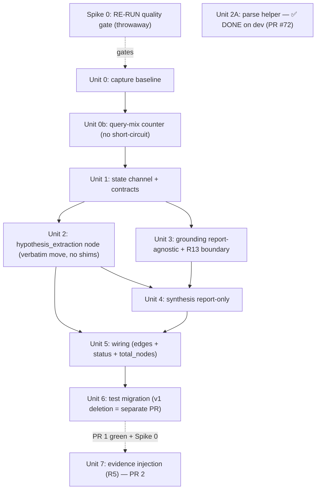

# feat: Ground Literature Before Synthesis

## Overview

Reorder the discovery pipeline so synthesis consumes grounded literature evidence instead of
having a references table bolted on after the report is already written. Since PR #69,
`literature_grounding` fetches and caches abstract bodies — but that evidence arrives *after*
`synthesis` writes its narrative, so the report's logic chains cite nothing the model actually read.

The target topology is:

```
... integration -+-> (temporal) -+-> hypothesis_extraction -> literature_grounding -> synthesis -> END
```

A new `hypothesis_extraction` node takes over bridge validation + hypothesis extraction (today done
inside `synthesis.run()`), so grounding has hypotheses to work on *before* synthesis runs. Synthesis
becomes report-only and reads grounded hypotheses (abstracts included) from state.

This ships as **two sequential PRs** (see Phased Delivery):
- **PR 1 (reorder, mechanical):** topology change + contract moves, behavior-preserving except for *where* the references table is assembled. No change to what the reader sees beyond ordering.
- **PR 2 (evidence injection, R5):** the value-delivering change — render grounded abstracts into the synthesis LLM context and update the prompt so the report reasons over real evidence.

## ⚠️ Review Corrections (2026-06-17, after multi-persona + code-verification review)

This plan was authored 2026-06-11; `dev` has since advanced ~40 commits. The corrections below are
authoritative where they conflict with the body text. Strategic decisions surfaced by the review
(Spike-0 strengthening, PR1→reader gating, query-mix sizing, further scope-slimming) are **deferred to
the requester** and intentionally NOT applied here.

- **Unit 2A is ALREADY MERGED on `dev` (treat as DONE, not a to-do).** `kestrel_client.parse_kestrel_response()`
  exists; all three call sites (`synthesis.py`, `integration.py`, `pathway_enrichment.py`) route through
  it; the `data.get("paths", data)` bug is gone; `integration`'s Bridge-reconstruction rewrite landed;
  the `test_multi_hop_integration.py` mocks already use the real `{"results": [...]}` shape;
  `backend/tests/test_kestrel_parse.py` exists. **Consequence:** moving `validate_bridge_hypotheses`
  into `hypothesis_extraction` is now a **verbatim, behavior-neutral** relocation — the parse-fix
  behavior delta already shipped, so the Unit 2 "NOT moved verbatim / fewer Tier-2 upgrades" caveat is
  void (corrected in Unit 2 below). The Unit-0 baseline is captured on a branch that already contains
  the parse fix.
- **Line-number anchors are STALE — use symbol names, not line numbers.** Key corrections:
  `state.py` `bridges` reducer `375 → 433` (`hypotheses` `445`, `literature_errors` `448`);
  `state_contracts.py` shifted ~+15 (`SynthesisOutput` `236 → 241`, `LiteratureGroundingOutput`
  `242 → 247`, `NODE_CONTRACTS` `251 → 267`); `synthesis.run` return `1099 → 1090`, `run` def `1030 → 1022`,
  `assemble_synthesis_context` `604 → 603`, `fallback_report` `695 → 694`, `validate_bridge_hypotheses`
  `844 → 843`, `extract_hypotheses` `939 → 930`; `integration` R13 boundary `746 → ~710` (746 is past
  EOF); `main.py` node-skip check `577 → 592`. Re-verify the rest by symbol before editing.
- **`NODE_CONTRACTS` is now an 11-entry registry** (bridge-grounding PR #74 added `bridge_grounding`
  + `BridgeGroundingInput/Output`; `state.py` gained `grounded_bridges` and `bridge_grounding_errors`).
  When editing `NODE_CONTRACTS`/`CONCAT_LIST_FIELDS`, do not assume 10 entries. `bridge_grounding` is
  eval-only (NOT wired into `build_discovery_graph()`), so Unit 5's topology edits are unaffected.
- **"degrade boundary" defined once (use consistently):** a top-level `try/except Exception` in a node's
  `run()` that catches an unguarded exception and returns a **contract-valid** output (not a special
  "DegradePayload" type) so the pipeline reaches synthesis. The `try` must wrap the **whole body**
  (input validation already ran in the `@validate_state` decorator, before the body).
- **R12 bridges rationale corrected:** last-write-wins is safe **not** merely "because writers are
  serial" — it is safe because the second writer (`hypothesis_extraction`) returns a full **replacement**
  list. The current `operator.add` reducer silently **duplicates** (integration originals + validated
  upgrades); dropping it removes that latent duplication (a real, intended output change to bridge
  counts — validate against the Unit-0 baseline, do not assert no-op). Footgun: any `bridges: []`
  degrade return now **clobbers** integration's bridges, so every degrade/early-return path in
  `hypothesis_extraction` MUST echo `state["bridges"]` (already prescribed in Unit 2's degrade payload).
- **Unit 4 "factor the append":** extract the references-table append into one helper called from
  **both** the SDK-success path and `fallback_report` (no duplicated append logic).

## Strategic Decisions (requester-confirmed 2026-06-18)

These four decisions resolve the strategic forks the review surfaced. They override the older
Phased-Delivery / Spike-0 / scope text where they conflict.

1. **Spike 0 is STRENGTHENED from a mechanism check to a directional QUALITY gate.** It no longer
   passes on "a claim changed." On its 2–3 speculative-hypothesis queries, a reviewer rates the
   before/after on **the same three failure dimensions PR 2 uses** (unsupported confidence,
   crowded-out KG-structural reasoning, authoritative-sounding tangential citations) and the spike
   passes only on a **net-positive direction that reproduces** (majority of the queries, not a single
   disjunctive draw). A change that is neutral-or-worse fails the gate. **Spike 0 must be RE-RUN, not
   re-judged:** no spike-0 artifacts persist on this branch, and the existing `assessment/scorer.py`
   rates `plausibility`/`relevance`/`novelty` — not these three dimensions — so it can't be reused;
   the re-run needs a human (or a new rubric) rating against the three failure dimensions. A previous
   "passed" under the weaker "did it change" bar does not carry. (See revised Spike 0 section.)
2. **PR 1 is gated out of `main`/production until PR 2 is ready (GATE).** PR 1 merges to `dev` for
   integration but does **not** promote to `main`/prod until PR 2's quality panel passes; treat PR 1 +
   PR 2 as a single reader-facing release boundary. **Caveat (be honest):** pushing to `dev`
   auto-deploys to `dev-kraken.expertintheloop.io`, a real Clerk-gated environment — so the
   dev/integration audience **does** see the slower-with-no-value interim from merge until PR 2 lands.
   That is accepted because the pipeline is still in active development (see Decision 5); the gate
   protects production, not the dev environment.
3. **Query mix pulled (Unit 0b) → NO short-circuit; rely on the existing empty-hypotheses no-op.**
   The pull returned n=2 runs in 60 days, both pre-fix garbage — no usable production mix. **Decision:
   do NOT add a well-characterized short-circuit router.** `literature_grounding` already no-ops on
   empty `hypotheses` (`literature_grounding.py:1142-1147`), so well-characterized-only runs are
   already cheap; a new conditional router on an undefined predicate isn't worth it at near-zero
   traffic (and would contradict Unit 5's unconditional edge). Keep only the cheap, forward-looking
   piece: a **structured triage-outcome counter** (promote triage's existing completion log line) so
   the mix is measurable once real traffic exists. Revisit a short-circuit only if a high-bridge
   latency problem actually shows up post-adoption.
4. **Slim PR 1 — split orthogonal work into separate PRs:**
   - **Drop the back-compat re-export shims entirely.** In Unit 2, retarget the ~5 test import sites
     (`test_multi_hop_integration.py`, `test_langgraph_prototype.py`) directly to `hypothesis_extraction`;
     do not add `synthesis` re-export aliases. Unit 6 loses its shim-removal step.
   - **`build_discovery_graph_v1()` deletion → its own standalone cleanup PR**, decoupled from the
     reorder (zero callers; ~10-line delete). Removed from Unit 6 / PR 1 scope.
   - **Timeout ceilings → their own PR after a representative run.** PR 1's R13 requirement is satisfied
     by the `try/except` whole-body degrade boundaries alone; the latency ceilings (with their pinned
     `asyncio.timeout` mechanism) land separately once a high-bridge run is observed. Removed from PR 1's
     critical path.
   - **PR 2's evaluation is a runnable SCRIPT, not a harness.** Unit 7's "before/after panel" is a short
     script chaining the existing `runner.main()` → `score_hypotheses`, saving pinned artifacts — not a
     generalized framework.
5. **This is a deliberate pre-adoption CAPABILITY BET (reframes the n=2 finding).** The review noted
   near-zero pipeline usage (n=2 in 60 days) and asked whether to build this now. **Confirmed: build
   now.** The near-zero usage is *expected* — the discovery pipeline is still in active development and
   not yet adoption-ready; the reorg is part of making it good enough to adopt, not a fix for measured
   production pain. So the "no one is feeling this pain" objection is moot: we are building the
   capability ahead of demand, on purpose. Consequence for framing (not a blocker): the Overview's
   "reports cite nothing the model read" is a *development-quality* gap we're closing proactively, and
   PR 1 sitting on `dev` during development is acceptable (not the stranded-investment risk it would be
   for a shipped, adopted feature). The forward triage-counter (Decision 3) is the instrument that will
   let us validate the bet once real traffic accrues.

## Problem Frame

The pipeline runs `synthesis → literature_grounding → END`. `synthesis` writes its report purely
from KG findings; `literature_grounding` then appends a references table to the finished report
(`backend/src/kestrel_backend/graph/nodes/literature_grounding.py:1244-1247`) and re-fetches abstract
bodies the report could have used but never saw.

This is a **contract problem, not an edge swap**. `literature_grounding` requires `hypotheses` as
input (`backend/src/kestrel_backend/graph/state_contracts.py:181-183`) and no-ops if the list is
empty (`literature_grounding.py:1141-1147`). A naive edge flip feeds it an empty list and it silently
does nothing — because hypotheses are produced *inside* `synthesis.run()`
(`backend/src/kestrel_backend/graph/nodes/synthesis.py:1051-1091`), downstream of where they're now
needed. The fix moves hypothesis production upstream into its own node.

See origin: `docs/brainstorms/2026-06-11-ground-before-synthesis-requirements.md`.

## Requirements Trace

- **R1.** Add a `hypothesis_extraction` node running `validate_bridge_hypotheses` then
  `extract_hypotheses` against the **validated** bridge list. Move this logic out of `synthesis.run()`.
- **R2.** Register the node in `NODE_CONTRACTS` with a new input/output contract pair and decorate
  `run` with `@validate_state`.
- **R3.** `literature_grounding` stops reading/appending `synthesis_report`; outputs grounded
  `hypotheses` + `literature_errors`. Declare `literature_errors` as a first-class output field.
- **R4.** `synthesis` no longer validates bridges or extracts hypotheses; reads grounded `hypotheses`
  and validated `bridges` from state; its return dict must **not** include `bridges`.
- **R5.** Inject grounded literature evidence into the synthesis LLM context; update `SYNTHESIS_PROMPT`
  so the report cites grounded evidence. *(PR 2 — value-delivering change.)*
- **R6.** References-table assembly lives with synthesis; the report appends it from grounded hypotheses
  already in state. Fallback path must also emit it.
- **R7.** `SynthesisInput` makes `hypotheses` an available Optional input; `SynthesisOutput` keeps
  producing `synthesis_report`.
- **R8.** Update `build_discovery_graph()` edges + ASCII diagram for the new topology.
- **R9.** Migrate tests importing/calling the moved functions and asserting `hypotheses` from
  `synthesis.run`.
- **R10.** Deprecate `build_discovery_graph_v1()`; keep the findings-branch guard as a real production
  check; make `hypotheses` Optional in `SynthesisInput`.
- **R11.** Add a `hypothesis_extraction` entry to `NODE_STATUS_MESSAGES` so the node's state merges and
  a progress message is sent.
- **R12.** Change `state.py:375` to plain `bridges: list[Bridge]` (last-write-wins); this also drops
  `bridges` from `CONCAT_LIST_FIELDS`.
- **R13.** Grounding failure must degrade, not block: synthesis proceeds with whatever
  hypotheses/literature exist and produces its KG-only report; `literature_errors` still surfaced.
  **Requires an explicit failure boundary** (Unit 3) — today nothing catches a grounding exception, and
  the reorder puts grounding upstream of synthesis, so without the boundary a grounding crash means no
  report at all. Proven by a failure-injection test, not assertion.

## Scope Boundaries

- Not touching grounding's internal search/merge/abstract-fetch logic (PR #69 behavior stays).
- Not changing the set of literature sources (OpenAlex/Exa/PubMed/S2) or dedup rules.
- Not redesigning hypothesis generation — `extract_hypotheses` logic moves **verbatim**, not rewritten.
- No frontend changes. `backend/src/kestrel_backend/protocol.py` **is** touched (R11), but no WebSocket
  *protocol* shape change.
- Not adding fallback grounding for well-characterized-only runs. When `extract_hypotheses` returns no
  hypotheses, grounding no-ops and synthesis produces its KG-grounded report (well-characterized
  entities already carry KG-native PMID citations). Abstract-enriched synthesis is intentionally scoped
  to runs producing speculative hypotheses (documented limitation).

## Context & Research

### Relevant Code and Patterns

- **`backend/src/kestrel_backend/graph/nodes/synthesis.py`** — `validate_bridge_hypotheses` (async,
  line 844), `extract_hypotheses` (pure-over-state, line 939), `assemble_synthesis_context` (line 604,
  renders **no** hypothesis/literature data today), `fallback_report` (line 695, does **not** emit a
  references table), `run` (line 1030), `SYNTHESIS_PROMPT` (line 43). Current `run` return dict
  (line 1099) includes `synthesis_report`, `hypotheses`, `bridges`, `model_usages`.
- **`backend/src/kestrel_backend/graph/nodes/literature_grounding.py`** — `build_references_table`
  (line 138), no-op guard (line 1141), references append + `synthesis_report` return (line 1241-1253).
- **`backend/src/kestrel_backend/graph/state_contracts.py`** — contract `_ContractBase` pattern,
  `IntegrationInput` OR-semantics validator (line 116, the model for `HypothesisExtractionInput`),
  `SynthesisInput` (line 152), `SynthesisOutput` (line 236), `LiteratureGroundingOutput` (line 242),
  `NODE_CONTRACTS` registry (line 251), `validate_state` deriving node name from `func.__module__`
  (line 282 — **module basename must match the contract key**).
- **`backend/src/kestrel_backend/graph/state.py`** — `bridges` reducer (line 375),
  `hypotheses` non-reducer last-write-wins (line 387), `literature_errors` reducer (line 390).
- **`backend/src/kestrel_backend/graph/builder.py`** — `route_after_integration` (line 59), node
  registration (line 125-134), edges (line 138-177), ASCII diagram (line ~104), dead
  `build_discovery_graph_v1()` (line 183).
- **`backend/src/kestrel_backend/main.py`** — `_get_concat_fields()` derives `CONCAT_LIST_FIELDS` from
  `operator.add`-annotated state fields (so dropping the `bridges` reducer auto-removes it); WebSocket
  accumulation loop skips nodes not in `NODE_STATUS_MESSAGES` (line 577).
- **`backend/src/kestrel_backend/protocol.py`** — `NODE_STATUS_MESSAGES` (line 131).

### Institutional Learnings

- `docs/solutions/best-practices/langgraph-pipeline-production-formalization.md` — the per-node
  state-contract formalization and the **two-tier assessment framework (structural regression +
  LLM-as-judge)** this pipeline already has. Use that assessment harness as the regression gate for
  PR 1 and the before/after judgment for PR 2.
- `docs/solutions/best-practices/discovery-pipeline-one-graph-methods-within-nodes-2026-05-28.md` —
  one-graph / methods-within-nodes architecture and the Tier-2/Tier-3 `multi_hop_query` validation
  pattern that `validate_bridge_hypotheses` implements (relevant when moving it intact).

### External References

None — this is a self-contained internal refactor over well-established local LangGraph/Pydantic
contract patterns. No external research needed.

## Key Technical Decisions

- **`build_references_table` stays in `literature_grounding.py`; synthesis imports it** (resolves the
  R6 deferred question). The function has a large dedicated test suite
  (`backend/tests/test_literature_grounding.py:896+`) that imports it from that module; moving the
  definition would churn those tests for no behavioral gain. Synthesis imports and calls it. **Both**
  the SDK path and `fallback_report` must call it, or the references table silently vanishes on an
  SDK-failure fallback (it does not call it today).
- **Relocate the two moved functions to `hypothesis_extraction.py` with NO re-export shims (Decision
  4).** `validate_bridge_hypotheses` and `extract_hypotheses` live only in the new module; in Unit 2,
  **retarget the ~5 test import sites directly** (`test_multi_hop_integration.py:19`,
  `synthesis.extract_hypotheses` callers in `test_langgraph_prototype.py`) — there are no non-test
  callers, so a back-compat alias layer buys nothing and is dropped. *(The earlier draft kept thin
  `synthesis` re-export aliases as a mid-PR shim; Decision 4 removes them — single source of truth,
  no shim to later delete.)*
- **`SynthesisOutput` drops the `hypotheses` requirement; `synthesis.run` returns only
  `synthesis_report` (+ `model_usages`).** After the reorder, grounded hypotheses already sit in the
  state channel (written by `literature_grounding`, last-write-wins, `state.py:387`). Synthesis is
  read-only over them; returning them would be a redundant pass-through. The frontend/final state still
  gets grounded hypotheses from `literature_grounding`'s channel write (it is in
  `NODE_STATUS_MESSAGES`). This is consistent with R7 ("keep `SynthesisOutput` producing
  `synthesis_report`") and R4 (drop `bridges` from the return).
- **Rename the non-temporal `route_after_integration` branch to `hypothesis_extraction`.** Change the
  return literal and the mapping target so the route reads honestly (`"temporal"` →
  `temporal`, otherwise → `hypothesis_extraction`); the `temporal -> hypothesis_extraction` edge
  carries the longitudinal path.
- **Add a `[Literature]` evidence tag to the synthesis prompt scheme** (resolves the R5 prompt
  deferred question). The prompt today distinguishes `[KG Evidence]/[Model Knowledge]/[Inferred]`;
  grounded abstracts are a distinct, higher-trust evidence class and should be labeled as such so the
  reader (and the model) can tell literature-grounded claims from KG-structural ones.
- **Abstract injection budget: per-hypothesis cap + truncation, defaults set in PR 2, tuning deferred.**
  Render grounded hypotheses' `literature_support` abstracts into a new context section with a
  per-hypothesis cap (e.g. top-N papers) and a per-abstract character/token truncation, respecting
  `max_buffer_size` (10MB) and SDK token limits. Exact numbers are an execution-time tuning knob
  (see Deferred to Implementation).

- **Bound the new critical-path latency with a grounding wall-clock timeout that triggers the R13
  degrade path.** The reorder pulls two slow operations ahead of *any* report: `validate_bridge_hypotheses`
  (a serial loop of live doubly-pinned `multi_hop_query` calls, each up to the ~60s Kestrel client
  timeout) in `hypothesis_extraction`, and grounding's 4-provider fan-out + EFetch backfill. "Report
  always ships" is only true if slowness is bounded, not just failures. **Decision:** size the added
  latency against a representative high-bridge run during implementation, and add **two** ceilings,
  each returning its own node's degrade payload (a timeout cannot return another node's output shape):
  (1) a per-bridge / whole-loop cap on `validate_bridge_hypotheses` **inside `hypothesis_extraction`**
  that on expiry returns the **same payload as the failure boundary**,
  `{"bridges": state.get("bridges", []), "hypotheses": []}` (`HypothesisExtractionOutput`-shaped); and
  (2) an overall grounding timeout **inside `literature_grounding`** that on expiry returns the grounding
  degrade payload (`{"hypotheses": <upstream>, "literature_errors": [...]}`). A single grounding-only
  timeout does **not** bound the serial KG-validation loop, which lives in the other node.
  - **(Review correction — the earlier `{"bridges": <validated-so-far>, "hypotheses": <extracted-so-far>}`
    is wrong and unconstructible):** `extract_hypotheses` runs *after* the validate loop, so on a
    validation-phase timeout (the case this ceiling exists for) `extracted-so-far` is unbound, and an
    output omitting `bridges` raises `StateValidationError` *outside* the body try/except → the
    `PIPELINE_ERROR` it was meant to prevent. Use the failure-boundary payload above.
  - **Mechanism is a DECISION, not deferred:** implement both ceilings with `asyncio.timeout()` /
    `asyncio.wait_for` wrapping the whole loop/gather, so cancellation surfaces as `asyncio.TimeoutError`
    (an `Exception`, caught by the degrade boundary). A manual `task.cancel()` leaks raw
    `asyncio.CancelledError` (a `BaseException`) past `except Exception` and past `main.py`'s catch — no
    `PIPELINE_ERROR`, no `DoneMessage`, strictly worse than the failure R13 prevents.
  - The concrete timeout *values* are tuned against a real run (deferred); the *existence* and
    *mechanism* of both ceilings are decisions, not deferred. "Representative high-bridge run" must be a
    pinned fixture for reproducibility.

## Open Questions

### Resolved During Planning

- **Move vs. import `build_references_table`?** → Import from `literature_grounding`; do not move
  (preserves its test suite). Fallback path must also call it.
- **Re-export vs. fully relocate the two moved functions?** → Relocate to `hypothesis_extraction`,
  re-export from `synthesis` for back-compat.
- **Does synthesis still return `hypotheses`?** → No. Drop from `SynthesisOutput`; channel already
  carries grounded hypotheses from `literature_grounding`.
- **`[Literature]` tag in the prompt?** → Yes, add it.
- **Final node name (`hypothesis_extraction` vs `hypothesis_generation`)?** → `hypothesis_extraction`
  (matches the verbatim-moved `extract_hypotheses`; the node extracts from state, it doesn't generate).
  This is the module basename, `NODE_CONTRACTS` key, builder label, and `NODE_STATUS_MESSAGES` key.
- **`bridges` parallel-write check (R12)?** → Confirmed only `integration` and `hypothesis_extraction`
  write `bridges`, and they are serial (`integration -> (temporal) -> hypothesis_extraction`). No
  parallel superstep writes it, so last-write-wins is safe.
- **Keep the `synthesis` back-compat re-exports long-term?** → No. They are a mid-PR shim only; Unit 6
  retargets all callers and removes the aliases in the same PR (no open-ended window).

### Deferred to Implementation

- **Exact abstract token/char budget (R5).** Final per-hypothesis paper cap and per-abstract truncation
  length depend on observing real assembled-context sizes against SDK limits. Set sensible defaults,
  tune against a real run.
- **Final abstract timeout values + per-bridge validation cap (R5/R13/latency).** The *existence* of a
  grounding/validation timeout ceiling is decided (Key Decisions); the concrete millisecond/char values
  are tuned against a representative real run during implementation.

## High-Level Technical Design

> *This illustrates the intended approach and is directional guidance for review, not implementation
> specification. The implementing agent should treat it as context, not code to reproduce.*

Responsibility shift across the three affected nodes:

| Node | Before | After |
|------|--------|-------|
| `hypothesis_extraction` (NEW) | — | `validate_bridge_hypotheses` (moved) + `extract_hypotheses` over **validated** bridges; outputs validated `bridges` + `hypotheses` |
| `literature_grounding` | grounds hypotheses, fetches abstracts, **appends references table to `synthesis_report`** | grounds hypotheses + fetches abstracts (unchanged); **stops touching the report** — outputs grounded `hypotheses` + `literature_errors` only |
| `synthesis` | validates bridges + extracts hypotheses + writes report + appends bridges to return | **report-only**; reads grounded `hypotheses` (abstracts) + validated `bridges`; renders evidence (PR 2); owns references table; returns `synthesis_report` only |

Dependency / sequencing graph for the implementation units:



## Implementation Units

### Phase 1 — Reorder (PR 1, mechanical)

> **Execution posture (whole phase):** characterization/regression-gated. This refactors a fragile,
> non-deterministic LLM pipeline. Before flipping topology, capture a baseline from the existing
> two-tier assessment harness (structural regression + LLM-as-judge) on a pinned query, and treat that
> baseline as the PR-1 acceptance gate — PR 1 must be behavior-preserving except for *where* the
> references table is assembled. Units 3–5 flip the topology; the suite is green only at the PR
> boundary, not necessarily between these commits.

- [ ] **Unit 0: Capture pre-change assessment baseline**

**Goal:** Snapshot the current pipeline's output on a pinned query **before** any topology change, so
PR 1's "no regression vs. baseline" gate has something to compare against.

**Requirements:** (enables the PR-1 acceptance gate)

**Dependencies:** None — must run on `dev` HEAD before Unit 1 touches anything.

**Files:**
- Run: the existing pipeline + Tier-1 structural checks (`backend/src/kestrel_backend/assessment/`)
  against a pinned query; save serialized state + structural-check output to a timestamped path under
  `backend/assessment_data/` (default-save, `--out` as override — do not inherit the `--output`-gated
  behavior)

**Approach:**
- **Scope the PR-1 baseline to Tier-1 (structural) only.** PR 1 is a mechanical reorder; its regression
  gate needs structural-regression detection, not the LLM-as-judge tier. `assessment/runner.py:main()`
  already produces serialized state (and `report.generate_report()` runs the Tier-1 structural checks);
  capturing that on the pinned query is sufficient for the PR-1 gate. The only gap to close here is
  **default-save** (today `main()` saves only with `--output`) — give it a timestamped default path.
- **The Tier-2 LLM-as-judge tier is PR 2's tool, not PR 1's gate** — `report.generate_report()` inserts
  `HypothesisJudgment()` *placeholders* and never calls `assessment/scorer.py:score_hypotheses` (which
  exists, async, and issues live Claude calls — cost/auth). The shim that chains runner → checks →
  **scorer** is built in **Unit 7** where the before/after panel actually needs judge scores; it does
  not belong in the PR-1 baseline. (This keeps PR 1 from carrying untested live-LLM orchestration.)
- Pin the query, data/commit SHA, seed, and config alongside the saved baseline so the post-change run
  is a like-for-like comparison. The pinned query must be one that produces **speculative hypotheses**
  (so grounding is actually exercised), and ideally the same query class used by Spike 0 and the Unit 7
  panel for coherence.
- If the harness/pipeline does not run cleanly on unmodified `dev` (a pre-existing pipeline error on the
  pinned query, or flakiness — note the suite already has ~16–18 unrelated failures), diagnose and
  resolve before proceeding; do not carry a broken baseline forward as the regression gate.
- This is the baseline the Phased Delivery PR-1 acceptance refers to; without it captured first, the
  gate is unrunnable (a non-deterministic pipeline cannot be regressed against a baseline that doesn't
  exist).

**Test expectation:** none — this is a measurement/setup step, not a behavioral change. Its output is
the saved baseline artifact.

**Verification:** Baseline structural artifact + serialized state exist on disk with pinned inputs
recorded; the pipeline + structural checks run clean on unmodified `dev` for the pinned query.

- [ ] **Unit 0b: Size the production query mix by triage outcome (Decision 3; gates the latency call)**

**Goal:** Quantify what fraction of real runs produce speculative hypotheses (sparse/cold_start) vs.
well-characterized-only, so the well-characterized latency regression is a deliberate, evidenced
choice rather than an implicit one.

**Dependencies:** None — runs against production data, independent of code changes.

**Approach:**
- Pull the distribution of recent production queries by triage classification
  (`well_characterized` / `moderate` / `sparse` / `cold_start`). Source options, easiest-first:
  (1) parse the triage completion log line on the prod/dev host (triage logs the per-bucket counts);
  (2) if a structured record exists, query `kraken_db`; (3) if neither yields a clean distribution,
  add a lightweight triage-outcome counter (one structured log/metric per run) and sample forward.
  Persist the result as a dated artifact (run-artifact SOP).
- **Decision rule (resolved — Decision 3):** the pull (below) returned no usable data, so there is no
  basis to add routing complexity. **Do NOT build a well-characterized short-circuit.**
  `literature_grounding` already no-ops on empty `hypotheses` (`literature_grounding.py:1142-1147`), so
  well-characterized-only runs already skip grounding's real work; a new conditional router on an
  undefined "well-characterized" predicate (which would also contradict Unit 5's unconditional edge) is
  not worth it at near-zero traffic. Keep only the cheap forward instrument: a structured triage-outcome
  counter.

**Pull result (2026-06-18):** the historical pull came back essentially empty — only **2** discovery
runs (`Completed triage …`) in 60 days of retained `kraken-backend` + `kraken-backend-dev` journals,
both from Jun 09 and both carrying the **pre-fix `direction`-bug signature** (`well_char=0, moderate=0,
sparse=0, cold_start=N, tier1_failed=N`), i.e. unusable. **There is no usable production query-mix to
size from** — pipeline-mode usage is near-zero today (expected: the pipeline is still in development —
this reorg is a deliberate pre-adoption capability bet, see Strategic Decision 5). **Decision: rely on
grounding's existing empty-hypotheses no-op (no new short-circuit router) and add the forward
triage-outcome counter so the mix becomes measurable once real traffic accrues.** Revisit a short-circuit
only if a real high-bridge latency problem appears post-adoption.

**Forward triage-outcome counter (the one thing to build here):** promote triage's *existing*
`Completed triage … well_char=N, moderate=N, sparse=N, cold_start=N` log line to a **structured** record
(JSON/kv, one per run) in `triage.py` — the counts are already computed there, so this is a few lines,
no new table or metrics backend.

**Verification:** the pull result is recorded (n=2, unusable); no short-circuit router is added; the
structured triage-outcome counter is in place; revisit when production pipeline volume exists.

- [ ] **Unit 1: State channel + contract definitions**

**Goal:** Make the state channel and contracts ready for the new topology before any node moves.

**Requirements:** R2, R3, R7, R10, R12

**Dependencies:** None

**Files:**
- Modify: `backend/src/kestrel_backend/graph/state.py` (line 375: `bridges` → plain `list[Bridge]`)
- Modify: `backend/src/kestrel_backend/graph/state_contracts.py` (add `HypothesisExtractionInput` +
  `HypothesisExtractionOutput`; register in `NODE_CONTRACTS`; add `hypotheses: list[Any] | None = None`
  to `SynthesisInput`; drop `hypotheses` from `SynthesisOutput`; add `literature_errors: list[Any]` to
  `LiteratureGroundingOutput`; **make `LiteratureGroundingInput.hypotheses` Optional**
  (`list[Any] | None = None`) so a missing/empty upstream `hypotheses` key degrades to a no-op instead
  of raising `StateValidationError` at grounding's input — load-bearing for R13, see Unit 3)
- Test: `backend/tests/test_state_contracts.py` (or the existing contracts test module)

**Approach:**
- `HypothesisExtractionInput` mirrors `IntegrationInput`'s OR-semantics `@model_validator` (at least
  one findings branch non-empty) and reads `bridges`. `HypothesisExtractionOutput` requires `bridges`
  + `hypotheses`. **Rationale, stated honestly:** this gate is a cheap "the pipeline reached the
  findings stage" precondition, **not** a guarantee the node will produce hypotheses.
  `extract_hypotheses` reads `cold_start_findings`, `bridges`, and `inferred_associations` — it never
  reads `direct_findings` — so a well-characterized-only run (`direct_findings` populated,
  `cold_start` empty) passes the gate yet legitimately yields `hypotheses: []`. Empty hypotheses is a
  valid output, not a contract failure; the gate exists only to reject a genuinely empty pipeline.
- Dropping the `bridges` `operator.add` reducer auto-removes it from `CONCAT_LIST_FIELDS` via
  `_get_concat_fields()` — verify, do **not** hand-edit `main.py`.
- `SynthesisOutput` now requires only `synthesis_report` (see Key Decisions).

**Patterns to follow:** `IntegrationInput`/`IntegrationOutput` (`state_contracts.py:116, 225`);
existing `_ContractBase` subclasses.

**Test scenarios:**
- Happy path: `HypothesisExtractionInput` validates a state with non-empty `direct_findings` and
  `bridges` present.
- Edge case: `HypothesisExtractionInput` validates with `cold_start_findings` only (OR-semantics).
- Error path: `HypothesisExtractionInput` raises when both `direct_findings` and `cold_start_findings`
  are empty/None (mirrors `IntegrationInput`).
- Happy path: `HypothesisExtractionOutput` validates a dict with `bridges` + `hypotheses`; raises when
  either is missing.
- Happy path: `SynthesisInput` validates a state where `hypotheses` is present, and where it is absent
  (Optional).
- Happy path: `SynthesisOutput` validates `{synthesis_report: "..."}` without `hypotheses`.
- Edge case: `LiteratureGroundingOutput` validates output carrying `literature_errors` as a declared
  field (not just an `extra='ignore'` passthrough).
- Edge case: `LiteratureGroundingInput` validates a state with `hypotheses` **absent** (Optional) and
  with `hypotheses: []` — neither raises (load-bearing for the R13 degrade path).
- Integration: `NODE_CONTRACTS["hypothesis_extraction"]` resolves to the new pair.

**Verification:** Contract unit tests pass; `CONCAT_LIST_FIELDS` no longer contains `bridges`
(assert in a test).

- [x] **Unit 2A: Shared `parse_kestrel_response()` helper — ✅ DONE (merged on `dev` via PR #72; see Review Corrections).** The text below is retained for context; no work remains. The helper exists at `kestrel_client.parse_kestrel_response()`, all three call sites route through it, the integration Bridge-rebuild landed, and the test mocks + `test_kestrel_parse.py` are in place. Skip this unit; treat the helper as a given dependency for Unit 2.

**Goal:** Replace three independent, drift-prone copies of the `multi_hop_query` response parse with one
tested helper that **fails loudly instead of silently falling back to the whole dict**.

**Requirements:** (correctness foundation for R1/R12 bridge handling; not a new origin requirement)

**Dependencies:** None — operates on the current base. Best landed as a small standalone PR *before* the
reorder (mirrors how amy's PR #70 fixed one copy), so it is independently reviewable and the reorder PR
moves an already-correct function.

**Files:**
- Create: `parse_kestrel_response()` (suggested home: `kestrel_client.py`, which already owns
  `multi_hop_query`) + `backend/tests/test_kestrel_parse.py`
- Modify (route through the helper, deleting the inline `data.get("paths", data)`):
  `graph/nodes/synthesis.py:902` (validate_bridge_hypotheses), `graph/nodes/integration.py:316`
  (`parse_multi_hop_result`), `graph/nodes/pathway_enrichment.py:256` (`find_two_hop_shared_neighbors`,
  which amy's PR #70 just fixed inline — re-route it through the helper to remove the duplicate logic)

**Approach:**
- The real Kestrel `multi_hop_query` response (verified against the live OpenAPI spec, 2026-06-11) is
  `{"results": [...], "nodes": {...}, "edges": {...}, "edge_schema": [...]}`. **The bug is wrong on two
  axes:** (1) no top-level `"paths"` key — it is `results`; and (2) each `result["paths"]` is a **list of
  CURIE-string lists** (e.g. `["CHEBI:4167","MONDO:0005148"]`), **not** a dict with `nodes`/`predicates`.
  Names come from the top-level `data["nodes"]` dict; predicates from `edges`/`edge_schema`. References:
  `direct_kg.py:549-557` and `code_on_graph_spike/kestrel_rest.py:128` (`parse_paths`); full context in
  `.claude/skills/kestrel-api/SKILL.md` and `docs/solutions/logic-errors/kestrel-multi-hop-response-shape-paths-key-2026-06-11.md`.
- **The bug is the silent fallback, not just the key.** `data.get("paths", data)` returns the entire
  `data` dict when `"paths"` is absent, so callers get garbage. The helper must **not** fall back to
  `data` — on a missing/mis-shaped `results` it returns an empty result set (and logs), never the raw dict.
- **Origin (for the PR writeup):** one commit (`bf07a72`, 2026-02-22) copy-pasted this parse into all
  three nodes at once; it survived ~3.5 months because `test_multi_hop_integration.py` mocked the wrong
  shape (`{"paths": [...]}`) and certified the bug. Those **~6 wrong-shape mocks must be rewritten to the
  real shape** (Unit 6 / this unit's fixture), or the suite keeps green-lighting the bug.
- **Behavior change is real and per-caller — validate against the Unit-0 baseline, do not assert
  neutral.** synthesis: fewer Tier-2 upgrades. **integration: highest blast radius, and a deeper rewrite
  than a key swap** — `parse_multi_hop_result` currently emits *zero* bridges on the real shape, AND its
  downstream Bridge-build (`integration.py:322-351`) reads `path_data.get("nodes"/"predicates"/"node_names")`,
  which don't exist on CURIE-string paths. Routing it through the helper will **newly populate bridges**
  it silently dropped, and the Bridge reconstruction must be rewritten to map CURIE paths + the
  `nodes`/`edges` maps. Validate integration's new bridge output separately; gate if noisy.
- **`direction` is a SEPARATE, dominant active bug that amy's PR #70 fixes (not neutral cleanup):** the
  **MCP** `one_hop_query` (what the pipeline calls) **rejects** `direction` with `isError`
  (`"Unexpected keyword argument"`, verified live 2026-06-11) — only the REST endpoint silently ignores
  it. `triage.py:76` sends `direction:"both"`, so triage's `isError → retry → None → cold_start`
  fallback buckets **every** resolved entity as cold_start (the 25/25 cold-start incident). This is
  out of scope for this plan but is the reason to **land PR #70 promptly** — until it does, triage erases
  the signal and nothing downstream is measurable. See
  `docs/solutions/logic-errors/kestrel-direction-param-triage-cold-start-2026-06-11.md`. (Lesson baked
  into the kestrel-api skill: verify request args against MCP, not REST.)

**Patterns to follow:** `direct_kg.py:549-557` (correct `results` → per-result `paths` access).

**Test scenarios (one fixture set behind the helper — point 1):**
- Happy path: real-shape `{"results": [{"end_node_id": "X", "paths": [["A","X"]]}], "nodes": {...}}`
  → helper returns the reachable nodes / a non-empty path set.
- Edge case: `{"results": [], "nodes": {}, "edges": {}}` (valid response, no path) → empty result, **no**
  fallback to the dict, no false "path exists".
- Error/malformed: missing `"results"` key, `results` not a list, non-dict `data`, malformed JSON →
  empty result + logged, never a raw-dict return or a `KeyError`/`AttributeError`.
- Integration: each of the three migrated call sites produces the same parsed result for a shared
  fixture (proves the drift is gone).

**Verification:** One helper, three call sites routed through it, no remaining `data.get("paths", data)`
in the codebase (grep clean); helper fails loudly (empty + log) on bad input; per-caller behavior deltas
captured against the Unit-0 baseline.

- [ ] **Unit 2: `hypothesis_extraction` node**

**Goal:** New node that validates bridges then extracts hypotheses, taking this logic out of synthesis
— **with its own failure boundary**, because it is now the unguarded upstream gate feeding both
grounding and synthesis.

**Requirements:** R1, R2, R13

**Dependencies:** Unit 1, Unit 2A (shared parse helper)

**Files:**
- Create: `backend/src/kestrel_backend/graph/nodes/hypothesis_extraction.py`
- Modify: `backend/src/kestrel_backend/graph/nodes/synthesis.py` (relocate
  `validate_bridge_hypotheses` + `extract_hypotheses`; NO re-export aliases — retarget importers, Decision 4)
- Modify: `backend/src/kestrel_backend/graph/nodes/__init__.py` (export the new module, mirroring how
  other nodes are exposed to `builder.py`)
- Test: `backend/tests/test_hypothesis_extraction.py` (new)

**Approach:**
- Module basename **must** be `hypothesis_extraction` so `@validate_state` derives the matching node
  name from `func.__module__` (`state_contracts.py:282`).
- `run` reproduces today's `synthesis.run()` lines 1051-1057 + 1091: validate bridges → build a
  `state_with_validated` copy → `extract_hypotheses(state_with_validated)`. Output dict:
  `{bridges: validated_bridges, hypotheses: hypotheses}` (plus `model_usages` if any usage records are
  produced — `validate_bridge_hypotheses` makes `multi_hop_query` KG calls but no SDK usage today).
- Decorate `run` with `@validate_state(HypothesisExtractionInput, HypothesisExtractionOutput)`.
- **Failure boundary (R13, co-equal with Unit 3's).** Today `validate_bridge_hypotheses` is called
  unguarded at the `run()` level (`synthesis.py:1053`; only its *per-bridge* `multi_hop_query` calls are
  internally guarded at `synthesis.py:923-926`), and `extract_hypotheses` iterates typed state objects
  (`finding.claim`, `bridge.tier`) that can `AttributeError` on a degraded state. Moving this verbatim
  leaves the node `run` unguarded — and because `main.py` converts **any** uncaught exception to
  `PIPELINE_ERROR` with no report, an unguarded crash here aborts the whole run *before grounding or
  synthesis*, the exact failure R13 forbids, one node further upstream. Wrap `run`'s body in
  `try/except Exception` returning a degrade payload that **satisfies `HypothesisExtractionOutput`**:
  `{"bridges": state.get("bridges", []), "hypotheses": []}`. Note: a naive `{"hypotheses": []}` would
  itself raise `StateValidationError` on *output* validation because `bridges` is a required output
  field — the degrade payload must include `bridges` or the degrade becomes the abort it prevents.
- Decorate-order caveat: `@validate_state` validates *input* before the body runs, so the in-body
  try/except cannot catch an input `StateValidationError`. `HypothesisExtractionInput` only requires the
  OR-gate (Optional findings fields), so input validation will not abort on a degraded-but-present
  state; confirm no required input field can be absent here.
- Move both `validate_bridge_hypotheses` and `extract_hypotheses` **verbatim** to
  `hypothesis_extraction.py`; do **not** add `synthesis` re-export aliases (Decision 4). Retarget the
  ~5 test import sites directly to `hypothesis_extraction` in this same unit.
- **`validate_bridge_hypotheses` is now moved VERBATIM (review correction — Unit 2A already shipped).**
  On current `dev`/this branch it **already** calls `parse_kestrel_response()` and gates on
  `parsed["n_paths"] > 0` — the buggy `data.get("paths", data)` inline parse is gone. So relocating it to
  `hypothesis_extraction.py` is a clean, behavior-neutral move; the "fewer Tier-2 upgrades" delta already
  landed via PR #72 and is **not** part of this PR. Assert output-equivalence with the current
  in-`synthesis` result freely. *(The prior draft here described the parse fix as in-scope and
  not-neutral; that is obsolete now that Unit 2A is merged.)*

**Execution note:** Move **both** `validate_bridge_hypotheses` and `extract_hypotheses` verbatim; a
fixed-state equivalence test against the current `synthesis.run` outputs (`bridges` + `hypotheses`) is
the cleanest guard for the move. The behavior-changing parse fix is already in `dev`, so there is no
in-scope behavior delta to validate against the baseline for this relocation.

**Patterns to follow:** Any existing node `run` decorated with `@validate_state` (e.g.
`integration.run`); the `state_with_validated` pattern at `synthesis.py:1056-1091`.

**Test scenarios:**
- Happy path: `run` on a state with Tier-3 bridges returns validated bridges (Tier-3→Tier-2 upgrades
  applied) and hypotheses extracted from the **validated** list — assert a Tier-2-upgraded bridge
  yields a `tier=2` hypothesis.
- Corrected upgrade logic (response-shape parsing itself is tested in Unit 2A): a `multi_hop_query`
  result that the helper parses to a non-empty path set → bridge upgrades to Tier 2; an empty/no-path
  result → bridge **stays Tier 3** (the case the old `data.get("paths", data)` bug wrongly upgraded).
  Regression-guards the always-upgrade no-op.
- Edge case: state with no bridges and only `cold_start_findings` → hypotheses from cold-start, empty
  bridge list returned.
- Edge case: empty hypotheses (no Tier-3 findings, no significant bridges) → returns `hypotheses: []`,
  output contract still satisfied.
- Integration: `validate_bridge_hypotheses` KG-call failure path (mocked `multi_hop_query` raising) →
  bridge kept as Tier 3, node still returns successfully (mirrors existing error handling).
- Integration: `synthesis.validate_bridge_hypotheses` and `synthesis.extract_hypotheses` re-exports
  still importable and identical objects.
- Error path (R13): force `validate_bridge_hypotheses`/`extract_hypotheses` to raise (e.g. mock raising
  an unguarded exception, or pass a malformed finding) → `run` returns
  `{"bridges": <upstream>, "hypotheses": []}`, the payload **passes `HypothesisExtractionOutput`
  validation**, and an end-to-end run still reaches synthesis with a report (not `PIPELINE_ERROR`).

**Verification:** New node's `run` output matches the values the old `synthesis.run()` produced for
`bridges` and `hypotheses` on a shared fixture.

- [ ] **Unit 3: `literature_grounding` becomes report-agnostic + cannot abort the run**

**Goal:** Grounding stops reading/appending `synthesis_report`; outputs grounded hypotheses +
`literature_errors` only; and a grounding-phase exception **degrades to a no-op return instead of
aborting the pipeline before synthesis** — making R13 real, not just asserted.

**Requirements:** R3, R13

**Dependencies:** Unit 1

**Files:**
- Modify: `backend/src/kestrel_backend/graph/nodes/literature_grounding.py` (lines 1241-1253: drop
  `references_table` compute + `synthesis_report` read/append; return only `hypotheses` +
  `literature_errors`; **wrap `run`'s body in a top-level failure boundary**)
- Test: `backend/tests/test_literature_grounding.py`

**Approach:**
- Remove the `build_references_table(grounded)` call and the `synthesis_report` assembly at the end of
  `run`; keep all search/merge/abstract-backfill logic untouched (scope boundary).
- `build_references_table` itself **stays defined** in this module (synthesis imports it — Unit 4); only
  its *call* moves out of grounding's `run`.
- **R13 failure boundary (the load-bearing change):** today `literature_grounding.run` has **no**
  top-level try/except, and `stream_discovery` (`backend/src/kestrel_backend/graph/runner.py:46`) does
  **not** wrap `graph.astream`. Per-source searches are guarded (`return_exceptions=True`) and
  `backfill_abstracts` has internal guards, so *typical* failures already degrade — but an unguarded
  path (e.g. an EFetch/contract edge) would propagate and, because grounding now runs **upstream** of
  synthesis, abort the run with **no report at all** (strictly worse than today, where synthesis ran
  first). Wrap the body of `run` in `try/except Exception` that returns
  `{"hypotheses": state.get("hypotheses", []), "literature_errors": [f"grounding failed: {e}"]}` so
  the graph always reaches synthesis with whatever hypotheses exist. (Pairs with Unit 1 making
  `LiteratureGroundingInput.hypotheses` Optional so the *input* validation also can't abort.)
- **Invariant, enumerated and verified (not just asserted):** because `main.py` turns any uncaught node
  exception into `PIPELINE_ERROR` with no report, *every node upstream of synthesis that can raise must
  have a `run()`-level degrade boundary returning its own contract-valid payload.* The full
  upstream-of-synthesis set is **`{integration, temporal, hypothesis_extraction, literature_grounding}`**.
  `integration` (`integration.py:746`) and `temporal` (`temporal.py:329`) **already have** run-level
  degrade boundaries returning contract-valid payloads — so only the two new/reordered nodes need a
  boundary added: `hypothesis_extraction` (Unit 2) and `literature_grounding` (this unit). With those
  four covered, a single upstream node crash always reaches synthesis with a report. Confirm these two
  existing boundaries still hold during implementation; do not add new ones to `integration`/`temporal`.
- **No runner-level safety net.** A `stream_discovery`/`main.py` "emit any existing `synthesis_report`"
  backstop was considered and rejected as incoherent: for an *upstream* failure synthesis has not run
  yet, so `accumulated_state` holds no `synthesis_report` to emit — the per-node boundaries above are
  the sole, sufficient mechanism, and a framework-level catch is out of scope for this reorder. (If the
  team later wants framework-wide resilience, the only correct form wraps each node's call site to
  convert exceptions into that node's contract-valid degrade payload — a separate task.)

**Execution note:** Write the failure-injection test first (red) — it is the proof R13 holds. Inject an
exception into an unguarded grounding path and assert the run still reaches synthesis and emits a
`synthesis_report`.

**Patterns to follow:** Existing return shape of `run`; the no-op early return at lines 1144-1147
already returns `{hypotheses, literature_errors}` — the success path and the new except branch should
both match that shape. The per-call `try/except` inside `validate_bridge_hypotheses`
(`synthesis.py:875-926`) is the existing degrade-on-error idiom to mirror.

**Test scenarios:**
- Happy path: `run` returns a dict with `hypotheses` and `literature_errors` and **no**
  `synthesis_report` key.
- Edge case: empty hypotheses → unchanged no-op return (`{hypotheses: [], literature_errors: []}`).
- Error path (R13): inject an exception in an unguarded grounding path (e.g. mock
  `backfill_abstracts`/EFetch to raise) → `run` returns `{hypotheses: <upstream>, literature_errors:
  ["grounding failed: ..."]}` and does **not** propagate.
- Integration (R13): end-to-end run with grounding forced to raise → pipeline still reaches synthesis,
  a `synthesis_report` lands in `accumulated_state`, and a `PipelineComplete`/done-with-report message
  is emitted (not an `ErrorMessage`/`PIPELINE_ERROR`).
- Integration: grounded hypotheses still carry `literature_support` (abstract backfill path unchanged).
- Regression: `build_references_table` unit tests (existing, `test_literature_grounding.py:896+`)
  still pass (function untouched).

**Verification:** Grounding output no longer contains `synthesis_report`; abstract backfill behavior
unchanged; a forced grounding exception leaves the run completing with a report (R13 proven by test,
not assertion).

- [ ] **Unit 4: `synthesis` becomes report-only**

**Goal:** Synthesis reads grounded hypotheses + validated bridges, owns the references table, and
returns only the report.

**Requirements:** R4, R6, R7, R13

**Dependencies:** Unit 2, Unit 3

**Files:**
- Modify: `backend/src/kestrel_backend/graph/nodes/synthesis.py` (`run`: remove bridge validation +
  `extract_hypotheses`; read `hypotheses` + `bridges` from state; import + call
  `build_references_table`; append references table in both SDK and `fallback_report` paths; drop
  `bridges` and `hypotheses` from the return dict)
- Test: `backend/tests/test_langgraph_prototype.py` (synthesis-focused cases)

**Approach:**
- `run` no longer calls `validate_bridge_hypotheses` or `extract_hypotheses`; it reads the
  already-validated `bridges` and grounded `hypotheses` from `state` (written upstream by
  `hypothesis_extraction` and `literature_grounding`).
- Import `build_references_table` from `literature_grounding`; build the table from `state["hypotheses"]`
  and append it to the report. **Critical:** `fallback_report` must also emit the references table —
  factor the append so both the SDK-success path and the fallback path include it.
- Return dict: `{synthesis_report: report, model_usages: [...]}` — **no** `bridges`, **no**
  `hypotheses` (`SynthesisOutput`'s `extra='ignore'` will not catch a stray `bridges` return, so it
  must be removed deliberately — see R12).
- **R13 (degrade, never block):** synthesis reads whatever `hypotheses`/`literature_support` exist; if
  grounding failed/timed out upstream, those may be ungrounded or empty — synthesis still produces its
  KG-only report. No new failure mode introduced by the read (hypotheses Optional per R7/R10).

**Execution note:** Start by asserting the references table appears in both the SDK-path report and the
`fallback_report` output — the fallback omission is the highest-risk silent regression in this unit.

**Patterns to follow:** Current `run` structure (`synthesis.py:1030-1105`); `fallback_report`
(`synthesis.py:695`).

**Test scenarios:**
- Happy path: `run` on a state with grounded hypotheses returns a report whose tail contains the
  references table built from those hypotheses; return dict has no `bridges`/`hypotheses` keys.
- Happy path: bridge section of the report shows validated (Tier-2-upgraded, `[KG-validated]`-tagged)
  bridges read from state — each bridge once.
- Edge case: empty hypotheses → report still produced, references table empty/absent, no crash.
- Error path (R13): SDK unavailable / raises → `fallback_report` path runs **and still appends the
  references table** (assert table present in fallback output).
- Error path (R13): upstream grounding produced `literature_errors` and ungrounded hypotheses →
  synthesis still returns a `synthesis_report` (no hard fail).
- Integration: full read of validated `bridges` from the merged channel (no double-counting — pairs
  with Unit 1 reducer change).

**Verification:** `synthesis.run` returns only `synthesis_report` (+ `model_usages`); references table
present in both SDK and fallback reports; bridge tiers preserved.

- [ ] **Unit 5: Wiring — graph edges + status message**

**Goal:** Re-point the topology to insert `hypothesis_extraction` and ensure its state merges + emits
progress.

**Requirements:** R8, R11

**Dependencies:** Unit 2, Unit 4

**Files:**
- Modify: `backend/src/kestrel_backend/graph/builder.py` (register `hypothesis_extraction` node;
  re-point `route_after_integration` non-temporal branch + `temporal` edge to `hypothesis_extraction`;
  add `hypothesis_extraction -> literature_grounding -> synthesis -> END`; update ASCII diagram)
- Modify: `backend/src/kestrel_backend/protocol.py` (add `hypothesis_extraction` to
  `NODE_STATUS_MESSAGES`; bump `PipelineProgressMessage.total_nodes` from 10 to 11 — or derive it from
  `len(NODE_STATUS_MESSAGES)` — so progress doesn't report 11/10)
- Test: `backend/tests/test_langgraph_prototype.py` (graph-topology / end-to-end cases)

**Approach:**
- Old edges removed: `temporal -> synthesis`, `synthesis -> literature_grounding`,
  `literature_grounding -> END`, and the `route_after_integration` `"synthesis"` mapping.
- New edges: `route_after_integration` → `{"temporal": "temporal", "hypothesis_extraction":
  "hypothesis_extraction"}` (rename the non-temporal return literal); `temporal ->
  hypothesis_extraction`; `hypothesis_extraction -> literature_grounding`; `literature_grounding ->
  synthesis`; `synthesis -> END`.
- `NODE_STATUS_MESSAGES["hypothesis_extraction"] = "Extracting and validating hypotheses..."` (or
  similar). Without it, `main.py:577` skips the node and its `bridges`/`hypotheses` writes never merge
  into `accumulated_state`. The detail extractor falls back to `_extract_default` — no new extractor
  needed.
- Bump `PipelineProgressMessage.total_nodes` (`protocol.py:77`, defaults to `10`) to `11` so the
  frontend progress indicator does not report `11/10` once the node count grows. This is the only
  reader-visible side effect of PR 1 and must ship with the wiring change, not be discovered in QA.

**Patterns to follow:** Existing `route_after_integration` (`builder.py:59`) and `add_edge` calls.

**Test scenarios:**
- Happy path (non-longitudinal): graph routes `integration -> hypothesis_extraction ->
  literature_grounding -> synthesis -> END`; `synthesis_report` present, hypotheses grounded.
- Happy path (longitudinal): `is_longitudinal=True` routes through `temporal -> hypothesis_extraction`.
- Integration: end-to-end run accumulates grounded `hypotheses` and validated `bridges` into final
  state (proves `NODE_STATUS_MESSAGES` entry merges the node's output).
- Edge case: no orphaned node — assert every registered node is reachable / all contracts pass on a
  representative run.
- Regression: WebSocket progress sequence includes a `hypothesis_extraction` status message.
- Regression: `nodes_completed` never exceeds `total_nodes` on a full run (guards the 11/10 off-by-one).

**Verification:** End-to-end discovery run completes with the new topology; all node contracts pass;
no orphaned node; grounded hypotheses appear in final accumulated state.

- [ ] **Unit 6: Test migration** (v1 deletion split to its own standalone PR — Decision 4)

**Goal:** Retarget moved-function imports and run-output assertions. **The dead-`v1`-graph deletion is
NOT in this unit/PR 1** (Decision 4 split it into its own ~10-line cleanup PR); the
`build_discovery_graph_v1()` references in the Files/Approach/Verification below belong to that
standalone PR, not here.

**Requirements:** R9, R10

**Dependencies:** Unit 2, Unit 5

**Files:**
- Modify: `backend/tests/test_multi_hop_integration.py` (line 19 import — keep via re-export or retarget
  to `hypothesis_extraction`; 4 `validate_bridge_hypotheses` uses)
- Modify: `backend/tests/test_langgraph_prototype.py` (~20 `synthesis.run` calls; retarget
  `synthesis.extract_hypotheses` calls and `result["hypotheses"]` assertions to `hypothesis_extraction`)
- Modify: `backend/src/kestrel_backend/graph/builder.py` (remove `build_discovery_graph_v1()` or leave
  with a deprecation note — see Approach)
- Modify/remove: any test exercising `build_discovery_graph_v1()`

**Approach:**
- **No shims to remove (Decision 4):** Unit 2 already retargeted the test imports directly to
  `hypothesis_extraction` and added no `synthesis` re-export aliases, so there is nothing to clean up
  here. (The earlier draft added shims in Unit 2 and removed them in Unit 6; Decision 4 eliminated that
  round-trip.) Grep confirms no non-test caller of
  `synthesis.validate_bridge_hypotheses`/`synthesis.extract_hypotheses`.
- **Parse-fix test updates are already done (Unit 2A merged):** the `test_multi_hop_integration.py`
  mocks already use the real `{"results": [...]}` shape and the `n_paths>0` expectation (shipped in
  PR #72). No retargeting of those mocks remains.
- `synthesis.run` no longer returns `hypotheses` — assertions like `result["hypotheses"]` move to
  `hypothesis_extraction.run`. Cases that called `synthesis.run` purely to get hypotheses should call
  `hypothesis_extraction.run` instead; cases asserting the report stay on `synthesis.run`.
- `build_discovery_graph_v1()` has zero callers and is not in `__all__`; it already fails on `dev`
  (`SynthesisInput.at_least_one_findings_branch` rejects its no-findings state). Delete it and any test
  that exercises it; the findings-branch guard remains a real production check (R10).

**Execution note:** This unit is what makes the PR-1 suite green at the boundary. Run the affected test
files individually per the project's pytest guidance (`python -m pytest <file>`), not the full suite —
the full suite has ~16-18 pre-existing unrelated failures (see backend test-suite isolation note).

**Patterns to follow:** Existing test structure in the two files.

**Test scenarios:**
- Migration: `test_multi_hop_integration.py` `validate_bridge_hypotheses` cases pass against the
  relocated function.
- Migration: `test_langgraph_prototype.py` hypothesis assertions pass against `hypothesis_extraction.run`;
  report assertions still pass against `synthesis.run`.
- Regression: removing `build_discovery_graph_v1()` breaks no remaining import (grep clean).
- Test expectation: this unit adds no new product behavior — it re-points existing coverage; net test
  count should be roughly preserved minus the deleted v1 case.

**Verification:** `test_multi_hop_integration.py`, `test_langgraph_prototype.py`,
`test_literature_grounding.py`, and the contracts test file all pass individually; no references to
`build_discovery_graph_v1` remain.

### Phase 2 — Evidence injection (PR 2, R5)

- [ ] **Unit 7: Render grounded literature into synthesis context + prompt**

**Goal:** The value-delivering change — synthesis reasons over grounded abstracts, not just a trailing
references table.

**Requirements:** R5

**Dependencies:** Phase 1 complete and green (PR 1 merged)

**Files:**
- Modify: `backend/src/kestrel_backend/graph/nodes/synthesis.py` (`assemble_synthesis_context`: add a
  new section walking grounded `state["hypotheses"]` and emitting their `literature_support`
  abstracts/key passages, with caps + truncation; update `SYNTHESIS_PROMPT` for a `[Literature]`
  evidence tag and a directive to cite grounded evidence in `structural_logic`/logic-chain narrative)
- Create: the before/after panel harness + pinned-query fixtures under `backend/assessment_data/`,
  including the **Tier-2 orchestration shim** that chains pipeline → structural checks →
  `assessment/scorer.py:score_hypotheses` (the LLM-as-judge tier `report.generate_report()` stubs out
  today). This is the shim deferred from Unit 0; PR 2's panel is the first consumer that needs judge
  scores. Default-save to a timestamped path (`--out` override), live Claude calls (cost/auth)
- Test: `backend/tests/test_langgraph_prototype.py` (synthesis context assembly cases)

**Approach:**
- `assemble_synthesis_context` today renders **no** hypothesis/literature data (`synthesis.py:604-692`).
  R5 is **net-new rendering**: a section that, for each grounded hypothesis, emits its
  `literature_support` entries' abstract bodies / key passages, capped per hypothesis and truncated per
  abstract (budget defaults per Key Decisions; respect `max_buffer_size` / SDK token limits).
- Only S2-inline and PMID-backfilled entries carry abstract bodies; OpenAlex/Exa entries do not — the
  renderer must handle missing-abstract entries gracefully (fall back to title/citation, no crash).
- Coverage is inherently partial: only the top `_config.max_hypotheses` are grounded
  (`literature_grounding.py:1167-1169`); ungrounded hypotheses contribute no abstracts. Render what
  exists; do not fabricate.
- Update `SYNTHESIS_PROMPT` to introduce a `[Literature]` tag alongside
  `[KG Evidence]/[Model Knowledge]/[Inferred]` and instruct the model to cite grounded abstract
  evidence in its logic chains.
- **Make partial coverage legible to the reader.** Because only speculative-hypothesis runs and only the
  top `_config.max_hypotheses` get grounded, a researcher otherwise can't tell "no literature reasoning
  here" from "no evidence exists." Surface, lightly, which hypotheses/sections were literature-grounded
  (e.g. a per-hypothesis grounded/ungrounded marker or a short coverage note), so the absence of a
  `[Literature]` citation reads as "not grounded," not "unsupported." This is a small synthesis-rendering
  addition, not a scope expansion, and it directly guards the mis-calibrated-trust risk.
  **The marker is itself a trust signal, so calibrate it:** state explicitly that "grounded" means
  *abstracts were fetched for this hypothesis*, **not** that the claim is verified or stronger; and
  distinguish "ungrounded because speculative/no literature found" from "ungrounded because it ranked
  below the `_config.max_hypotheses` cap" — otherwise a ranking-cutoff artifact reads as epistemic
  strength (an important below-cap hypothesis looks weaker than a marginal grounded one). Add the
  marker's own wording/calibration to the negative-direction guard's rating dimensions.

**Execution note:** Three-part acceptance (raised from the origin's single-query bar — see Phased
Delivery PR 2). (1) **Mechanical guard:** assembled context contains abstract text *before* the LLM
call (unit-testable, guards a silent no-op reorder). (2) **Panel before/after** on 3–5 queries spanning
well-characterized/mixed/speculative runs, reporting direction of change per query (LLM-as-judge for
breadth, human for the panel). (3) **Negative-direction guard:** a quality regression blocks PR 2 — but
define the veto to fire on signal, not noise: whoever approves the PR holds the veto; each of the three
failure modes (unsupported confidence, crowded-out KG-structural reasoning, authoritative-sounding
tangential citations) gets a simple before/after rating; and a regression counts only if it is a
categorical correctness error **or** a consistent directional dip (reproduces on re-run / across the
panel), so a single non-deterministic dip doesn't false-block. Save before/after artifacts by
default with inputs pinned (run-artifact SOP). PR 2 proceeds only after PR 1 is merged, which in turn
required Spike 0 to show value — i.e. Spike 0 gates PR 1, PR 1-green gates PR 2.

**Patterns to follow:** Existing `format_*` section helpers in `synthesis.py` (e.g. `format_bridges`,
`format_findings_summary`) for the new `format_literature_evidence`-style section.

**Test scenarios:**
- Happy path / mechanical guard: given grounded hypotheses with abstract-bearing `literature_support`,
  `assemble_synthesis_context` output contains the abstract text (assert substring) before any LLM call.
- Edge case: hypotheses grounded only via OpenAlex/Exa (no abstract body) → section renders
  title/citation, no crash, no empty `[Literature]` noise.
- Edge case: empty hypotheses → no literature section emitted (well-characterized-only run); report
  unchanged from PR-1 behavior.
- Edge case: abstract exceeds truncation budget → truncated to cap; total context respects
  `max_buffer_size`.
- Error path: malformed/missing `literature_support` field on a hypothesis → skipped gracefully.
- Happy path (legibility): a run with some grounded and some ungrounded hypotheses renders a
  grounded/ungrounded signal so ungrounded sections read as "not grounded," not "unsupported."
- Acceptance (manual, documented): panel before/after (3–5 queries) shows direction of change per
  query **and** no quality regression on any query; artifacts saved with pinned inputs.

**Verification:** Mechanical guard test passes (abstract text in pre-LLM context); before/after
artifacts saved and a reviewer signs off that grounded evidence materially changed the report.

## System-Wide Impact

- **Interaction graph:** New node sits between `(temporal)` and `literature_grounding`. Routing
  (`route_after_integration`), the WebSocket node loop (`main.py:577` via `NODE_STATUS_MESSAGES`), and
  the contract registry are the touch points. `synthesis` and `literature_grounding` swap order.
- **Error propagation (R13):** Failure must degrade, not block. **The reorder introduces a net-new
  hard-fail path at *two* nodes now upstream of synthesis** — `hypothesis_extraction` (Unit 2) and the
  reordered `literature_grounding` (Unit 3) — neither guarded today (`grounding.run` has no try/except;
  `validate_bridge_hypotheses` is called unguarded at `run()` level; `stream_discovery` doesn't wrap
  `graph.astream`; `main.py` turns any uncaught exception into `PIPELINE_ERROR` with no report). The
  invariant — **scoped honestly (review correction):** the goal is that **the reorder introduces no
  NEW no-report path**, NOT that the pipeline is globally crash-safe. The reorder adds exactly two new
  hard-fail paths upstream of synthesis (`hypothesis_extraction`, `literature_grounding`); Units 2 + 3
  add a whole-body degrade boundary to each, restoring parity with today for those two failure classes.
  - **The pipeline is NOT globally crash-safe, and the plan must not claim it is.** Six earlier nodes
    (`intake`, `entity_resolution`, `triage`, `direct_kg`, `cold_start`, `pathway_enrichment`) also run
    upstream of synthesis and lack whole-body boundaries today — and `entity_resolution` *intentionally*
    propagates `BioMapperAuthError` out of `run()`. A crash there still yields no report, exactly as
    today; that is unchanged by this reorder and out of scope here.
  - **`integration`/`temporal` are only PARTIALLY guarded** — their `try` starts mid-`run()`, so the
    pre-`try` preamble (state reads, `resolved[:20]` comprehensions, prompt assembly) is unguarded. Do
    **not** present them as full-body-safe reference implementations; if you mirror them, wrap the
    *whole* body in the new nodes (see Unit 2: the `try` must enclose **both** `validate_bridge_hypotheses`
    AND `extract_hypotheses` — the cold-start loop reads `finding.claim`/`finding.tier` with no
    `isinstance` guard and is the specific `AttributeError` the boundary must catch).
  The two timeouts (Key Decisions) bound the slow-path versions. No runner-level catch is added (it
  would be inert for upstream failures, since synthesis has not written a report yet).
  `validate_bridge_hypotheses`'s per-bridge KG-call failures already degrade to keeping Tier 3 (moved
  intact); `literature_errors` still surfaced via its `operator.add` channel.
- **State lifecycle risks:** `bridges` now last-write-wins (R12) — `integration` writes raw,
  `hypothesis_extraction` overwrites with validated; serial, no parallel superstep writer. `hypotheses`
  already last-write-wins; grounded version is the final writer before synthesis. `synthesis_report`
  now has a single writer (synthesis).
- **API surface parity:** `synthesis.run` return shape changes (drops `bridges` + `hypotheses`).
  Re-exports preserve `synthesis.validate_bridge_hypotheses` / `synthesis.extract_hypotheses` import
  surface for back-compat.
- **Integration coverage:** End-to-end topology test (Unit 5) is the only thing that proves the
  channel-merge + status-message wiring; unit tests on nodes in isolation will not catch a missing
  `NODE_STATUS_MESSAGES` entry.
- **Unchanged invariants:** Grounding's internal search/merge/abstract-fetch (PR #69), the literature
  source set and dedup rules, `extract_hypotheses` logic, the WebSocket protocol shape, and
  `build_references_table`'s own definition + tests all stay unchanged. `SynthesisInput`'s
  findings-branch guard remains a real production check.

## Risks & Dependencies

| Risk | Mitigation |
|------|------------|
| `fallback_report` silently drops the references table (it doesn't call it today) | Unit 4 routes the table append through both SDK and fallback paths; explicit test asserts table in fallback output |
| `bridges` double-counted after reorder (additive reducer + new second writer) | R12: drop the reducer (last-write-wins); auto-removes from `CONCAT_LIST_FIELDS`; planning confirmed serial writers only |
| Missing `NODE_STATUS_MESSAGES` entry → new node's state never merges, no progress message | R11/Unit 5 adds the entry; Unit 5 integration test asserts grounded hypotheses reach final state |
| Module basename ≠ `NODE_CONTRACTS` key → `@validate_state` derives wrong node name | File named exactly `hypothesis_extraction.py`; key/label/status-message all use `hypothesis_extraction` |
| Any upstream-of-synthesis node exception aborts the run with no report (`main.py` → `PIPELINE_ERROR`) — now applies to both the new `hypothesis_extraction` and the reordered `literature_grounding` | R13: `run()`-level degrade boundary on **both** nodes, each returning its own contract-valid degrade payload (`hypothesis_extraction`: `{bridges, hypotheses:[]}`; `grounding`: `{hypotheses, literature_errors}`); `LiteratureGroundingInput.hypotheses` made Optional. Scoped to **no NEW no-report path** (not global crash-safety): `integration`/`temporal` have *partial* (mid-`run`) boundaries and the 6 earlier nodes stay unguarded as today — out of scope. The new boundaries wrap the **whole** body (incl. `extract_hypotheses`' unguarded cold-start `.claim`/`.tier` access). Each proven by a failure-injection integration test |
| Time-to-first-report increases (report now waits on serial KG bridge-validation + grounding fan-out) | **PR 1 satisfies the crash-degrade half of R13 via the `try/except` boundaries.** The *latency* ceiling is a **separate PR** (Decision 4): until it lands, the serial validate loop's worst case (≤ N×60s before any report) is an **accepted `dev`-only exposure** (the reader gate keeps it out of prod). The ceiling's mechanism is pinned (`asyncio.timeout` wrapping the loop → `TimeoutError` → degrade payload); tie that PR to land before the prod promotion. So "report always ships *promptly*" holds only once the ceiling PR lands; "report always ships (no crash)" holds in PR 1 |
| Abstract bodies blow the SDK token / `max_buffer_size` budget (R5) | Per-hypothesis cap + per-abstract truncation; mechanical guard + real-run tuning before PR-2 acceptance |
| `data.get("paths", data)` silent-fallback parse bug is duplicated across **3** node files (`synthesis.py:902`, `integration.py:316`, `pathway_enrichment.py:256`); amy's PR #70 fixed only one, drift risk on the rest | Unit 2A extracts one tested `parse_kestrel_response()` helper (fails loudly, no whole-dict fallback) and routes all three through it; `direct_kg.py` already-correct parse is the reference. Lands first as its own PR |
| Behavior change from the parse fix is **not** neutral and differs per caller | synthesis: fewer Tier-2 upgrades; **integration: newly emits bridges it currently drops silently (highest blast radius)** — validate each against the Unit-0 baseline, gate integration's new output if noisy, call out in the PR — never assert a no-op |
| Pure reorder ships zero reader-visible value if PR 2 stalls | PR 1 is explicitly a stepping stone; R5 (PR 2) is required, not optional (origin Key Decisions) |
| Full pytest suite has ~16-18 pre-existing failures masking real regressions | Run affected test files individually (`python -m pytest <file>`); use the assessment harness for regression gating |

## Phased Delivery

### Spike 0 — De-risk the premise before paying the reorder cost (throwaway)
**Spike 0 must complete and show a positive signal before PR 1 implementation begins** — not just
before PR 2. PR 1 is a 7-unit structural change that ships **zero** reader value on its own, so a
negative spike result should change whether the reorder happens at all.

Run a **throwaway** spike: inject grounded abstracts into the synthesis context via any quick path (no
contract/topology work — e.g. a local hack that grounds then re-synthesizes) on **2–3 queries that
produce speculative hypotheses** (cold-start / sparse entities). This is non-negotiable: the plan's own
scope boundary restricts abstract-enriched synthesis to speculative-hypothesis runs, so a
well-characterized query no-ops grounding and the spike would validate nothing. Have a reviewer judge
whether grounded evidence changes a conclusion.

**Honest framing of what the spike can and cannot prove:** with throwaway tooling and a handful of
non-deterministic draws, Spike 0 establishes *mechanism feasibility* — that grounded abstracts **can**
change a conclusion — not that quality improves across the run distribution (that verdict genuinely
lands only at PR 2's panel, after the reorder is built). Treat PR 1 as an accepted bet de-risked on
mechanism, not a fully de-risked investment. **Gate (STRENGTHENED 2026-06-18 — Decision 1):** the
spike no longer passes on "a claim changed." Rate the before/after on each speculative query against
**the same three PR-2 failure dimensions** — unsupported confidence, crowded-out KG-structural
reasoning, authoritative-sounding tangential citations — and pass **only on a net-positive direction
that reproduces across the majority of the 2–3 queries** (not a single disjunctive draw). A
neutral-or-worse result fails the gate → reconsider scope before committing to the reorder. Two further
guards: (a) the spike's quick injection should approximate PR 2's *capped + truncated* mechanism (a
full-abstract dump is an upper bound — a positive result is necessary, not sufficient); (b) Spike 0
gates the **decision to build PR 2's value**; PR 1's *structural* risk is gated separately by the
Unit-0 baseline + R13 tests — do not conflate them. Because Spike 0 only ran under the weaker bar,
**RE-RUN it against this gate — do not "re-judge saved outputs": no spike-0 artifacts persist on this
branch, and the existing `assessment/scorer.py` rates plausibility/relevance/novelty (not these three
failure dimensions), so the re-run needs a human (or a new rubric) rating. The prior "passed" does not
carry.** The
spike is discarded; nothing it produces is merged.

### PR 1 — Reorder (mechanical) — Units 0, 0b, 1–6
Topology change + contract moves + R13 failure boundary. Behavior-preserving except *where* the
references table is assembled. Acceptance: all affected node contracts pass; end-to-end run green;
references table appears exactly once (from synthesis, incl. fallback); bridges not double-counted; a
forced grounding exception (in either upstream node) still yields a report (R13 tests); `nodes_completed`
≤ `total_nodes`; Tier-1 structural checks show no regression vs. the Unit-0 baseline.
Ships only when green. (Quality/LLM-judge assessment is PR 2's bar, not PR 1's.)

**Scope split (Decision 4) — these are NOT in PR 1:** the `build_discovery_graph_v1()` deletion ships
as its own standalone cleanup PR; the two timeout ceilings ship as their own PR after a representative
high-bridge run (PR 1's R13 is satisfied by the `try/except` whole-body boundaries alone); and Unit 2
retargets test imports directly with **no** re-export shims. Unit 2A is already merged (PR #72).

**Reader gate (Decision 2):** PR 1 may merge to `dev` for integration but **does not promote to
`main`/production until PR 2 is review-ready**. Honest caveat: `dev` auto-deploys to
`dev-kraken.expertintheloop.io` (a real Clerk-gated env), so the dev/integration audience *does* see
the slower-with-no-value interim from merge until PR 2 — accepted because the pipeline is still in
development (Decision 5). The gate protects prod, not the dev environment.
PR 1 and PR 2 form one reader-facing release boundary.

### PR 2 — Evidence injection (R5) — Unit 7
Net-new rendering of grounded abstracts into synthesis context + prompt. Separated because its risk
profile is LLM-behavioral, not mechanical. **Its evaluation is a runnable SCRIPT, not a harness
(Decision 4):** a short script chaining the existing `runner.main()` → `score_hypotheses` over the
pinned queries, saving before/after artifacts by default — no generalized framework. **PR 2 passing is
the gate that promotes the whole reorder (PR 1 + PR 2) to `main`/the reader (Decision 2).**
**Acceptance (raised from one-query):**
1. **Mechanical guard** — assembled context contains abstract text before the LLM call.
2. **Panel, not n=1** — before/after on a small panel (3–5 queries) spanning well-characterized,
   mixed, and speculative-hypothesis runs; report the **direction** of change per query, leaning on the
   existing LLM-as-judge harness for breadth and reserving human judgment for the panel.
3. **Negative-direction guard** — confirm grounded injection does not *degrade* reports: no unsupported
   confidence, no crowding-out of KG-structural reasoning, no authoritative-sounding tangential
   citations. Rate before/after on correctness and calibration (not just "did it change"); a quality
   regression on **any** panel query is a PR-2 blocker.
Before/after artifacts saved by default, inputs pinned.

## Success Metrics

- End-to-end run on a known query (before/after) shows `synthesis_report` logic chains referencing
  grounded abstract evidence — not just a trailing references table.
- No regression: contracts pass for all nodes; no orphaned node; `literature_support` still populated;
  references table present exactly once; `literature_errors` still surfaced.
- `bridges` shown once each, Tier-3→Tier-2 upgrades and `[KG-validated]` tags preserved.
- Assembled synthesis context contains abstract text before the LLM call (guards silent no-op reorder).
- A forced grounding exception still completes the run with a `synthesis_report` (R13 proven by test),
  and `nodes_completed` never exceeds `total_nodes`.
- PR 2 panel (3–5 queries) shows the direction of change per query with **no quality regression on any
  query** — grounded synthesis improves or holds, never degrades, report quality/calibration.
- v1 deprecated — its prior breakage is not treated as an in-scope regression.

## Operational / Rollout Notes

- Deploys via the standard `dev` → `main` flow (push to `dev` → `deploy-dev.yml`). No DB migration, no
  env-var change, no frontend rebuild needed for behavior (protocol shape unchanged).
- PR-2 before/after artifacts (pinned-query reports, KG vs. grounded) must be saved to a timestamped
  path **by default**, with inputs pinned (query, data/commit SHA, config) — per the run-artifact SOP.
- Use the **Tier-1 structural** checks as the PR-1 regression gate (Unit 0 baseline); the **Tier-2
  LLM-as-judge** tier is wired up in Unit 7 (it is stubbed today) and used only for PR-2's quality
  panel. The two tiers are not chained in the existing harness — Unit 7 builds that shim.

## Sources & References

- **Origin document:** [docs/brainstorms/2026-06-11-ground-before-synthesis-requirements.md](docs/brainstorms/2026-06-11-ground-before-synthesis-requirements.md)
- Related code: `backend/src/kestrel_backend/graph/nodes/synthesis.py`,
  `backend/src/kestrel_backend/graph/nodes/literature_grounding.py`,
  `backend/src/kestrel_backend/graph/state_contracts.py`,
  `backend/src/kestrel_backend/graph/state.py`,
  `backend/src/kestrel_backend/graph/builder.py`,
  `backend/src/kestrel_backend/protocol.py`, `backend/src/kestrel_backend/main.py`
- Related learnings: `docs/solutions/best-practices/langgraph-pipeline-production-formalization.md`,
  `docs/solutions/best-practices/discovery-pipeline-one-graph-methods-within-nodes-2026-05-28.md`
- Related PRs: #69 (literature abstract fetch — the change that motivated this reorder)
