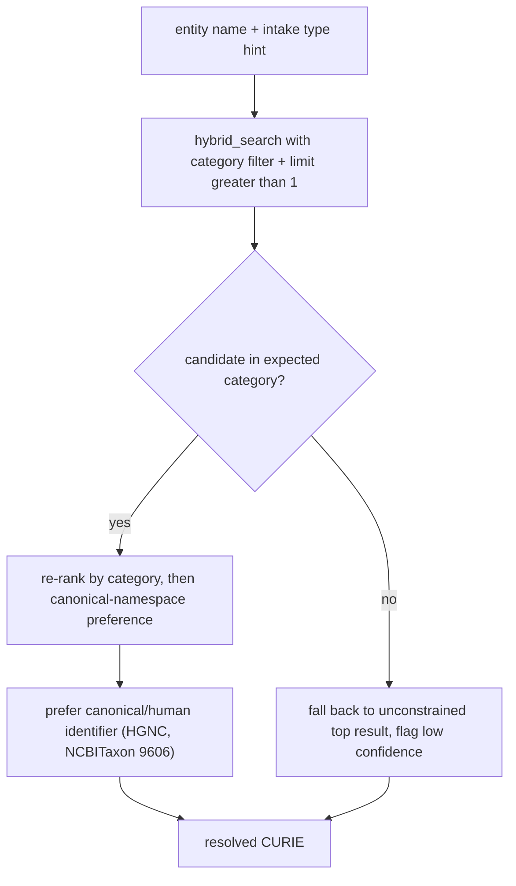

# Entity Resolution Returns Wrong-Namespace CURIEs: Evidence and a Path Forward

## Summary

Kraken's entity-resolution step maps a free-text entity name to a single knowledge-graph CURIE by taking the top text-similarity match from Kestrel `hybrid_search`, with no constraint on the result's Biolink category. We report that this routinely returns a CURIE in the wrong namespace: disease names resolve to metabolic-pathway identifiers, and gene symbols resolve to non-canonical gene entries. The failure is the dominant error mode we encountered while evaluating a downstream bridge-grounding feature, and it is the same mechanism that produces false cold-starts elsewhere in the pipeline. We demonstrate that the fix is largely available client-side: `hybrid_search` accepts a `category` filter that, when supplied with the entity category kraken's intake already infers, recovers the correct namespace as the top result. We recommend a two-tier resolution hardening, and we identify the residual case — gene identity and species disambiguation — that requires ranking changes in Kestrel/BioMapper rather than in kraken.

## Motivation

This finding surfaced during a separate investigation into per-bridge literature grounding (scoring whether a discovered A→B→C knowledge-graph chain is mechanistically supported). When we probed real Kestrel edges to validate that effort, the majority of test chains failed not because the scoring was wrong but because their endpoint names never resolved to the correct CURIE, so no edges existed between the mis-resolved nodes. Resolution quality is the load-bearing input to grounding, triage, and multi-hop analysis; a mis-resolved entity acquires zero edges and is silently bucketed as a cold-start, so resolution errors propagate downstream as apparent coverage gaps. We therefore characterized the resolution behavior directly against the live service.

## The failure

We resolved a labeled set of entity names through the production path (`resolve_via_api`, which calls `hybrid_search` with `limit=1`) and inspected the returned CURIE. Disease and gene names resolve to the wrong namespace whenever a same-text entry from another namespace scores higher. The table below reports the unconstrained top result against the expected canonical identifier.

| Entity name | Unconstrained top result | Expected | Error |
|---|---|---|---|
| chronic myeloid leukemia | `KEGG:05220` (biolink:Pathway) | `MONDO:0011996` (Disease) | disease → metabolic pathway |
| Parkinson disease | `PANTHER.PATHWAY:P00049` (biolink:Pathway) | `MONDO:0005180` (Disease) | disease → signaling pathway |
| MMR vaccine | `CHV:0000019769` (consumer-health vocabulary, no edges) | a vaccine node carrying edges | wrong vocabulary |
| VKORC1 | `NCBIGene:445422` (biolink:Gene) | `NCBIGene:79001` (canonical human gene) | non-canonical gene entry |

The pathway substitutions are the most damaging: "chronic myeloid leukemia" and "Parkinson disease" both exist verbatim as KEGG/PANTHER pathway names, and the lexical match to the pathway entry (`hybrid_search` score ≈ 4.86) outranks the corresponding MONDO disease entry (score ≈ 2.49). Because `resolve_via_api` requests a single result and applies no category filter, the pathway CURIE wins, and every downstream query against that node returns nothing.

## Root cause

The production resolver retrieves one candidate and trusts lexical similarity to select the namespace:

```python
result = await call_kestrel_tool("hybrid_search", {
    "search_text": entity,
    "limit": 1,   # only the top text/vector match; no category constraint
})
```

`hybrid_search` ranks by a combined text and vector score over names and synonyms across all namespaces simultaneously. Pathway, ortholog, and consumer-vocabulary entries frequently share a name string with the intended disease, gene, or chemical, and nothing in the call expresses which Biolink category the caller expects. The resolver thus cannot distinguish "the disease named X" from "the pathway named X." Notably, kraken's intake step already infers an expected type for each entity (`entity_type_hints`, e.g. gene, metabolite, disease), but that signal is never passed to resolution.

## The signal is available, and the filter works

Each `hybrid_search` result row carries the fields needed to disambiguate — `id`, `categories`, `prefixes`, and `equivalent_ids` — and the tool accepts a `category` argument that filters results to a Biolink class. Supplying the expected category recovers the correct namespace as the top result in exactly the cases that fail unconstrained:

| Entity name | With `category` filter, top result |
|---|---|
| chronic myeloid leukemia | `MONDO:0011996` (Disease) — correct, now rank 1 |
| Parkinson disease | `MONDO:0005180` (Disease) — correct, now rank 1 |

For both pathway-substitution cases, constraining to `biolink:Disease` demotes the pathway entries and promotes the canonical MONDO disease to rank 1. The fix for the wrong-namespace class of errors therefore does not require changes to Kestrel or BioMapper: it requires kraken to pass the category it already knows. We confirmed that `category` is the accepted parameter; the alternative `node_categories` is rejected by the tool with a validation error.

## What the category filter does not fix

Gene identity is a separate problem. For "VKORC1," both the non-canonical top entry (`NCBIGene:445422`) and the expected human gene (`NCBIGene:79001`) are `biolink:Gene`, so a category filter leaves the ranking unchanged and the resolver still selects the wrong gene. Disambiguating these requires a canonical-entity or species preference (favoring the human gene, or an HGNC-anchored identifier) rather than a category constraint. The correct entry does appear within the top candidates, so the information needed to choose it is present; what is missing is a ranking rule that prefers it.

## Suggested path forward

We recommend hardening resolution in two tiers, lightest first.



**Tier 1 — category-constrained resolution (kraken, client-side, no BioMapper change).** Map each intake `entity_type_hint` to a Biolink category (gene → `biolink:Gene`, metabolite → `biolink:ChemicalEntity`, disease → `biolink:Disease`), pass it as the `hybrid_search` `category` argument, and raise `limit` above one so a re-rank is possible. This resolves the pathway-substitution errors, which are the most frequent and most damaging, and it is verified to work against the live service today. Where the intake provides no hint, fall back to the current unconstrained behavior but record lower confidence.

**Tier 2 — canonical-entity and species ranking (Kestrel / BioMapper).** Within a category, prefer the canonical namespace and the human entity: favor MONDO over ICD/UMLS for disease, prefer the human gene (NCBITaxon:9606) and HGNC-anchored identifiers over orthologs and bare Ensembl transcripts. This is the residual fix the category filter cannot provide, and because BioMapper resolution is itself a wrapper over Kestrel hybrid search, it is best expressed as a ranking or post-filter improvement in the shared resolution layer rather than re-implemented per client. The candidate set already contains the correct entity, so this is a re-ordering problem, not a recall problem.

A pragmatic sequence is to ship Tier 1 in kraken immediately, measure the residual error rate it leaves (expected to be concentrated in gene identity and species), and scope Tier 2 in BioMapper against that measured residual rather than against the full failure set.

## Why this matters

Resolution sits upstream of every graph operation. A mis-resolved entity returns zero edges, which the triage step reads as a sparse or cold-start entity, so a resolution error is reported downstream as missing biology rather than as a lookup failure. In our bridge-grounding evaluation, mis-resolution voided the majority of test chains and masked the true behavior of the feature under test. The same mechanism inflates the cold-start bucket in ordinary discovery runs. Fixing resolution is therefore high leverage: it improves grounding, triage accuracy, and multi-hop coverage simultaneously, and Tier 1 captures most of that benefit at low cost.

## Limitations

The evidence here is a targeted characterization on a labeled probe set, not an exhaustive audit; we report the error modes we observed and the verified behavior of the `category` filter on the pathway-substitution cases, and we have not quantified the residual gene-identity error rate that Tier 1 would leave. The `category` argument's filtering semantics were confirmed empirically against the live instance but are not documented in the Kestrel API reference held in this repository, so the parameter name and behavior should be reconfirmed before relying on them in production. Finally, the Tier 2 recommendation assumes BioMapper resolution remains a thin layer over Kestrel hybrid search; if that architecture changes, the placement of the canonical-ranking fix should be revisited.
