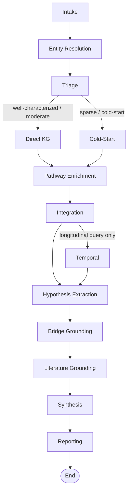

# Kraken Discovery Pipeline: Architecture and Node-by-Node Operation

This document describes how the Kraken discovery pipeline turns a set of input analytes into a grounded biological discovery report. It is the methods reference for every analysis in this collection: each module report in the per-module tables, and each cross-module synthesis, is the output of one pass through the pipeline described here. The pipeline is a twelve-node directed graph implemented in LangGraph, followed by a terminal reporting node that emits the performance report. We describe the flow, then each node, then the cross-cutting design principles that make the output trustworthy.

## Overview

The pipeline accepts a query containing named analytes (proteins by gene symbol, metabolites and chemistry species by name), resolves them to knowledge-graph identifiers, classifies how well-characterized each one is, retrieves evidence along the path appropriate to that classification, integrates the evidence into cross-entity bridges and biological themes, grounds the resulting hypotheses in both the knowledge graph and the external literature, and only then synthesizes a final report. The deferral of synthesis until after grounding is the central design choice: hypotheses are written against assembled evidence rather than generated freely, and every load-bearing claim in the output carries an evidence tier of `[KG Evidence]` (curated or database-derived knowledge-graph support), `[Inferred]` (pipeline reasoning over graph structure), or `[Model Knowledge]` (language-model background knowledge). Each run produces two artifacts: the discovery report (the biology) and the performance report (per-node cost, latency, tokens, and context telemetry).

## Pipeline flow

Triage fans out to a branch: well-characterized and moderate entities take the Direct-KG path, while sparse and cold-start entities take the Cold-Start path, and both branches rejoin at Pathway Enrichment. The Temporal node is conditional and runs only for longitudinal queries; the cross-sectional module analyses in this collection skip it, passing from Integration directly to Hypothesis Extraction.

## The twelve nodes

| Node | Role | Primary knowledge-graph method |
|---|---|---|
| Intake | Parse the query, extract and normalize analyte names, classify query type | None (heuristic, no model call) |
| Entity Resolution | Map each name to a canonical knowledge-graph CURIE with a confidence and method | `hybrid_search` and `text_search`, with an optional BioMapper pre-resolver |
| Triage | Classify each entity by its knowledge-graph edge count and route it | `one_hop_query` in preview mode (returns an edge count) |
| Direct KG | For well-characterized and moderate entities: disease associations, pathway memberships, hub flags | `one_hop_query` filtered by Biolink category across ranking presets |
| Cold-Start | For sparse and cold-start entities: analogue-based inference of associations | `similar_nodes` then `one_hop_query` on each analogue |
| Pathway Enrichment | Shared neighbors and biological themes across the entity set | `multi_hop_query` (two hops) plus model theme synthesis |
| Integration | Cross-entity bridges between categories, and gap analysis | `multi_hop_query` (doubly-pinned), optional `subgraph_query` |
| Temporal | Longitudinal classification (conditional) | None or light (usually skipped) |
| Hypothesis Extraction | Distil candidate hypotheses, including cross-type bridge hypotheses | Operates on accumulated state |
| Bridge Grounding | Attach a deterministic evidence-provenance label to each bridge leg | `multi_hop_query` re-validation of bridge paths |
| Literature Grounding | Attach external publications to hypotheses | PubMed, OpenAlex, Exa, and Semantic Scholar |
| Synthesis | Generate the final report and hypotheses against the assembled, grounded evidence | Model call, no graph access |

The terminal **Reporting** node runs after Synthesis and emits the performance report (per-node duration, tokens, estimated cost, output counts, errors, and context-management telemetry); it does not alter the discovery output.

### Ingestion and resolution

Intake parses the query heuristically without a model call, splitting labeled sections and normalizing analyte names so that chemical names with internal commas and parenthetical synonyms survive. Entity Resolution then maps each name to a canonical knowledge-graph identifier through Kestrel hybrid and text search, optionally pre-resolved by BioMapper, recording for each entity the resolution method (BioMapper, fuzzy, or exact) and a confidence. These two nodes determine the denominator for everything downstream: an analyte that fails to resolve cannot be analysed.

### Triage and the two retrieval paths

Triage queries the edge count of each resolved entity and classifies it as well-characterized (at least 200 edges), moderate (20 to 199), sparse (1 to 19), or cold-start (0). The classification routes the entity: well-characterized and moderate entities go to Direct KG, which retrieves disease associations and pathway memberships through category-filtered one-hop queries across ranking presets and flags high-degree hubs; sparse and cold-start entities go to Cold-Start, which finds structural or functional analogues and infers associations from them. This split ensures that sparse metabolites, which are genuinely under-represented in the graph, are handled by analogue inference rather than being silently dropped, while well-connected proteins are analysed on direct curated evidence.

### Enrichment, integration, and grounding

Pathway Enrichment finds neighbors shared within two hops across the entity set and synthesizes biological themes from them. Integration detects cross-entity bridges between molecular categories and performs gap analysis. Hypothesis Extraction then distils candidate hypotheses, and the two grounding nodes test them before any report is written: Bridge Grounding re-validates each bridge path in the knowledge graph and attaches a deterministic evidence-provenance label, and Literature Grounding attaches external publications retrieved from PubMed, OpenAlex, Exa, and Semantic Scholar.

### Synthesis and reporting

Synthesis is the only node that composes prose, and it does so against the assembled, grounded evidence rather than from open-ended generation. It aggregates the evidence in a module-aware fashion, applies caps that keep the assembled context within the model's token window at module scale, tags every claim with its evidence tier, and writes in the project's research register. The terminal Reporting node then emits the performance report.

## Cross-cutting design principles

Five principles govern the pipeline's trustworthiness. First, **ground before synthesis**: hypotheses are extracted and then grounded in the knowledge graph and the literature before the synthesis node writes anything, so the report describes assembled evidence rather than free generation. Second, **explicit evidence tiers**: every load-bearing claim is tagged `[KG Evidence]`, `[Inferred]`, or `[Model Knowledge]`, which bounds how far each statement can be trusted and is the basis for the evidence-tier-calibration scoring used in the model evaluation. Third, **classification-appropriate retrieval**: triage routes each entity to the path suited to its graph coverage, so the well-characterized and the sparse are handled on their own terms. Fourth, **bounded concurrency against shared infrastructure**: the nodes that query the knowledge graph cap their fan-out so that a module-scale run does not exhaust the shared graph service, a safeguard added after an unbounded fan-out caused a reader-pool exhaustion incident. Fifth, **fail loud, never silently degrade**: when a node cannot complete a measurement or a downstream service returns an error, the pipeline records a visible marker in the run state rather than letting a failure masquerade as a biological result, so a degraded run is always distinguishable from a genuine finding.

## Reading the two outputs

Each run yields a discovery report and a performance report. The discovery report is the biology: an executive summary, key disease and pathway findings, biological themes, cross-entity bridges, and grounded hypotheses, each claim tier-tagged. The performance report is the instrument: a per-node table of duration, tokens, estimated cost, and output counts, plus a context-management section showing how synthesis compressed the accumulated evidence to fit the model's token window. The per-module tables in the master index link both reports for every module under both models analysed in this collection.
